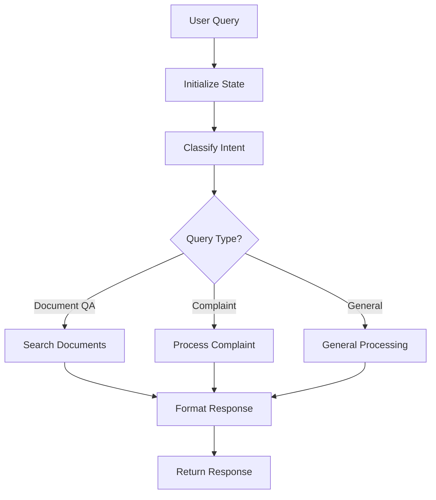

# Engine Architecture Documentation

## Overview

The University Chatbot uses a modular conversation engine architecture built on LangGraph, providing a flexible and extensible system for processing user queries, document retrieval, and intelligent responses. The engine follows a clean separation of concerns with dependency injection and interfaces for easy testing and maintenance.

## Architecture Components

### 1. Core Engine Structure

```
app/engines/
├── base.py              # Base classes and mock implementations
├── factory.py           # Engine factory for dependency injection
└── langgraph/          # Main LangGraph-based engine
    ├── engine.py       # Main engine coordinator
    ├── nodes/          # Processing nodes (workflow steps)
    ├── state/          # State management and schemas
    ├── tools/          # Service integration tools
    ├── utils/          # Engine utilities
    └── workflows/      # Workflow orchestration
```

### 2. Engine Interface

The engine implements the `ConversationEngine` interface defined in `app/interfaces/conversation_engine.py`:

#### Key Components:
- **ConversationContext**: Contains user context, session info, and conversation history
- **ConversationResponse**: Structured response with metadata, sources, and confidence scores
- **QueryType**: Enumeration of supported query types (document QA, complaints, general info, procedures)

#### Main Methods:
- `process_query()`: Main entry point for processing user messages
- `initialize_documents()`: Setup document knowledge base
- `health_check()`: Engine health monitoring

### 3. ModularLangGraphEngine

The main engine implementation (`app/engines/langgraph/engine.py`) acts as a coordinator that:

1. **Sets up tools** - Service wrappers for document search, user management, etc.
2. **Sets up nodes** - Individual processing steps in the workflow
3. **Sets up workflow** - Orchestrates the conversation flow
4. **Processes conversations** - Executes the complete pipeline

#### Initialization Flow:
```python
def __init__(self, services: Dict[str, Any], providers: Dict[str, Any]):
    self.services = services      # DocumentService, UserService, etc.
    self.providers = providers    # LLMProvider, DatabaseProvider, etc.
    
    self.tools = self._setup_tools()        # Create service wrappers
    self.nodes = self._setup_nodes()        # Create workflow nodes
    self.workflow = self._setup_workflow()  # Create orchestration
```

### 4. State Management

#### ConversationState (`app/engines/langgraph/state/`)
- **Central state object** that flows through the entire workflow
- **Tracks conversation context**, user intents, retrieved documents
- **Maintains processing metadata** and intermediate results
- **Thread-safe state transitions** between workflow nodes

#### StateManager
- **Initializes conversation state** from user input and context
- **Manages state transitions** between workflow steps
- **Handles state validation** and error recovery

### 5. Workflow Nodes

Individual processing steps located in `app/engines/langgraph/nodes/`:

#### Classification Node (`classification.py`)
- **Analyzes user intent** using LLM
- **Determines query type** (document QA, complaint, general info)
- **Routes conversation** to appropriate processing path

#### Document Search Node (`document_search.py`)
- **Performs semantic search** on document knowledge base
- **Retrieves relevant context** for user queries
- **Ranks and filters results** by relevance

#### Complaint Processing Node (`complaint_processing.py`)
- **Handles complaint submissions** and processing
- **Validates complaint data** structure
- **Integrates with complaint management** system

#### Response Formatting Node (`response_formatting.py`)
- **Formats final response** using LLM
- **Incorporates retrieved context** and sources
- **Ensures response quality** and consistency

### 6. Workflow Orchestration

#### Chat Workflow (`app/engines/langgraph/workflows/chat_workflow.py`)
- **Defines conversation flow** between nodes
- **Handles conditional routing** based on user intent
- **Manages error handling** and fallback scenarios
- **Coordinates state transitions** through the pipeline

#### Workflow Execution Flow:
```
User Query → State Initialization → Classification → Document Search 
    ↓
Response Formatting ← Context Retrieval ← Intent Processing
    ↓
Final Response → User
```

### 7. Tools Integration

Tools in `app/engines/langgraph/tools/` wrap services for workflow integration:

- **Document tools** - Search and retrieval operations
- **User tools** - User management and authentication
- **Complaint tools** - Complaint processing and validation
- **General tools** - Utility functions and helpers

### 8. Engine Factory

The `ConversationEngineFactory` (`app/engines/factory.py`) provides:

- **Dependency injection** for services and providers
- **Engine instantiation** with proper configuration
- **Singleton management** for engine instances
- **Environment-specific setup** (development, production)

## Processing Flow

### 1. Query Processing Pipeline



### 2. State Transitions

1. **Initial State**: User message, context, empty results
2. **Classification State**: Intent determined, routing decided
3. **Processing State**: Relevant data retrieved, processing complete
4. **Response State**: Final response formatted, metadata attached

### 3. Error Handling

- **Node-level error handling** with graceful degradation
- **Workflow-level recovery** mechanisms
- **Fallback responses** for unhandled scenarios
- **Comprehensive logging** for debugging and monitoring

## Key Design Principles

### 1. KISS (Keep It Simple, Stupid)
- **Clear separation of concerns** between components
- **Minimal complexity** in individual modules
- **Focused responsibility** for each node and tool

### 2. Modularity
- **Pluggable components** that can be easily replaced
- **Interface-based design** for loose coupling
- **Dependency injection** for testability

### 3. Scalability
- **Stateless design** allows horizontal scaling
- **Async processing** for high concurrency
- **Efficient resource utilization** through connection pooling

### 4. Observability
- **Comprehensive logging** with structured data
- **Performance metrics** tracking
- **Health check endpoints** for monitoring

## Configuration and Deployment

### Environment Variables
- `ENGINE_TYPE`: Specifies which engine implementation to use
- `LLM_PROVIDER`: Configures the language model provider
- `VECTOR_STORE_TYPE`: Sets the vector database type
- `DEBUG_MODE`: Enables detailed logging and debugging

### Health Monitoring
- **Engine health checks** verify component status
- **Performance metrics** track processing times
- **Error rate monitoring** for system reliability

## Extension Points

### Adding New Query Types
1. Add enum value to `QueryType`
2. Create processing node in `nodes/`
3. Update workflow routing logic
4. Add corresponding tools if needed

### Adding New Providers
1. Implement provider interface
2. Add to dependency injection container
3. Update factory configuration
4. Test integration with engine

### Custom Workflows
1. Extend `BaseWorkflow` class
2. Define node sequence and routing
3. Register in workflow factory
4. Configure through settings

## Performance Considerations

### Optimization Strategies
- **Connection pooling** for database and API calls
- **Caching strategies** for frequent queries
- **Batch processing** for document operations
- **Async/await patterns** for I/O operations

### Monitoring Metrics
- **Query processing time** per workflow step
- **Document retrieval performance** and accuracy
- **LLM API response times** and costs
- **Memory usage** and resource consumption

## Testing Strategy

### Unit Testing
- **Individual node testing** with mock dependencies
- **Tool integration testing** with service mocks
- **State management testing** for edge cases

### Integration Testing
- **End-to-end workflow testing** with real services
- **Provider integration testing** with external APIs
- **Performance testing** under load conditions

### Mock Implementations
- **MockConversationEngine** for development
- **Service mocks** for isolated testing
- **Provider mocks** for CI/CD environments

This architecture provides a robust, scalable, and maintainable foundation for the university chatbot's conversation processing capabilities.
