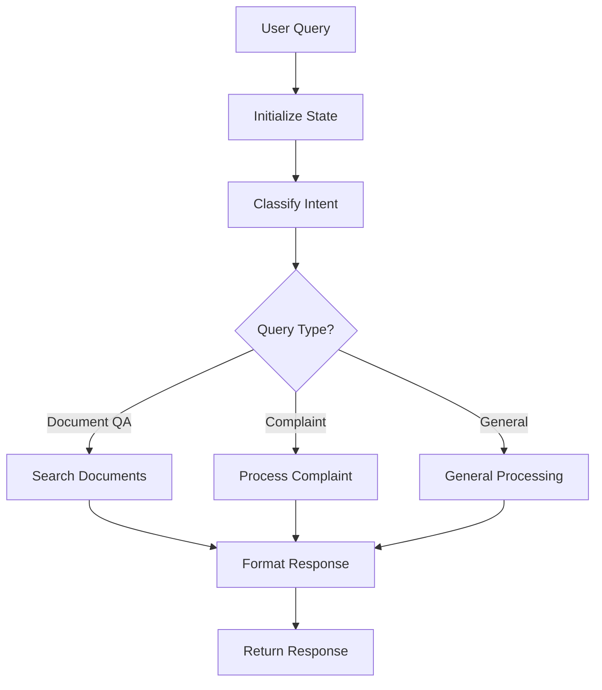

# Engine Architecture Documentation

## Overview

The University Chatbot features a **provider-agnostic** modular conversation engine architecture designed for maximum flexibility and extensibility. The system is built with clean separation of concerns, dependency injection, and well-defined interfaces that allow for easy swapping of different conversation engines and providers.

**Current Implementation**: While the architecture supports multiple conversation engines, the current implementation uses **LangGraph** as the primary engine provider. This demonstrates the system's capability to integrate sophisticated workflow orchestration while maintaining provider independence.

## Provider-Agnostic Design Philosophy

The engine architecture is intentionally decoupled from specific providers to ensure:

- **Flexibility**: Easy migration between different conversation engines (LangGraph, LangChain, custom implementations)
- **Vendor Independence**: No lock-in to specific LLM providers, vector databases, or orchestration frameworks
- **Extensibility**: Simple addition of new engines without architectural changes
- **Testing**: Ability to use mock implementations for all provider interactions

## Architecture Components

### 1. Core Engine Structure

```
app/engines/
├── base.py              # Base classes and mock implementations
├── factory.py           # Engine factory for dependency injection
└── langgraph/          # Main LangGraph-based engine
    ├── engine.py       # Main engine coordinator
    ├── nodes/          # Processing nodes (workflow steps)
    ├── state/          # State management and schemas
    ├── tools/          # Service integration tools
    ├── utils/          # Engine utilities
    └── workflows/      # Workflow orchestration
```

### 2. Engine Interface

The engine implements the `ConversationEngine` interface defined in `app/interfaces/conversation_engine.py`. This interface serves as the **provider-agnostic contract** that any conversation engine implementation must fulfill, ensuring consistent behavior regardless of the underlying technology.

#### Key Components:
- **ConversationContext**: Contains user context, session info, and conversation history
- **ConversationResponse**: Structured response with metadata, sources, and confidence scores
- **QueryType**: Enumeration of supported query types (document QA, complaints, general info, procedures)

#### Main Methods:
- `process_query()`: Main entry point for processing user messages
- `initialize_documents()`: Setup document knowledge base
- `health_check()`: Engine health monitoring

**Provider Independence**: Any conversation engine (LangGraph, LangChain, custom implementations) can be plugged in by implementing this interface.

### 3. ModularLangGraphEngine (Current Implementation)

The current engine implementation (`app/engines/langgraph/engine.py`) demonstrates how the provider-agnostic architecture works in practice. This **LangGraph-specific implementation** acts as a coordinator that:

1. **Sets up tools** - Service wrappers for document search, user management, etc.
2. **Sets up nodes** - Individual processing steps in the workflow
3. **Sets up workflow** - Orchestrates the conversation flow
4. **Processes conversations** - Executes the complete pipeline

#### Initialization Flow:
```python
def __init__(self, services: Dict[str, Any], providers: Dict[str, Any]):
    self.services = services      # DocumentService, UserService, etc.
    self.providers = providers    # LLMProvider, DatabaseProvider, etc.
    
    self.tools = self._setup_tools()        # Create service wrappers
    self.nodes = self._setup_nodes()        # Create workflow nodes
    self.workflow = self._setup_workflow()  # Create orchestration
```

### 4. LangGraph-Specific Components (Current Implementation)

The following components are specific to the **LangGraph implementation** and demonstrate how provider-specific features can be integrated while maintaining the agnostic architecture:

#### State Management (`app/engines/langgraph/state/`)
- **LangGraph-specific state object** that flows through the workflow
- **Thread-safe state transitions** between workflow nodes
- **Provider-specific state handling** while implementing generic interfaces

#### Workflow Nodes (`app/engines/langgraph/nodes/`)
- **LangGraph workflow nodes** implementing specific processing steps
- **Provider-agnostic interfaces** with LangGraph-specific implementations
- **Modular design** allowing easy replacement with other provider implementations

#### Workflow Orchestration (`app/engines/langgraph/workflows/`)
- **LangGraph-specific workflow definition** and execution
- **Graph-based conversation flow** management
- **Conditional routing** and error handling specific to LangGraph

**Note**: These components showcase how provider-specific features can be leveraged while maintaining the overall agnostic design. Other conversation engine providers would have their own equivalent implementations.

### 5. State Management

#### ConversationState (`app/engines/langgraph/state/`)
- **Central state object** that flows through the entire workflow
- **Tracks conversation context**, user intents, retrieved documents
- **Maintains processing metadata** and intermediate results
- **Thread-safe state transitions** between workflow nodes

#### StateManager
- **Initializes conversation state** from user input and context
- **Manages state transitions** between workflow steps
- **Handles state validation** and error recovery

### 6. Workflow Nodes

Individual processing steps located in `app/engines/langgraph/nodes/`:

#### Classification Node (`classification.py`)
- **Analyzes user intent** using LLM
- **Determines query type** (document QA, complaint, general info)
- **Routes conversation** to appropriate processing path

#### Document Search Node (`document_search.py`)
- **Performs semantic search** on document knowledge base
- **Retrieves relevant context** for user queries
- **Ranks and filters results** by relevance

#### Complaint Processing Node (`complaint_processing.py`)
- **Handles complaint submissions** and processing
- **Validates complaint data** structure
- **Integrates with complaint management** system

#### Response Formatting Node (`response_formatting.py`)
- **Formats final response** using LLM
- **Incorporates retrieved context** and sources
- **Ensures response quality** and consistency

### 7. Workflow Orchestration

#### Chat Workflow (`app/engines/langgraph/workflows/chat_workflow.py`)
- **Defines conversation flow** between nodes
- **Handles conditional routing** based on user intent
- **Manages error handling** and fallback scenarios
- **Coordinates state transitions** through the pipeline

#### Workflow Execution Flow:
```
User Query → State Initialization → Classification → Document Search 
    ↓
Response Formatting ← Context Retrieval ← Intent Processing
    ↓
Final Response → User
```

### 8. Tools Integration

Tools in `app/engines/langgraph/tools/` wrap services for workflow integration:

- **Document tools** - Search and retrieval operations
- **User tools** - User management and authentication
- **Complaint tools** - Complaint processing and validation
- **General tools** - Utility functions and helpers

### 9. Engine Factory (Provider Management)

The `ConversationEngineFactory` (`app/engines/factory.py`) is the **key component for provider management**:

- **Provider-agnostic instantiation** - Creates engines based on configuration
- **Dependency injection** for services and providers
- **Engine selection** through environment variables or configuration
- **Singleton management** for engine instances
- **Environment-specific setup** (development, production)

**Switching Providers**: To use a different conversation engine, simply:
1. Implement the `ConversationEngine` interface
2. Register the new engine in the factory
3. Update configuration to select the new provider

## Alternative Provider Examples

The provider-agnostic architecture supports various conversation engine implementations:

### Potential Engine Providers
- **LangGraph** (Current): Advanced workflow orchestration with state management
- **LangChain**: Traditional chain-based conversation flows
- **Custom Implementations**: Tailored engines for specific use cases
- **Microsoft Bot Framework**: Enterprise-grade bot conversations
- **Rasa**: Open-source conversational AI framework

### Provider Selection Strategy
The architecture allows for:
- **Development environments**: Mock or lightweight implementations
- **Testing environments**: Controlled providers for consistent testing
- **Production environments**: High-performance, scalable providers
- **A/B testing**: Multiple providers running simultaneously for comparison

### Migration Benefits
- **Zero service disruption**: Switch providers without changing business logic
- **Performance optimization**: Choose the best provider for specific workloads
- **Cost optimization**: Migrate to more cost-effective solutions
- **Feature utilization**: Leverage provider-specific capabilities when needed

## Provider-Agnostic Processing Flow

### 1. Query Processing Pipeline



### 2. State Transitions

1. **Initial State**: User message, context, empty results
2. **Classification State**: Intent determined, routing decided
3. **Processing State**: Relevant data retrieved, processing complete
4. **Response State**: Final response formatted, metadata attached

### 3. Error Handling

- **Node-level error handling** with graceful degradation
- **Workflow-level recovery** mechanisms
- **Fallback responses** for unhandled scenarios
- **Comprehensive logging** for debugging and monitoring

## Key Design Principles

### 1. Provider Agnosticism
- **Interface-driven design** ensures any conversation engine can be integrated
- **Abstraction layers** hide provider-specific implementation details
- **Configuration-based selection** allows runtime provider switching
- **Consistent API** regardless of underlying technology

### 2. KISS (Keep It Simple, Stupid)
- **Clear separation of concerns** between components
- **Minimal complexity** in individual modules
- **Focused responsibility** for each node and tool

### 3. Modularity
- **Pluggable components** that can be easily replaced
- **Interface-based design** for loose coupling
- **Dependency injection** for testability

### 4. Scalability
- **Stateless design** allows horizontal scaling
- **Async processing** for high concurrency
- **Efficient resource utilization** through connection pooling

### 5. Observability
- **Comprehensive logging** with structured data
- **Performance metrics** tracking
- **Health check endpoints** for monitoring

## Configuration and Deployment

### Environment Variables
- `ENGINE_TYPE`: Specifies which engine implementation to use
- `LLM_PROVIDER`: Configures the language model provider
- `VECTOR_STORE_TYPE`: Sets the vector database type
- `DEBUG_MODE`: Enables detailed logging and debugging

### Health Monitoring
- **Engine health checks** verify component status
- **Performance metrics** track processing times
- **Error rate monitoring** for system reliability

## Extension Points

### Adding New Conversation Engine Providers
1. **Implement** the `ConversationEngine` interface
2. **Create** provider-specific implementation directory (e.g., `app/engines/langchain/`)
3. **Register** the new engine in the factory
4. **Update** configuration to support the new provider
5. **Test** integration with existing services

### Adding New Query Types
1. Add enum value to `QueryType`
2. Create processing node in `nodes/`
3. Update workflow routing logic
4. Add corresponding tools if needed

### Adding New Service Providers
1. Implement provider interface (LLM, Database, Storage)
2. Add to dependency injection container
3. Update factory configuration
4. Test integration with engine

### Custom Workflows (LangGraph-specific)
1. Extend `BaseWorkflow` class
2. Define node sequence and routing
3. Register in workflow factory
4. Configure through settings

## Performance Considerations

### Optimization Strategies
- **Connection pooling** for database and API calls
- **Caching strategies** for frequent queries
- **Batch processing** for document operations
- **Async/await patterns** for I/O operations

### Monitoring Metrics
- **Query processing time** per workflow step
- **Document retrieval performance** and accuracy
- **LLM API response times** and costs
- **Memory usage** and resource consumption

## Testing Strategy

### Unit Testing
- **Individual node testing** with mock dependencies
- **Tool integration testing** with service mocks
- **State management testing** for edge cases

### Integration Testing
- **End-to-end workflow testing** with real services
- **Provider integration testing** with external APIs
- **Performance testing** under load conditions

### Mock Implementations
- **MockConversationEngine** for development
- **Service mocks** for isolated testing
- **Provider mocks** for CI/CD environments

## Conclusion

This **provider-agnostic architecture** provides a robust, scalable, and maintainable foundation for the university chatbot's conversation processing capabilities. The current **LangGraph implementation** demonstrates the system's flexibility while showcasing advanced workflow orchestration features.

**Key Benefits**:
- **Future-proof design**: Easy adoption of new conversation technologies
- **Vendor independence**: No lock-in to specific providers or frameworks
- **Consistent interfaces**: Uniform behavior across different implementations
- **Development flexibility**: Choose the right tool for each environment

The architecture ensures that as conversation AI technology evolves, the university chatbot can seamlessly adapt and integrate new capabilities without fundamental architectural changes.
