# LangGraph Explained Like You're 5 🤖

## What is LangGraph?

Think of LangGraph like a **decision tree for conversations**. Just like how you might ask yourself:
1. "What does this person want?" 
2. "What should I do about it?"
3. "How should I respond?"

LangGraph helps our chatbot make these same decisions, but in a organized, step-by-step way!

## The Magic Behind Our University Chatbot

Our chatbot is like a smart assistant that can help students with different things. Here's how it thinks:

### 🧠 The Brain (Classification)
First, the bot reads what you wrote and thinks: "Hmm, what does this person need?"

- **"Where is the library?"** → This is a **QUESTION** about the university
- **"My grade is wrong!"** → This is a **COMPLAINT** that needs help
- **"Hello!"** → This is just **GENERAL CHAT** to be friendly

### 🛤️ The Decision Path (Routing)
Once it knows what you need, it picks the right "specialist":

- Questions about university → **Document Expert** (searches through university info)
- Complaints or problems → **Problem Solver** (helps file complaints)
- Just chatting → **Friendly Helper** (has normal conversations)

### 📝 The Final Touch (Response Formatting)
Finally, it makes sure the answer sounds natural and helpful, not like a robot!

## Our University Chatbot Workflow

Here's exactly how our chatbot works, step by step:

```mermaid
graph TD
    A[👋 Student asks something] --> B[🧠 Classification Node]
    
    B --> C{What type of message?}
    
    C -->|Question about UP| D[📚 Document Search Node]
    C -->|Problem/Complaint| E[📝 Complaint Processing Node]
    C -->|General Chat| F[💬 General Chat Node]
    
    D --> G[✨ Format Response Node]
    E --> G
    F --> G
    
    G --> H[📱 Send nice answer to student]
    
    style A fill:#e1f5fe
    style B fill:#f3e5f5
    style D fill:#e8f5e8
    style E fill:#fff3e0
    style F fill:#fce4ec
    style G fill:#f1f8e9
    style H fill:#e3f2fd
```



## The Detailed Journey 🗺️

Let's follow a message through the entire system:

```mermaid
flowchart TD
    Start([🚀 Student Message Arrives]) --> Init[📋 Initialize State]
    
    Init --> Classify[🧠 Classification Node]
    Classify --> CheckIntent{Intent Classification}
    
    CheckIntent -->|pregunta| DocSearch[📚 Document Search]
    CheckIntent -->|queja| Complaint[📝 Complaint Handler]
    CheckIntent -->|conversacion| Chat[💬 General Chat]
    CheckIntent -->|desconocido| Chat
    
    DocSearch --> DocResult[📊 Search University Docs]
    DocResult --> Format[✨ Format Response]
    
    Complaint --> ComplaintForm[📋 Create Complaint]
    ComplaintForm --> Format
    
    Chat --> ChatLLM[🤖 Generate Friendly Response]
    ChatLLM --> Format
    
    Format --> Final[📱 Final Response]
    Final --> End([✅ Done!])
    
    style Start fill:#4caf50,color:#fff
    style Classify fill:#9c27b0,color:#fff
    style DocSearch fill:#2196f3,color:#fff
    style Complaint fill:#ff9800,color:#fff
    style Chat fill:#e91e63,color:#fff
    style Format fill:#8bc34a,color:#fff
    style End fill:#4caf50,color:#fff
```



## The State: Our Chatbot's Memory 🧠

Think of "state" as the chatbot's notebook where it writes down everything it learns about your conversation:


## Example: Following a Real Conversation

Let's see what happens when a student asks: **"¿Dónde está la biblioteca?"** (Where is the library?)

```mermaid
sequenceDiagram
    participant Student
    participant Classifier
    participant DocSearch
    participant Formatter
    participant Database
    
    Student->>Classifier: "¿Dónde está la biblioteca?"
    Note over Classifier: 🤔 This looks like a QUESTION
    Classifier->>DocSearch: Intent: "pregunta"
    
    DocSearch->>Database: Search for "biblioteca"
    Database-->>DocSearch: Location: Building A, 2nd floor
    
    DocSearch->>Formatter: Raw info about library
    Note over Formatter: 🎨 Make it sound natural
    Formatter->>Student: "¡Hola! La biblioteca está ubicada en el Edificio A, segundo piso. ¿Te ayudo con algo más?"
```



## Why Use LangGraph? 🤔

### Before LangGraph (The Old Way):
```python
# Messy, hard to follow
if "biblioteca" in message:
    search_docs()
elif "queja" in message:
    handle_complaint()
else:
    general_chat()
```

### With LangGraph (The Smart Way):
- **Clear Steps**: Each part has one job
- **Easy to Debug**: See exactly where things go wrong
- **Easy to Improve**: Add new features without breaking old ones
- **Visual**: You can actually draw how it works!

## Our Nodes Explained Simply 🎯

### 1. 🧠 Classification Node
**Job**: Figure out what the student wants
**Input**: Raw message from student
**Output**: "This is a question/complaint/chat"

### 2. 📚 Document Search Node
**Job**: Find university information
**Input**: Student's question
**Output**: Relevant documents and info

### 3. 📝 Complaint Processing Node
**Job**: Help with problems
**Input**: Student's complaint
**Output**: Complaint form or guidance

### 4. 💬 General Chat Node
**Job**: Have friendly conversations
**Input**: Casual messages
**Output**: Warm, helpful responses

### 5. ✨ Response Formatting Node
**Job**: Make everything sound natural
**Input**: Raw results from other nodes
**Output**: Polished, student-friendly response

## The Backup Plan (Fallback) 🚨

Sometimes LangGraph isn't available (like when the internet is slow). Our chatbot has a backup plan:

```mermaid
graph LR
    A[Message] --> B{LangGraph Available?}
    B -->|Yes| C[🚀 Use LangGraph Workflow]
    B -->|No| D[🔧 Use Simple Backup]
    
    C --> E[Perfect Experience]
    D --> F[Still Works, Just Simpler]
    
    style C fill:#4caf50,color:#fff
    style D fill:#ff9800,color:#fff
```



## Real Examples 📱

### Example 1: University Question
**Student**: "¿Cuáles son los horarios de la cafetería?"
**Flow**: Classification → Document Search → Format Response
**Response**: "La cafetería está abierta de lunes a viernes de 7:00 AM a 6:00 PM..."

### Example 2: Complaint
**Student**: "Mi nota del examen está mal calculada"
**Flow**: Classification → Complaint Processing → Format Response
**Response**: "Entiendo tu preocupación. Te ayudo a reportar esto..."

### Example 3: Friendly Chat
**Student**: "¡Hola! ¿Cómo estás?"
**Flow**: Classification → General Chat → Format Response
**Response**: "¡Hola! Muy bien, gracias. Soy tu asistente de UP. ¿En qué puedo ayudarte?"

## Summary: Why This is Awesome 🌟

1. **Smart Routing**: Each message goes to the right specialist
2. **Consistent Experience**: Every student gets helpful responses
3. **Easy to Maintain**: Developers can improve one part without breaking others
4. **Scalable**: Easy to add new features (like homework help, schedule info, etc.)
5. **Reliable**: Has backup plans when things go wrong

Think of LangGraph as giving our chatbot a **smart brain** that can think step-by-step, just like how you solve problems in real life! 🧠✨

---

*This document explains the LangGraph architecture used in our University of the Pacific chatbot system. For technical implementation details, see the `/app/engines/langgraph/` directory.*
