# University Chatbot - System Architecture

## Overview

This document provides a comprehensive architectural overview of the University Chatbot system, featuring a provider-agnostic, microservices-inspired design with clean separation of concerns, dependency injection, and extensible interfaces.

## Table of Contents

1. [High-Level Architecture](#high-level-architecture)
2. [Core Components](#core-components)
3. [Data Flow](#data-flow)
4. [Conversation Engine Architecture](#conversation-engine-architecture)
5. [Provider System](#provider-system)
6. [Service Layer](#service-layer)
7. [Database Architecture](#database-architecture)
8. [API Architecture](#api-architecture)
9. [Deployment Architecture](#deployment-architecture)
10. [Security Architecture](#security-architecture)

## High-Level Architecture

The University Chatbot system follows a layered architecture pattern with clear separation of concerns, enabling maintainability, scalability, and testability. The architecture is designed around the principle of **provider agnosticism**, allowing for easy swapping of external services and implementations.

### Architectural Layers Overview

The system is organized into five distinct layers, each with specific responsibilities:

1. **Client Layer**: User-facing interfaces and applications
2. **API Gateway**: Request routing, middleware, and protocol handling
3. **Business Logic Layer**: Core application logic and conversation processing
4. **Data Access Layer**: Database operations and data persistence
5. **Provider Layer**: External service integrations and abstractions

### Key Architectural Principles

- **Dependency Inversion**: High-level modules don't depend on low-level modules; both depend on abstractions
- **Single Responsibility**: Each component has a single, well-defined purpose
- **Open/Closed Principle**: System is open for extension but closed for modification
- **Interface Segregation**: Clients depend only on interfaces they use
- **Loose Coupling**: Components are minimally dependent on each other

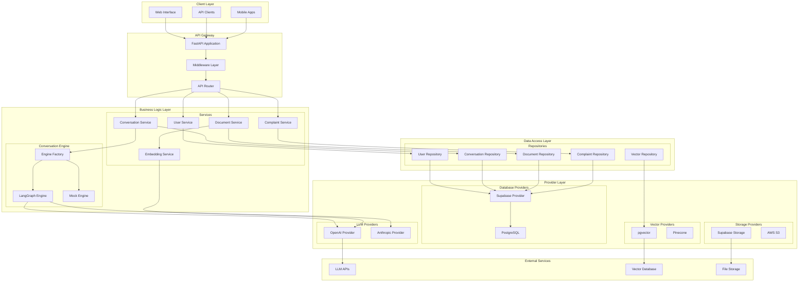

### Layer-by-Layer Analysis

#### 1. Client Layer
The client layer encompasses all user-facing interfaces that interact with the chatbot system. This includes:

- **Web Interface**: Browser-based chat interface for desktop users
- **API Clients**: Direct API consumers like mobile applications or third-party integrations
- **Mobile Apps**: Native mobile applications for iOS and Android platforms

All client interfaces communicate with the system through standardized REST APIs, ensuring consistent behavior across different platforms.

#### 2. API Gateway
The API Gateway serves as the single entry point for all client requests, implementing cross-cutting concerns:

- **FastAPI Application**: Modern, high-performance Python web framework providing automatic API documentation and validation
- **Middleware Layer**: Handles CORS, authentication, rate limiting, and request logging
- **API Router**: Routes requests to appropriate service endpoints based on URL patterns and HTTP methods

#### 3. Business Logic Layer
This layer contains the core application logic and is divided into two main subsystems:

**Services Subsystem:**
- **User Service**: Manages user authentication, profiles, and permissions
- **Conversation Service**: Orchestrates chat interactions and maintains conversation context
- **Document Service**: Handles document ingestion, processing, and retrieval
- **Complaint Service**: Manages complaint submission and processing workflows
- **Embedding Service**: Generates and manages vector embeddings for semantic search

**Conversation Engine Subsystem:**
- **Engine Factory**: Creates and manages different conversation engine implementations
- **LangGraph Engine**: Primary conversation engine using LangGraph for workflow orchestration
- **Mock Engine**: Testing and development engine for isolated testing scenarios

#### 4. Data Access Layer
The repository pattern is implemented to abstract database operations:

- **User Repository**: User data persistence and retrieval
- **Conversation Repository**: Chat history and session management
- **Document Repository**: Document metadata and content storage
- **Complaint Repository**: Complaint data management
- **Vector Repository**: Vector embedding storage and similarity search

#### 5. Provider Layer
This layer implements the provider pattern for external service integration:

- **LLM Providers**: OpenAI, Anthropic, and other language model providers
- **Database Providers**: Supabase, PostgreSQL, and other database systems
- **Storage Providers**: File storage solutions like Supabase Storage or AWS S3
- **Vector Providers**: Vector database implementations like pgvector or Pinecone

## Core Components

The core components of the University Chatbot system are designed around modularity, testability, and extensibility. Each component has a well-defined interface and responsibility, enabling independent development and testing.

### 1. Application Layer

The application layer serves as the foundation of the system, handling application lifecycle, configuration management, and dependency injection. This layer is responsible for bootstrapping the entire system and ensuring all components are properly initialized and configured.

#### FastAPI Application (`app/main.py`)
- **Purpose**: Main application entry point and HTTP server configuration
- **Responsibilities**: 
  - Application lifecycle management
  - Middleware configuration and registration
  - Exception handling and error responses
  - Health check endpoints
  - CORS policy enforcement
- **Key Features**:
  - Structured logging with contextual information
  - Request timing middleware for performance monitoring
  - Environment-specific configuration (development vs production)
  - Automatic API documentation generation

#### Configuration Management (`app/core/config.py`)
- **Purpose**: Centralized configuration management using environment variables
- **Responsibilities**:
  - Environment variable validation and type conversion
  - Default value management
  - Configuration caching and optimization
  - Feature flag management
- **Configuration Categories**:
  - Application settings (name, version, debug mode)
  - Security settings (JWT secrets, token expiration)
  - Provider configurations (API keys, endpoints)
  - Feature flags (enable/disable specific functionality)

#### Dependency Injection Container (`app/core/container.py`)
- **Purpose**: Manages object creation and dependency resolution
- **Responsibilities**:
  - Singleton instance management
  - Lazy initialization of expensive resources
  - Provider selection based on configuration
  - Service lifecycle management
- **Benefits**:
  - Testability through dependency injection
  - Loose coupling between components
  - Easy switching between implementations
  - Resource optimization through caching

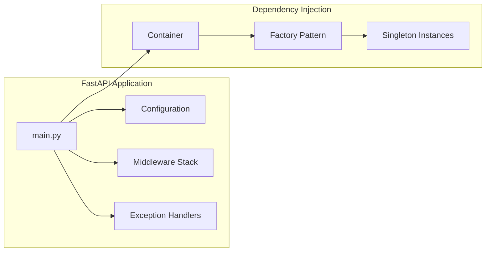

### 2. Interface Layer

The interface layer defines contracts between different components of the system, enabling loose coupling and easy extensibility. This layer is crucial for maintaining the provider-agnostic nature of the architecture.

#### Core Interfaces
Each interface defines a specific contract that implementations must fulfill:

**ConversationEngine Interface (`app/interfaces/conversation_engine.py`)**
- **Purpose**: Defines the contract for conversation processing engines
- **Methods**:
  - `process_query()`: Main conversation processing entry point
  - `initialize_documents()`: Document knowledge base setup
  - `health_check()`: Engine health monitoring
- **Data Structures**:
  - `ConversationContext`: User context and conversation history
  - `ConversationResponse`: Structured response with metadata
  - `QueryType`: Enumeration of supported query types

**DatabaseProvider Interface (`app/interfaces/database_provider.py`)**
- **Purpose**: Abstracts database operations across different providers
- **Capabilities**: CRUD operations, connection management, transaction support
- **Benefits**: Database vendor independence, easy testing with mocks

**LLMProvider Interface (`app/interfaces/llm_provider.py`)**
- **Purpose**: Standardizes language model interactions
- **Features**: Model selection, token management, streaming support
- **Flexibility**: Supports multiple LLM providers (OpenAI, Anthropic, local models)

**StorageProvider Interface (`app/interfaces/storage_provider.py`)**
- **Purpose**: File storage operations abstraction
- **Operations**: Upload, download, delete, metadata management
- **Scalability**: Supports various storage backends (cloud and local)

#### Interface Benefits
- **Testability**: Easy mocking for unit tests
- **Flexibility**: Runtime provider switching
- **Maintainability**: Clear contracts between components
- **Extensibility**: Easy addition of new implementations

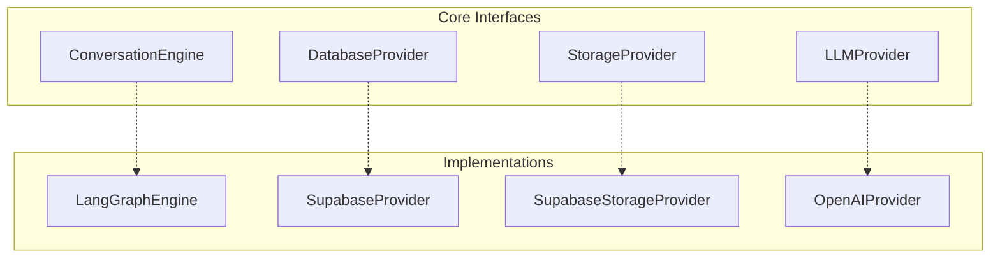

### Interface Implementation Strategy

The system uses a factory pattern to create appropriate implementations based on configuration:

1. **Configuration-Driven Selection**: Environment variables determine which implementations to use
2. **Graceful Degradation**: Fallback to mock implementations when providers are unavailable
3. **Health Monitoring**: Regular health checks ensure provider availability
4. **Hot Swapping**: Runtime switching between providers for A/B testing or failover

## Data Flow

Understanding the data flow through the University Chatbot system is crucial for comprehending how user requests are processed and responses are generated. The system implements two primary data flow patterns: request processing and conversation processing.

### 1. Request Processing Flow

The request processing flow handles all incoming HTTP requests, from initial reception to final response delivery. This flow ensures proper authentication, validation, and error handling for all API interactions.

#### Flow Stages

1. **Request Reception**: Client sends HTTP request to FastAPI application
2. **Authentication**: Middleware validates JWT tokens and user permissions
3. **Request Validation**: Pydantic models validate request structure and data types
4. **Business Logic**: Service layer processes the request according to business rules
5. **Data Access**: Repository layer interacts with databases through provider interfaces
6. **Provider Interaction**: Providers communicate with external services (databases, APIs)
7. **Response Assembly**: Results are assembled into standardized response format
8. **Response Delivery**: HTTP response is sent back to the client

#### Security and Validation
- **Input Sanitization**: All user inputs are sanitized to prevent injection attacks
- **Rate Limiting**: Prevents abuse through request rate limiting
- **Error Handling**: Comprehensive error handling with structured error responses
- **Audit Logging**: All requests are logged for security and debugging purposes

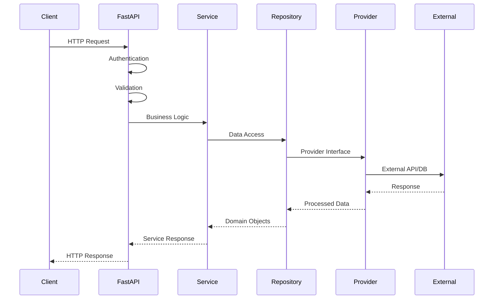

### 2. Conversation Processing Flow

The conversation processing flow is the heart of the chatbot system, handling user messages and generating intelligent responses through the conversation engine architecture.

#### Conversation Flow Components

**Context Management**:
- User session tracking and conversation history
- User preferences and metadata management
- Document context and relevance tracking

**Intent Classification**:
- LLM-powered intent analysis
- Query type determination (document QA, complaints, general info)
- Confidence scoring for classification accuracy

**Information Retrieval**:
- Vector-based document search for relevant context
- Semantic similarity matching
- Multi-source information aggregation

**Response Generation**:
- Context-aware response generation using LLMs
- Response formatting and enhancement
- Source attribution and confidence scoring

**Quality Assurance**:
- Response validation and safety checks
- Fact verification against source documents
- Inappropriate content filtering

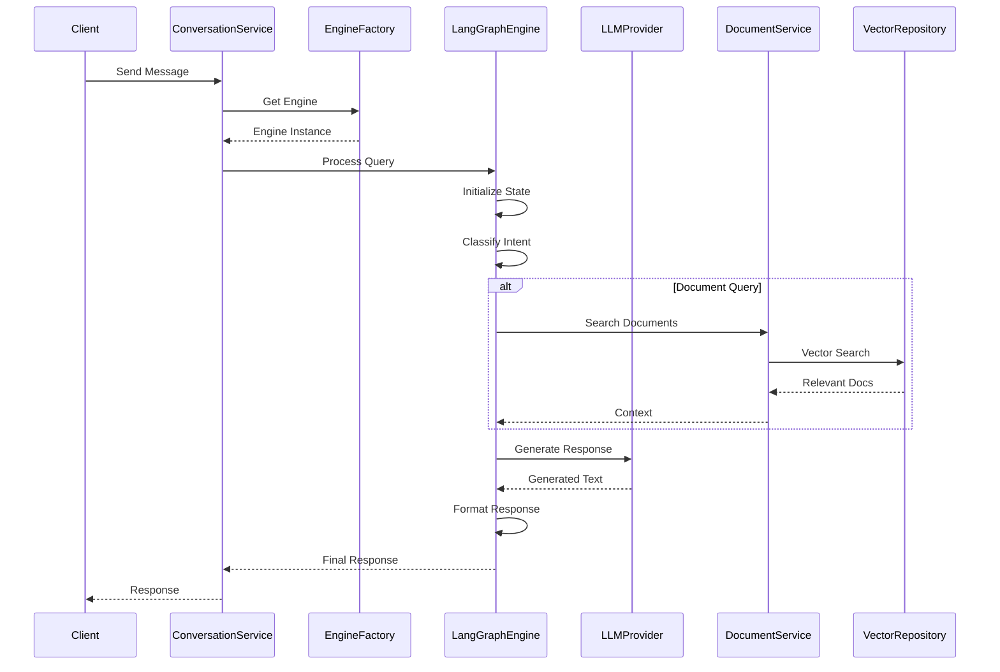

### Data Flow Optimization

#### Performance Optimizations
- **Connection Pooling**: Database and API connections are pooled for efficiency
- **Caching Strategies**: Frequently accessed data is cached at multiple levels
- **Async Processing**: Non-blocking I/O operations for better concurrency
- **Batch Operations**: Multiple operations are batched when possible

#### Error Handling and Resilience
- **Circuit Breaker Pattern**: Prevents cascading failures in external service calls
- **Retry Logic**: Automatic retry with exponential backoff for transient failures
- **Fallback Mechanisms**: Graceful degradation when services are unavailable
- **Timeout Management**: Appropriate timeouts to prevent hanging requests

#### Monitoring and Observability
- **Request Tracing**: End-to-end request tracing for debugging
- **Performance Metrics**: Response times, throughput, and error rates
- **Health Checks**: Continuous monitoring of system components
- **Structured Logging**: Contextual logging for better debugging

## Conversation Engine Architecture

The conversation engine is the intelligent core of the University Chatbot system, responsible for understanding user intents, retrieving relevant information, and generating contextually appropriate responses. The architecture is built on the principle of modularity, allowing for different conversation engines to be plugged in based on requirements.

### Engine Design Philosophy

The conversation engine architecture follows several key design principles:

- **Provider Agnosticism**: The engine can work with different LLM providers, vector databases, and storage systems
- **Workflow Orchestration**: Complex conversation flows are managed through a graph-based workflow system
- **State Management**: Conversation state is maintained throughout the interaction process
- **Modular Processing**: Individual processing steps are isolated and can be tested independently
- **Extensibility**: New processing nodes and workflows can be added without affecting existing functionality

### 1. LangGraph Engine Structure

The LangGraph engine represents the current implementation of the conversation engine interface, built on the LangGraph framework for workflow orchestration. This engine provides sophisticated conversation management through a graph-based approach.

#### Core Components

**Engine Coordinator**:
- **Purpose**: Main orchestrator that manages the entire conversation process
- **Responsibilities**: 
  - Initialize conversation state
  - Coordinate workflow execution
  - Manage error handling and recovery
  - Provide health monitoring capabilities
- **Integration**: Works with all other engine components to deliver cohesive conversation experience

**Workflow Management**:
- **Chat Workflow**: Defines the sequence of operations for processing user queries
- **State Manager**: Maintains conversation state throughout the workflow
- **Conditional Routing**: Dynamically routes conversation flow based on user intent and context

**Processing Nodes**:
- **Classification Node**: Analyzes user input to determine intent and query type
- **Document Search Node**: Performs semantic search on document knowledge base
- **Complaint Processing Node**: Handles complaint submission and validation
- **Response Formatting Node**: Generates and formats the final response

**Tools Layer**:
- **Document Tools**: Interface with document services for search and retrieval
- **User Tools**: Manage user authentication and profile operations
- **Complaint Tools**: Handle complaint processing and validation

**State Management**:
- **Conversation State**: Central state object that flows through the workflow
- **State Schema**: Defines the structure and validation rules for conversation state
- **State Transitions**: Manages how state changes between workflow steps

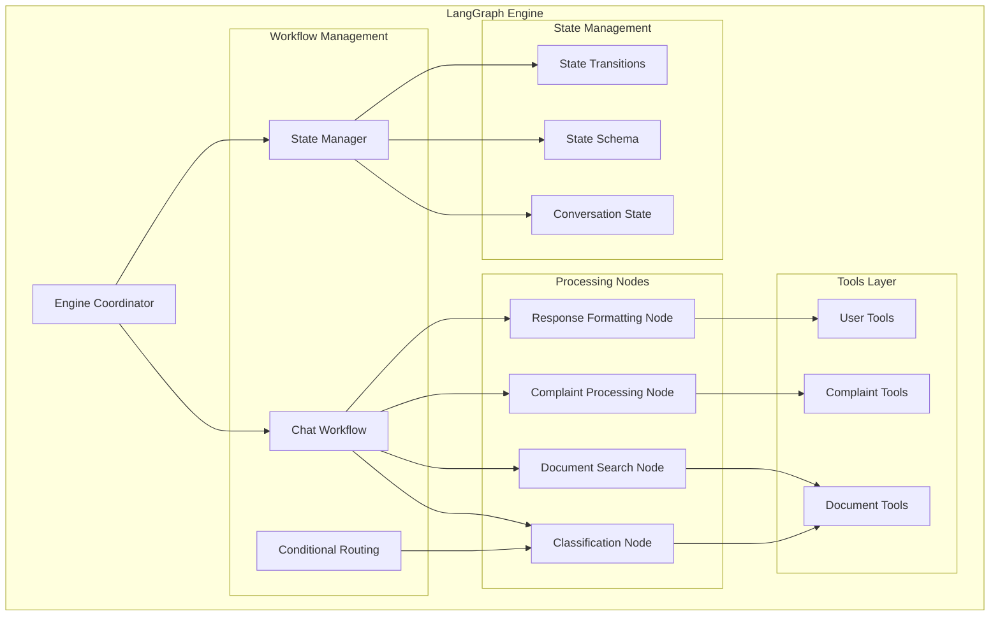

### 2. Workflow Execution

The workflow execution process defines how user queries are processed through the various stages of the conversation engine. Each stage has specific responsibilities and can branch based on the determined user intent.

#### Workflow Stages

**Initialization Phase**:
- **User Query Processing**: Parse and validate incoming user message
- **Context Loading**: Retrieve conversation history and user metadata
- **State Initialization**: Create initial conversation state object
- **Session Management**: Maintain or create user session

**Classification Phase**:
- **Intent Analysis**: Use LLM to analyze user intent and determine query type
- **Confidence Scoring**: Assign confidence scores to classification results
- **Context Consideration**: Factor in conversation history for better classification
- **Routing Decision**: Determine which processing path to follow

**Processing Phase**:
The processing phase branches based on the classified intent:

- **Document QA Path**: 
  - Semantic search on document knowledge base
  - Context retrieval and ranking
  - Relevance filtering based on similarity thresholds
  
- **Complaint Submission Path**:
  - Data validation and structure verification
  - Complaint categorization and priority assignment
  - Integration with complaint management system
  
- **General Information Path**:
  - General knowledge processing
  - University-specific information retrieval
  - FAQ matching and response generation
  
- **Procedure Help Path**:
  - Step-by-step procedure guidance
  - Interactive assistance for complex processes
  - Progress tracking and checkpoint management

**Response Generation Phase**:
- **Context Integration**: Combine retrieved information with user query
- **Response Generation**: Use LLM to generate contextually appropriate response
- **Quality Assurance**: Validate response for accuracy and appropriateness
- **Metadata Enrichment**: Add sources, confidence scores, and suggested actions

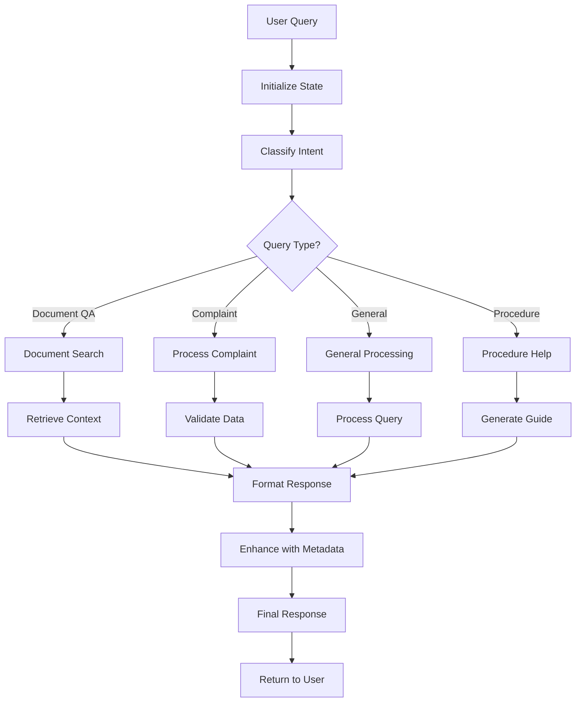

### Engine Capabilities and Features

#### Advanced Features
- **Multi-turn Conversations**: Maintains context across multiple conversation turns
- **Conversation Memory**: Remembers important information from previous interactions
- **Intent Refinement**: Improves intent classification based on user feedback
- **Dynamic Workflow Adaptation**: Adjusts workflow based on conversation patterns

#### Error Handling and Recovery
- **Graceful Degradation**: Provides fallback responses when primary processing fails
- **Error Recovery**: Attempts to recover from errors at each workflow stage
- **User Feedback Integration**: Learns from user corrections and feedback
- **Monitoring and Alerting**: Comprehensive monitoring of engine performance and errors

#### Performance Optimizations
- **Parallel Processing**: Executes independent workflow nodes in parallel
- **Caching Strategies**: Caches frequently accessed information and responses
- **Resource Management**: Optimizes memory and CPU usage for large-scale deployment
- **Load Balancing**: Distributes processing load across multiple engine instances

## Provider System

The provider system is a cornerstone of the University Chatbot's architecture, implementing the Strategy pattern to enable seamless switching between different external service providers. This system ensures vendor independence, facilitates testing, and provides flexibility in choosing the best services for different environments.

### Provider Architecture Philosophy

The provider system is built on several key principles:

- **Abstraction**: All external services are accessed through well-defined interfaces
- **Interchangeability**: Providers can be swapped without changing application logic
- **Configuration-Driven**: Provider selection is controlled through environment variables
- **Graceful Degradation**: System continues functioning even when some providers are unavailable
- **Performance Optimization**: Providers implement caching, connection pooling, and other optimizations

### 1. Provider Architecture

The provider architecture consists of four main categories, each addressing specific system needs:

#### LLM Providers
Language Model providers handle all AI-powered text generation and understanding tasks:

**OpenAI Provider**:
- **Models Supported**: GPT-4, GPT-3.5 Turbo, text-embedding-ada-002
- **Features**: Chat completions, embeddings, function calling
- **Optimization**: Request batching, token management, streaming responses
- **Use Cases**: Primary conversation processing, intent classification, response generation

**Anthropic Provider**:
- **Models Supported**: Claude 3 family (Haiku, Sonnet, Opus)
- **Features**: Large context windows, safety-focused responses
- **Advantages**: Strong reasoning capabilities, ethical AI alignment
- **Use Cases**: Complex reasoning tasks, safety-critical responses

**Azure OpenAI Provider**:
- **Benefits**: Enterprise security, compliance, regional data residency
- **Features**: Same OpenAI models with enterprise features
- **Use Cases**: Enterprise deployments requiring specific compliance

**Local LLM Provider**:
- **Purpose**: On-premises deployment, cost optimization, data privacy
- **Models**: Llama 2, Mistral, other open-source models
- **Benefits**: No external API calls, complete data control

#### Database Providers
Database providers handle all data persistence and retrieval operations:

**Supabase Provider**:
- **Features**: PostgreSQL with real-time subscriptions, built-in auth
- **Benefits**: Rapid development, integrated features, excellent developer experience
- **Use Cases**: Primary database for most deployments

**PostgreSQL Provider**:
- **Features**: Direct PostgreSQL connection, maximum flexibility
- **Benefits**: Full control over database configuration and optimization
- **Use Cases**: Custom deployments, specific performance requirements

**MongoDB Provider**:
- **Features**: Document-based storage, flexible schema
- **Benefits**: Rapid prototyping, handling of unstructured data
- **Use Cases**: Document metadata storage, flexible data models

#### Storage Providers
Storage providers manage file uploads, document storage, and media handling:

**Supabase Storage**:
- **Features**: S3-compatible API, integrated with Supabase ecosystem
- **Benefits**: Seamless integration, built-in CDN, automatic optimization
- **Use Cases**: Primary file storage for most deployments

**AWS S3 Provider**:
- **Features**: Industry-standard object storage, extensive ecosystem
- **Benefits**: Unlimited scalability, global distribution, enterprise features
- **Use Cases**: Large-scale deployments, multi-region applications

**Google Cloud Storage**:
- **Features**: Google's object storage with machine learning integration
- **Benefits**: AI/ML capabilities, global infrastructure
- **Use Cases**: Google Cloud deployments, AI-enhanced workflows

#### Vector Providers
Vector providers handle embedding storage and similarity search operations:

**pgvector Provider**:
- **Features**: PostgreSQL extension for vector operations
- **Benefits**: Single database for all data, ACID compliance, familiar SQL interface
- **Use Cases**: Integrated deployments, transactional consistency requirements

**Pinecone Provider**:
- **Features**: Purpose-built vector database, optimized for similarity search
- **Benefits**: High-performance search, automatic scaling, advanced indexing
- **Use Cases**: Large-scale vector search, high-performance requirements

**Weaviate Provider**:
- **Features**: Open-source vector database with semantic search
- **Benefits**: GraphQL API, hybrid search capabilities, schema flexibility
- **Use Cases**: Complex search requirements, open-source deployments

```mermaid
graph TB
    subgraph "Provider Interfaces"
        IFACE_LLM[LLMProvider Interface]
        IFACE_DB[DatabaseProvider Interface]
        IFACE_STORAGE[StorageProvider Interface]
        IFACE_VECTOR[VectorProvider Interface]
    end
    
    subgraph "LLM Providers"
        OPENAI[OpenAI Provider]
        ANTHROPIC[Anthropic Provider]
        AZURE[Azure OpenAI Provider]
        LOCAL[Local LLM Provider]
    end
    
    subgraph "Database Providers"
        SUPABASE[Supabase Provider]
        POSTGRES[PostgreSQL Provider]
        MONGODB[MongoDB Provider]
    end
    
    subgraph "Storage Providers"
        SUPABASE_STORAGE[Supabase Storage]
        AWS_S3[AWS S3 Provider]
        GCS[Google Cloud Storage]
    end
    
    subgraph "Vector Providers"
        PGVECTOR[pgvector Provider]
        PINECONE[Pinecone Provider]
        WEAVIATE[Weaviate Provider]
    end
    
    IFACE_LLM -.-> OPENAI
    IFACE_LLM -.-> ANTHROPIC
    IFACE_LLM -.-> AZURE
    IFACE_LLM -.-> LOCAL
    
    IFACE_DB -.-> SUPABASE
    IFACE_DB -.-> POSTGRES
    IFACE_DB -.-> MONGODB
    
    IFACE_STORAGE -.-> SUPABASE_STORAGE
    IFACE_STORAGE -.-> AWS_S3
    IFACE_STORAGE -.-> GCS
    
    IFACE_VECTOR -.-> PGVECTOR
    IFACE_VECTOR -.-> PINECONE
    IFACE_VECTOR -.-> WEAVIATE
```

### 2. Provider Selection Strategy

The provider selection strategy ensures that the most appropriate providers are chosen for each environment and use case, while maintaining system stability and performance.

#### Environment-Based Selection

**Development Environment**:
- **Purpose**: Rapid development and testing
- **LLM Provider**: OpenAI (fast iteration, good documentation)
- **Database**: Supabase (easy setup, integrated features)
- **Storage**: Supabase Storage (seamless integration)
- **Vector**: pgvector (simple setup, single database)

**Testing Environment**:
- **Purpose**: Automated testing and CI/CD
- **LLM Provider**: Mock providers (predictable responses, no API costs)
- **Database**: SQLite or in-memory (fast, isolated tests)
- **Storage**: Local filesystem (no external dependencies)
- **Vector**: In-memory vector store (fast, isolated)

**Staging Environment**:
- **Purpose**: Pre-production validation
- **LLM Provider**: Same as production (realistic testing)
- **Database**: Scaled-down production setup
- **Storage**: Production-like storage with smaller capacity
- **Vector**: Same as production (realistic performance testing)

**Production Environment**:
- **Purpose**: Live system serving real users
- **LLM Provider**: Based on performance, cost, and compliance requirements
- **Database**: High-availability setup with replication
- **Storage**: Scalable cloud storage with CDN
- **Vector**: High-performance vector database with clustering

#### Selection Criteria

**Performance Considerations**:
- **Latency Requirements**: Choose providers with lowest latency for critical paths
- **Throughput Needs**: Select providers that can handle expected load
- **Scalability**: Ensure providers can scale with system growth
- **Availability**: Choose providers with appropriate SLA guarantees

**Cost Optimization**:
- **API Costs**: Balance features with per-request costs
- **Storage Costs**: Consider data volume and access patterns
- **Compute Costs**: Factor in processing and hosting costs
- **Total Cost of Ownership**: Include operational and maintenance costs

**Compliance Requirements**:
- **Data Residency**: Ensure data stays in required geographic regions
- **Security Standards**: Meet industry-specific security requirements
- **Audit Trail**: Maintain required audit and compliance logs
- **Privacy Regulations**: Comply with GDPR, CCPA, and other privacy laws

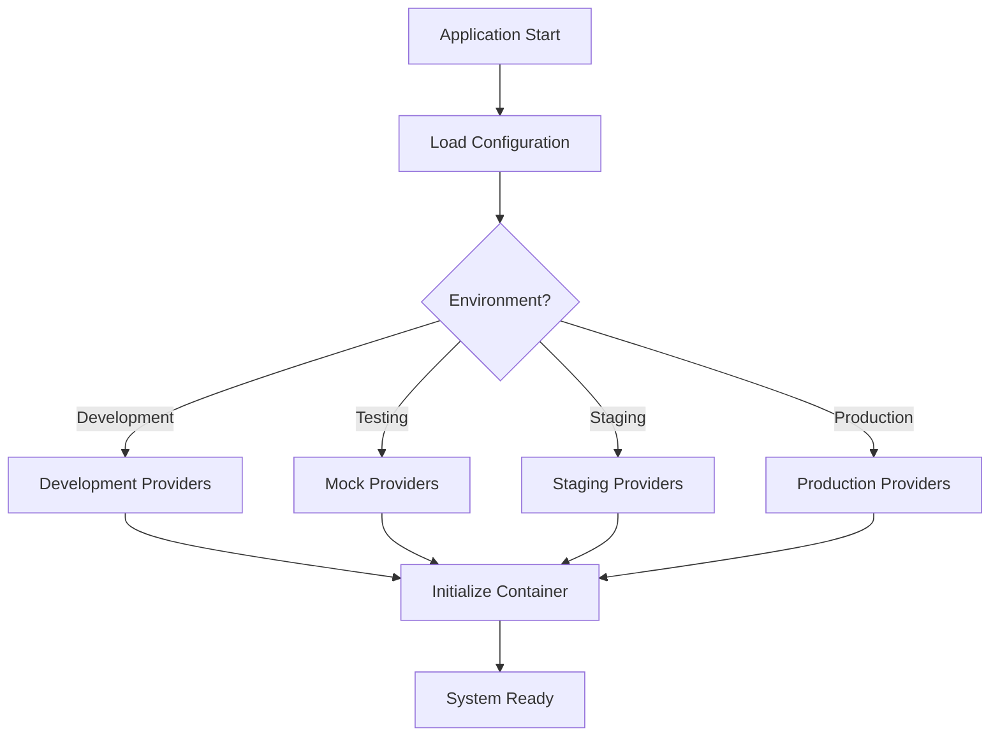

### Provider Management Features

#### Health Monitoring
- **Continuous Health Checks**: Regular monitoring of provider availability and performance
- **Automatic Failover**: Switch to backup providers when primary providers fail
- **Performance Metrics**: Track response times, error rates, and resource usage
- **Alert Systems**: Notify operations team of provider issues

#### Configuration Management
- **Environment Variables**: Provider selection through configuration
- **Runtime Switching**: Change providers without system restart
- **A/B Testing**: Run multiple providers simultaneously for comparison
- **Feature Flags**: Enable/disable provider features dynamically

#### Cost Management
- **Usage Tracking**: Monitor API calls, storage usage, and costs
- **Budget Alerts**: Notify when approaching cost thresholds
- **Cost Optimization**: Automatically choose cost-effective providers
- **Usage Analytics**: Detailed breakdown of provider costs and usage patterns

## Service Layer

The service layer implements the business logic of the University Chatbot system, providing a clean separation between the API layer and data access layer. This layer encapsulates all business rules, workflows, and cross-cutting concerns, ensuring that complex operations are properly organized and reusable.

### Service Layer Architecture

The service layer is organized into two main categories: core business services and cross-cutting services. Each service has a specific domain of responsibility and communicates with other services through well-defined interfaces.

#### Core Business Services

**User Service (`app/services/user_service.py`)**:
- **Primary Responsibilities**:
  - User authentication and authorization
  - User profile management and updates
  - Permission validation and role-based access control
  - User session management and tracking
- **Key Features**:
  - JWT token generation and validation
  - Password hashing and security
  - User preference management
  - Activity logging and audit trails
- **Integration Points**:
  - Authentication middleware for request validation
  - Conversation service for user context
  - Audit logging for security compliance

**Conversation Service (`app/services/conversation_service.py`)**:
- **Primary Responsibilities**:
  - Orchestrate conversation processing through engines
  - Manage conversation history and context
  - Handle multi-turn conversation flows
  - Provide conversation analytics and insights
- **Key Features**:
  - Engine factory integration for provider-agnostic processing
  - Conversation state management across multiple turns
  - Context enrichment with user preferences and history
  - Performance monitoring and optimization
- **Integration Points**:
  - Conversation engine factory for processing
  - User service for authentication and context
  - Document service for information retrieval

**Document Service (`app/services/document_service.py`)**:
- **Primary Responsibilities**:
  - Document ingestion and processing workflows
  - Semantic search and information retrieval
  - Document metadata management
  - Content extraction and chunking
- **Key Features**:
  - Multi-format document processing (PDF, DOCX, TXT, HTML)
  - Intelligent text chunking with overlap management
  - Vector embedding generation and storage
  - Search result ranking and relevance scoring
- **Integration Points**:
  - Embedding service for vector generation
  - Vector repository for similarity search
  - Storage providers for file management

**Complaint Service (`app/services/complaint_service.py`)**:
- **Primary Responsibilities**:
  - Complaint submission and validation
  - Complaint categorization and priority assignment
  - Workflow management for complaint resolution
  - Status tracking and notifications
- **Key Features**:
  - Structured data validation for complaint forms
  - Automatic categorization using AI classification
  - Integration with university complaint management systems
  - Email notifications and status updates
- **Integration Points**:
  - User service for complaint attribution
  - Conversation engine for natural language complaint extraction
  - External university systems for complaint routing

**Embedding Service (`app/services/embedding_service.py`)**:
- **Primary Responsibilities**:
  - Vector embedding generation for text content
  - Embedding model management and optimization
  - Batch processing for large document sets
  - Embedding quality monitoring and validation
- **Key Features**:
  - Support for multiple embedding models
  - Efficient batch processing with rate limiting
  - Embedding caching and optimization
  - Quality metrics and monitoring
- **Integration Points**:
  - LLM providers for embedding generation
  - Vector repository for storage and retrieval
  - Document service for content processing

#### Cross-Cutting Services

**Authentication Service**:
- **Purpose**: Centralized authentication and authorization logic
- **Features**: JWT management, session handling, multi-factor authentication
- **Benefits**: Consistent security across all endpoints

**Cache Service**:
- **Purpose**: Distributed caching for performance optimization
- **Features**: Redis integration, cache invalidation strategies, TTL management
- **Benefits**: Reduced database load, improved response times

**Monitoring Service**:
- **Purpose**: Application performance monitoring and metrics collection
- **Features**: Custom metrics, health checks, performance tracking
- **Benefits**: Operational visibility, proactive issue detection

**Validation Service**:
- **Purpose**: Centralized data validation and sanitization
- **Features**: Schema validation, input sanitization, business rule validation
- **Benefits**: Consistent data quality, security enhancement

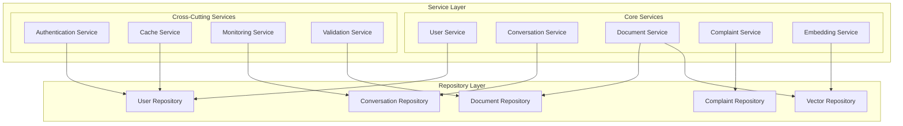

### 2. Service Interactions

Service interactions are designed to be efficient, reliable, and maintainable. The interaction patterns follow established enterprise patterns and best practices.

#### Interaction Patterns

**Service Orchestration**:
- Services coordinate complex business processes
- Each service maintains its own domain responsibilities
- Cross-service communications are minimized and well-defined
- Transaction boundaries are clearly established

**Event-Driven Communication**:
- Services communicate through events for loose coupling
- Asynchronous processing for non-critical operations
- Event sourcing for audit trails and debugging
- Eventual consistency for distributed operations

**Circuit Breaker Pattern**:
- Services implement circuit breakers for external dependencies
- Graceful degradation when downstream services are unavailable
- Automatic recovery and health monitoring
- Fallback strategies for critical operations

#### Performance Optimization

**Caching Strategies**:
- **Service-Level Caching**: Frequently accessed business objects
- **Query Result Caching**: Expensive database queries
- **API Response Caching**: Cacheable API responses
- **Distributed Caching**: Shared cache across service instances

**Async Processing**:
- Non-blocking I/O operations for better concurrency
- Background task processing for time-intensive operations
- Queue-based processing for scalability
- Real-time processing for critical operations

**Connection Management**:
- Connection pooling for database and external API connections
- Connection health monitoring and automatic recovery
- Resource cleanup and lifecycle management
- Load balancing across connection pools

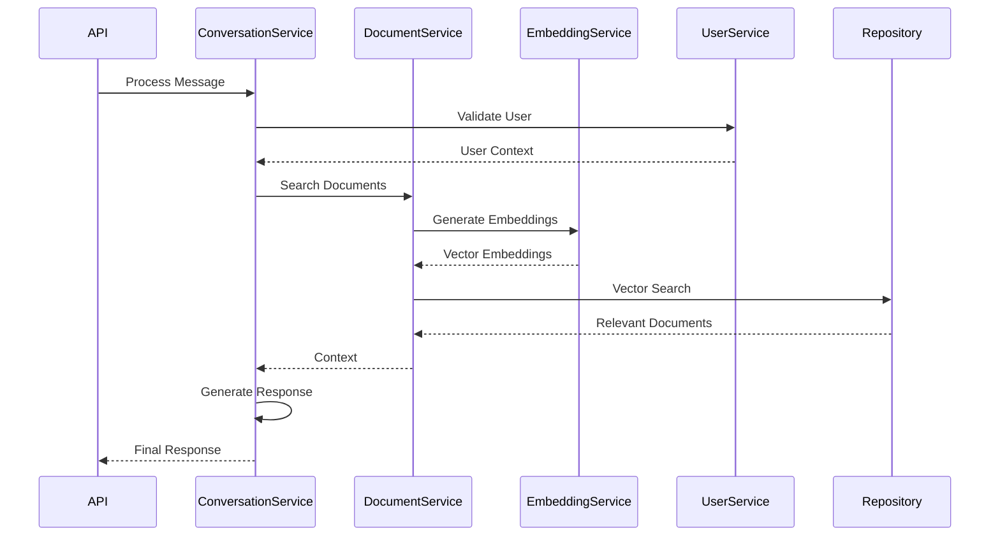

### Service Design Principles

#### Domain-Driven Design
- **Bounded Contexts**: Each service operates within a well-defined domain boundary
- **Domain Models**: Rich domain models that encapsulate business logic
- **Ubiquitous Language**: Consistent terminology across service interfaces
- **Aggregate Roots**: Clear entity relationships and transaction boundaries

#### SOLID Principles
- **Single Responsibility**: Each service has one reason to change
- **Open/Closed**: Services are open for extension, closed for modification
- **Liskov Substitution**: Service interfaces can be substituted without breaking clients
- **Interface Segregation**: Clients depend only on interfaces they use
- **Dependency Inversion**: Services depend on abstractions, not concretions

#### Error Handling and Resilience
- **Structured Error Responses**: Consistent error format across all services
- **Error Recovery**: Automatic retry mechanisms with exponential backoff
- **Graceful Degradation**: Partial functionality when dependencies are unavailable
- **Comprehensive Logging**: Detailed logging for debugging and monitoring

#### Testing Strategy
- **Unit Testing**: Individual service method testing with mocks
- **Integration Testing**: Service interaction testing with real dependencies
- **Contract Testing**: Interface contract validation between services
- **Load Testing**: Performance testing under realistic load conditions

## Database Architecture

The database architecture of the University Chatbot system is designed for scalability, performance, and data integrity. The system uses a hybrid approach combining relational data management with vector search capabilities, providing both transactional consistency and advanced semantic search features.

### Database Design Philosophy

The database architecture follows several key principles:

- **Single Source of Truth**: All data has a clear primary location and ownership
- **ACID Compliance**: Critical operations maintain transactional consistency
- **Scalability**: Schema and indexes designed for horizontal and vertical scaling
- **Performance**: Optimized queries and efficient data access patterns
- **Extensibility**: Schema can evolve without breaking existing functionality
- **Data Integrity**: Comprehensive constraints and validation rules

### 1. Database Schema

The database schema is organized around core business entities with clear relationships and well-defined boundaries. The schema supports both operational workloads and analytical queries.

#### Core Entities

**Users Table**:
- **Purpose**: Central user management and authentication
- **Key Fields**:
  - `id`: UUID primary key for global uniqueness
  - `email`: Unique identifier for authentication
  - `name`: User display name
  - `role`: Role-based access control (student, staff, admin)
  - `metadata`: JSON field for extensible user properties
- **Indexes**: Email unique index, role index for access control queries
- **Relationships**: One-to-many with conversations and complaints

**Conversations Table**:
- **Purpose**: Conversation session management and organization
- **Key Fields**:
  - `id`: UUID primary key
  - `user_id`: Foreign key to users table
  - `title`: Conversation title (auto-generated or user-defined)
  - `session_id`: Grouping identifier for related conversations
  - `type`: Conversation category (general, document_qa, complaint)
  - `metadata`: JSON field for conversation-specific data
- **Indexes**: User_id index, session_id index, type index for filtering
- **Relationships**: Belongs to user, has many messages

**Messages Table**:
- **Purpose**: Individual message storage with full conversation history
- **Key Fields**:
  - `id`: UUID primary key
  - `conversation_id`: Foreign key to conversations table
  - `content`: Message text content
  - `role`: Message sender (user, assistant, system)
  - `metadata`: JSON field for message-specific data (sources, confidence, etc.)
- **Indexes**: Conversation_id index, role index, created_at index for chronological queries
- **Relationships**: Belongs to conversation, may reference documents

**Documents Table**:
- **Purpose**: Document metadata and content management
- **Key Fields**:
  - `id`: UUID primary key
  - `title`: Document title or filename
  - `content`: Full text content for search
  - `file_path`: Storage location reference
  - `content_type`: MIME type for file handling
  - `metadata`: JSON field for document properties
  - `embedding`: Vector embedding for semantic search (using pgvector)
- **Indexes**: Title index, content_type index, vector index for similarity search
- **Relationships**: May be referenced by messages through metadata

**Complaints Table**:
- **Purpose**: Complaint submission and tracking system
- **Key Fields**:
  - `id`: UUID primary key
  - `user_id`: Foreign key to users table
  - `title`: Complaint summary
  - `description`: Detailed complaint description
  - `status`: Current status (submitted, in_progress, resolved, closed)
  - `priority`: Priority level (low, medium, high, urgent)
  - `metadata`: JSON field for additional complaint data
- **Indexes**: User_id index, status index, priority index for filtering and reporting
- **Relationships**: Belongs to user, may be referenced in conversations

#### Schema Features

**UUID Primary Keys**:
- Global uniqueness across distributed systems
- No sequential patterns for security
- Efficient replication and merging
- Future-proof for multi-database scenarios

**JSON Metadata Fields**:
- Flexible schema evolution without migrations
- Efficient storage of semi-structured data
- Native JSON querying capabilities in PostgreSQL
- Indexing support for frequently accessed JSON keys

**Vector Embeddings**:
- Native vector storage using pgvector extension
- Efficient similarity search with various distance metrics
- Index support for high-performance vector operations
- Integration with PostgreSQL's query optimizer

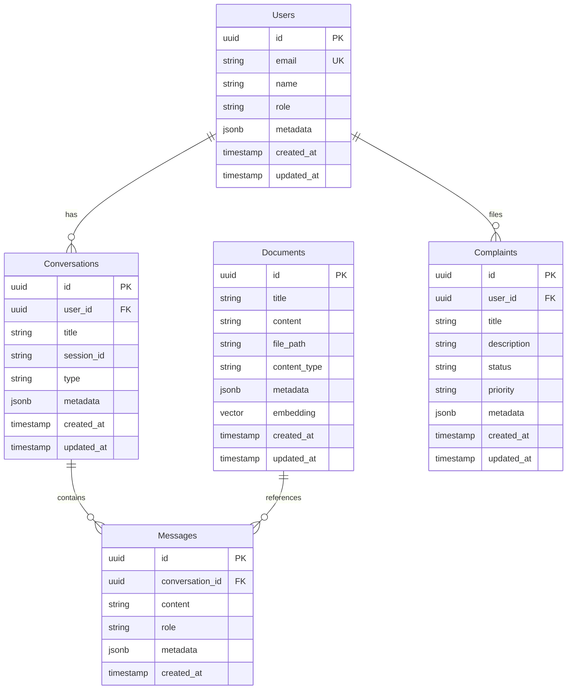

### 2. Data Access Pattern

The data access pattern implements the Repository pattern to provide a clean abstraction between the business logic and data persistence layers. This pattern enables testing, caching, and provider switching while maintaining data consistency.

#### Repository Pattern Implementation

**Base Repository (`app/repositories/base.py`)**:
- **Purpose**: Common data access operations and patterns
- **Features**:
  - CRUD operations with standardized interfaces
  - Query building and parameter binding
  - Transaction management and rollback handling
  - Connection pooling and resource management
  - Error handling and logging
- **Benefits**:
  - Consistent data access patterns across all entities
  - Centralized optimization and caching logic
  - Easy testing with mock implementations
  - Database provider independence

**Entity-Specific Repositories**:
Each entity has a specialized repository that extends the base repository:

- **User Repository**: User authentication, profile management, role queries
- **Conversation Repository**: Session management, conversation history, analytics
- **Document Repository**: Document search, metadata management, content operations
- **Complaint Repository**: Complaint submission, status tracking, reporting queries
- **Vector Repository**: Embedding storage, similarity search, index management

#### Database Provider Abstraction

**Provider Interface Benefits**:
- **Database Independence**: Switch between PostgreSQL, Supabase, or other providers
- **Testing Flexibility**: Use different databases for testing and production
- **Performance Optimization**: Provider-specific optimizations
- **Migration Support**: Gradual migration between database systems

**Connection Management**:
- **Connection Pooling**: Efficient resource utilization with configurable pool sizes
- **Health Monitoring**: Automatic detection and recovery from connection issues
- **Load Balancing**: Distribute queries across read replicas
- **Transaction Isolation**: Appropriate isolation levels for different operations

**Query Optimization**:
- **Prepared Statements**: Improved performance and security
- **Query Caching**: Cache expensive query results
- **Index Optimization**: Automatic index usage analysis and recommendations
- **Batch Operations**: Efficient bulk insert and update operations

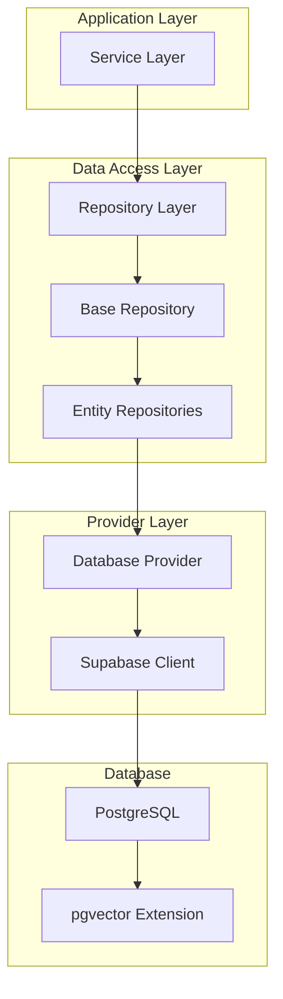

### Database Performance and Scalability

#### Performance Optimizations

**Indexing Strategy**:
- **Primary Indexes**: UUID primary keys with B-tree indexes
- **Foreign Key Indexes**: Efficient join operations
- **Composite Indexes**: Multi-column indexes for complex queries
- **Partial Indexes**: Filtered indexes for common query patterns
- **Vector Indexes**: Specialized indexes for similarity search (IVFFlat, HNSW)

**Query Optimization**:
- **Query Analysis**: Regular analysis of slow queries and optimization
- **Materialized Views**: Pre-computed aggregations for reporting
- **Query Plan Caching**: Reuse of execution plans for repeated queries
- **Parallel Queries**: Utilize multiple CPU cores for large operations

**Caching Strategies**:
- **Application-Level Caching**: Redis for frequently accessed data
- **Query Result Caching**: Cache expensive query results
- **Connection Caching**: Persistent connections to reduce overhead
- **Metadata Caching**: Cache schema information and query plans

#### Scalability Considerations

**Horizontal Scaling**:
- **Read Replicas**: Scale read operations across multiple database instances
- **Sharding Strategy**: Partition data across multiple databases if needed
- **Connection Pooling**: Manage connections efficiently across instances
- **Load Balancing**: Distribute database load intelligently

**Vertical Scaling**:
- **Resource Optimization**: Efficient use of CPU, memory, and storage
- **Connection Limits**: Appropriate connection pool sizing
- **Memory Configuration**: Optimized buffer sizes and cache settings
- **Storage Performance**: Fast SSD storage with appropriate IOPS

**Data Lifecycle Management**:
- **Data Archiving**: Move old data to cheaper storage
- **Data Retention**: Automated cleanup of expired data
- **Backup Strategy**: Regular backups with point-in-time recovery
- **Disaster Recovery**: Multi-region backup and recovery procedures

## API Architecture

### 1. API Structure

```mermaid
graph TB
    subgraph "API Layer"
        subgraph "API Versioning"
            V1[API v1]
            V2[API v2 (Future)]
        end
        
        subgraph "API Endpoints"
            AUTH[Authentication]
            USERS[Users]
            CONVERSATIONS[Conversations]
            DOCUMENTS[Documents]
            COMPLAINTS[Complaints]
            HEALTH[Health Check]
        end
        
        subgraph "Middleware"
            CORS[CORS Middleware]
            AUTH_MW[Auth Middleware]
            RATE_LIMIT[Rate Limiting]
            LOGGING[Request Logging]
        end
    end
    
    V1 --> AUTH
    V1 --> USERS
    V1 --> CONVERSATIONS
    V1 --> DOCUMENTS
    V1 --> COMPLAINTS
    V1 --> HEALTH
    
    CORS --> AUTH_MW
    AUTH_MW --> RATE_LIMIT
    RATE_LIMIT --> LOGGING
```

### 2. Request/Response Flow

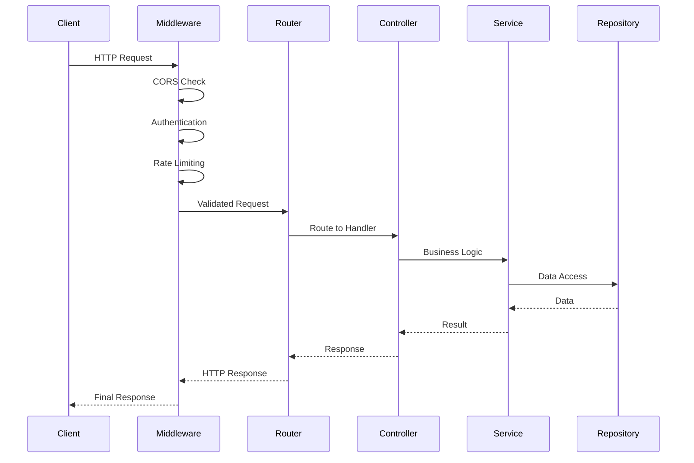

## Deployment Architecture

### 1. Container Architecture

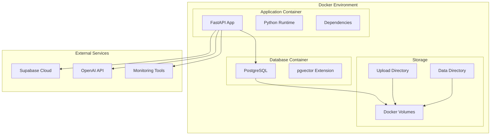

### 2. Production Deployment

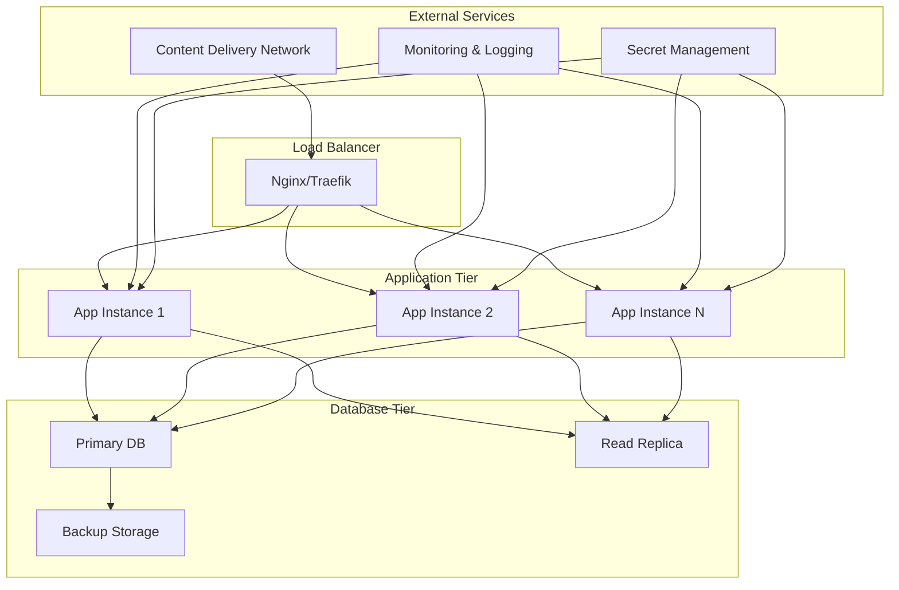

## Security Architecture

### 1. Security Layers

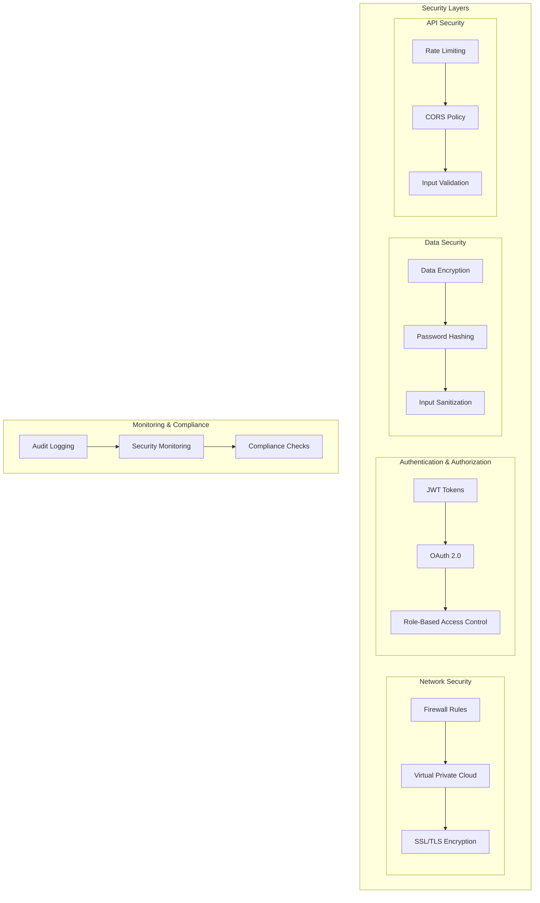

### 2. Authentication Flow

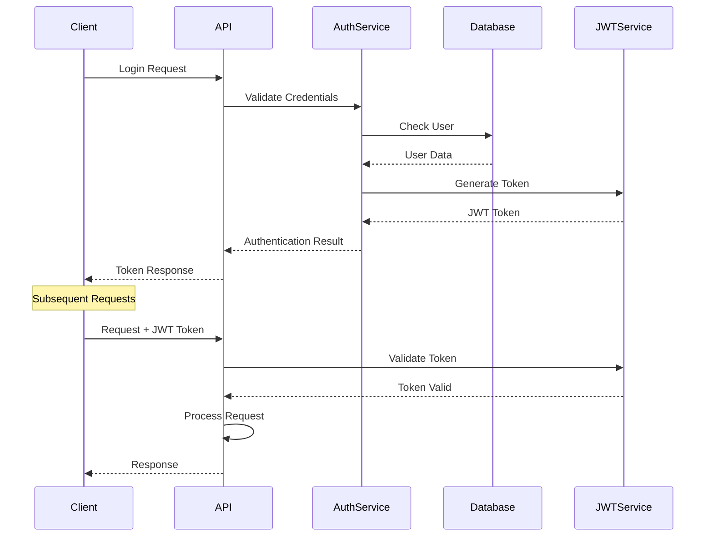

## Monitoring and Observability

### 1. Monitoring Architecture

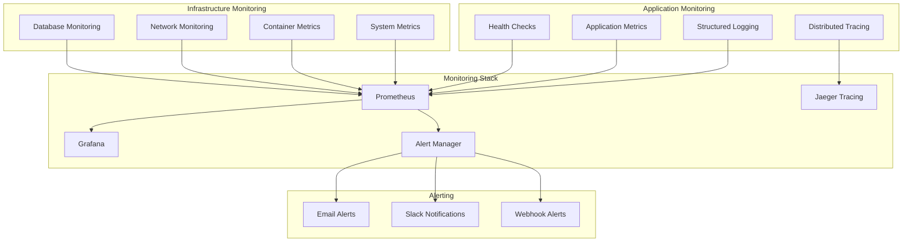

## Performance Considerations

### 1. Scalability Patterns

```mermaid
graph TB
    subgraph "Horizontal Scaling"
        LOAD_BALANCER[Load Balancer]
        APP_INSTANCES[Multiple App Instances]
        DATABASE_REPLICAS[Database Replicas]
    end
    
    subgraph "Caching Strategy"
        REDIS[Redis Cache]
        CDN[Content Delivery Network]
        APPLICATION_CACHE[Application Cache]
    end
    
    subgraph "Optimization"
        CONNECTION_POOLING[Connection Pooling]
        ASYNC_PROCESSING[Async Processing]
        BATCH_OPERATIONS[Batch Operations]
    end
    
    LOAD_BALANCER --> APP_INSTANCES
    APP_INSTANCES --> DATABASE_REPLICAS
    
    REDIS --> APPLICATION_CACHE
    CDN --> APPLICATION_CACHE
    
    CONNECTION_POOLING --> ASYNC_PROCESSING
    ASYNC_PROCESSING --> BATCH_OPERATIONS
```

## Conclusion

The University Chatbot system architecture represents a sophisticated, production-ready solution that balances complexity with maintainability, performance with flexibility, and innovation with reliability. The architecture demonstrates how modern software engineering principles can be applied to create a robust AI-powered system.

### Architectural Achievements

#### Technical Excellence
The system successfully implements several advanced architectural patterns:

- **Provider-Agnostic Design**: Complete abstraction of external dependencies enables vendor independence and easy testing
- **Modular Architecture**: Clean separation of concerns with well-defined interfaces and responsibilities
- **Conversation Engine Framework**: Sophisticated workflow orchestration using LangGraph for complex conversation management
- **Multi-Provider Support**: Seamless integration with multiple LLM, database, and storage providers
- **Advanced Vector Operations**: Integrated semantic search with pgvector for intelligent document retrieval

#### Scalability and Performance
The architecture is designed for enterprise-scale deployment:

- **Horizontal Scaling**: Stateless design allows easy scaling across multiple instances
- **Performance Optimization**: Connection pooling, caching strategies, and async processing
- **Resource Efficiency**: Optimized database queries, lazy loading, and efficient memory management
- **Load Distribution**: Support for load balancers, read replicas, and CDN integration

#### Security and Compliance
Security is built into every layer of the architecture:

- **Multi-Layer Security**: Network, application, and data-level security measures
- **Authentication & Authorization**: JWT-based auth with role-based access control
- **Data Protection**: Encryption at rest and in transit, input sanitization, and audit logging
- **Compliance Ready**: GDPR, CCPA compliance capabilities with data retention and deletion

#### Developer Experience
The architecture prioritizes developer productivity and maintainability:

- **Clear Abstractions**: Well-defined interfaces and contracts between components
- **Comprehensive Testing**: Unit, integration, and end-to-end testing capabilities
- **Documentation**: Extensive documentation with diagrams and examples
- **Development Tools**: Hot reloading, debugging tools, and comprehensive logging

### Business Value Delivered

#### Operational Efficiency
- **Automated Support**: Reduces manual workload for university administrative staff
- **24/7 Availability**: Continuous service without human intervention requirements
- **Consistent Responses**: Standardized information delivery reduces errors and confusion
- **Scalable Operations**: Handles varying load without proportional staffing increases

#### User Experience Enhancement
- **Intelligent Responses**: Context-aware, personalized assistance for students and staff
- **Multi-Channel Support**: Consistent experience across web, mobile, and API integrations
- **Quick Resolution**: Immediate responses to common queries and efficient complaint processing
- **Learning System**: Continuous improvement through conversation analysis and feedback

#### Cost Optimization
- **Resource Efficiency**: Optimized infrastructure usage through smart caching and scaling
- **Provider Flexibility**: Choose cost-effective providers without architectural changes
- **Operational Savings**: Reduced need for human support staff for routine queries
- **Future-Proof Investment**: Architecture adapts to new technologies without major rewrites

### Technology Stack Benefits

#### FastAPI Framework
- **Modern Python**: Leverages latest Python features with excellent performance
- **Automatic Documentation**: Self-documenting APIs with interactive exploration
- **Type Safety**: Pydantic integration ensures data validation and type safety
- **Async Support**: Native async/await support for high-concurrency scenarios

#### LangGraph Integration
- **Workflow Orchestration**: Graph-based conversation flows for complex interactions
- **State Management**: Sophisticated state handling for multi-turn conversations
- **Extensibility**: Easy addition of new conversation nodes and workflows
- **Debugging**: Visual workflow representation aids in debugging and optimization

#### PostgreSQL with pgvector
- **ACID Compliance**: Reliable transactions for critical business operations
- **Vector Search**: Native vector operations for semantic similarity
- **Mature Ecosystem**: Extensive tooling, monitoring, and optimization options
- **Scalability**: Proven performance at enterprise scale with read replicas

#### Supabase Integration
- **Rapid Development**: Accelerated development with built-in features
- **Real-time Capabilities**: Live updates for collaborative features
- **Built-in Auth**: Comprehensive authentication and authorization
- **Storage Integration**: Seamless file handling with CDN capabilities

### Future Roadmap and Extensibility

#### Planned Enhancements
- **Multi-Language Support**: Internationalization for diverse user base
- **Voice Interface**: Speech-to-text and text-to-speech capabilities
- **Advanced Analytics**: Deep conversation analytics and user behavior insights
- **Mobile Applications**: Native iOS and Android applications

#### Extensibility Points
- **New Conversation Engines**: Easy integration of alternative AI frameworks
- **Additional Providers**: Support for new LLM, database, and storage providers
- **Custom Workflows**: University-specific conversation flows and processes
- **Integration APIs**: Connect with existing university systems and databases

#### Technology Evolution
- **AI Model Upgrades**: Seamless migration to newer, more capable language models
- **Cloud Migration**: Easy deployment across different cloud providers
- **Microservices Transition**: Potential evolution to full microservices architecture
- **Real-time Features**: Enhanced real-time collaboration and communication

### Best Practices Demonstrated

#### Software Architecture
- **Domain-Driven Design**: Clear domain boundaries and ubiquitous language
- **SOLID Principles**: Maintainable, extensible, and testable code structure
- **Clean Architecture**: Dependency inversion and layered architecture
- **Pattern Implementation**: Proper use of Factory, Repository, and Strategy patterns

#### DevOps and Operations
- **Infrastructure as Code**: Containerized deployment with Docker
- **Monitoring and Observability**: Comprehensive logging, metrics, and health checks
- **Security First**: Security considerations integrated throughout the architecture
- **Documentation**: Living documentation that evolves with the system

#### AI and Machine Learning
- **Responsible AI**: Ethical considerations in AI implementation and usage
- **Model Management**: Proper versioning, monitoring, and fallback strategies
- **Data Privacy**: Privacy-preserving AI with appropriate data handling
- **Performance Optimization**: Efficient AI model usage and cost management

### Strategic Impact

The University Chatbot architecture serves as more than just a technical solution; it represents a strategic investment in the university's digital transformation. The system provides:

- **Competitive Advantage**: Modern, intelligent student services that enhance university reputation
- **Operational Excellence**: Streamlined administrative processes and improved efficiency
- **Innovation Platform**: Foundation for future AI-powered educational initiatives
- **Knowledge Management**: Centralized, searchable repository of university information

The architecture's flexibility and extensibility ensure that it can evolve with changing requirements, new technologies, and growing user needs, making it a sustainable long-term investment in the university's technological infrastructure.

This comprehensive architectural approach demonstrates how thoughtful design, modern technologies, and engineering best practices can be combined to create a system that not only meets current requirements but provides a solid foundation for future growth and innovation.
