# University Chatbot - System Architecture

## Overview

This document provides a comprehensive architectural overview of the University Chatbot system, featuring a **provider-agnostic, microservices-inspired design** with clean separation of concerns, dependency injection, and extensible interfaces.

**System Purpose**: The University Chatbot serves as an intelligent conversational interface for university stakeholders, providing instant access to institutional information, document search capabilities, complaint processing, and procedural guidance through natural language interactions.

**Architectural Philosophy**: Built on the principle of **provider independence**, the system can seamlessly switch between different LLM providers (OpenAI, Anthropic), database systems (Supabase, PostgreSQL), and conversation engines (LangGraph, LangChain) without requiring architectural changes. This approach ensures vendor flexibility, cost optimization, and future-proofing against technology evolution.

## Table of Contents

1. [High-Level Architecture](#high-level-architecture)
2. [Core Components](#core-components)
3. [Data Flow](#data-flow)
4. [Conversation Engine Architecture](#conversation-engine-architecture)
5. [Provider System](#provider-system)
6. [Service Layer](#service-layer)
7. [Database Architecture](#database-architecture)
8. [API Architecture](#api-architecture)
9. [Deployment Architecture](#deployment-architecture)
10. [Security Architecture](#security-architecture)
11. [Monitoring and Observability](#monitoring-and-observability)
12. [Performance Considerations](#performance-considerations)
13. [Conclusion](#conclusion)

## High-Level Architecture

The University Chatbot system follows a layered architecture pattern with clear separation of concerns, enabling maintainability, scalability, and testability. The architecture is designed around the principle of **provider agnosticism**, allowing for easy swapping of external services and implementations.

### Architectural Layers Overview

The system is organized into five distinct layers, each with specific responsibilities and clear boundaries:

1. **Client Layer**: User-facing interfaces and applications (Web, Mobile, API clients)
2. **API Gateway**: Request routing, middleware, and protocol handling with FastAPI
3. **Business Logic Layer**: Core application logic, conversation processing, and service orchestration
4. **Data Access Layer**: Database operations, data persistence, and repository pattern implementation
5. **Provider Layer**: External service integrations with abstraction interfaces for flexibility

**Layer Communication**: Each layer communicates only with adjacent layers through well-defined interfaces, ensuring loose coupling and maintainability. This design enables independent testing, scaling, and replacement of components without affecting other layers.

### Key Architectural Principles

- **Dependency Inversion**: High-level modules depend on abstractions, not concrete implementations, enabling easy provider swapping
- **Single Responsibility**: Each component has a single, well-defined purpose with clear boundaries and minimal side effects
- **Open/Closed Principle**: System is open for extension (new providers, features) but closed for modification of existing stable components
- **Interface Segregation**: Clients depend only on interfaces they use, reducing coupling and improving testability
- **Loose Coupling**: Components interact through interfaces with minimal direct dependencies, facilitating independent development and deployment

**Design Benefits**: These principles enable rapid development, easy testing with mocks, seamless provider migration, and system evolution without breaking existing functionality.

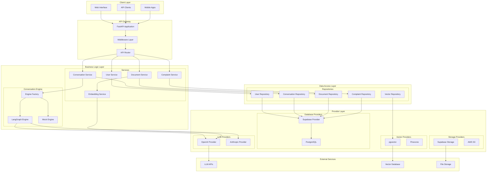

### Layer-by-Layer Analysis

#### 1. Client Layer
The client layer encompasses all user-facing interfaces that interact with the chatbot system through standardized REST APIs:

- **Web Interface**: Browser-based chat interface with real-time messaging, conversation history, and document upload capabilities
- **API Clients**: Direct API consumers including mobile applications, third-party integrations, and administrative tools
- **Mobile Apps**: Native iOS and Android applications with offline capability and push notifications (future enhancement)

**Communication Protocol**: All client interfaces use HTTP/HTTPS with JSON payloads, WebSocket for real-time messaging, and JWT authentication for secure access. The standardized API ensures consistent behavior across all platforms and simplifies client development.

#### 2. API Gateway
The API Gateway serves as the **single entry point** for all client requests, implementing cross-cutting concerns and request orchestration:

- **FastAPI Application**: Modern, high-performance Python web framework providing automatic OpenAPI documentation, request validation, and async processing
- **Middleware Layer**: Handles CORS policies, JWT authentication, rate limiting (prevents abuse), request/response logging, and error handling
- **API Router**: Intelligent request routing to appropriate service endpoints based on URL patterns, HTTP methods, and API versioning

**Performance Features**: Built-in request validation, automatic response caching for static content, connection pooling, and async request processing ensure optimal performance under high load.

#### 3. Business Logic Layer
This layer contains the **core application intelligence** and is divided into two main subsystems for clear separation of concerns:

**Services Subsystem** (Domain Logic):
- **User Service**: Manages authentication, user profiles, role-based permissions, and session management
- **Conversation Service**: Orchestrates chat interactions, maintains conversation context, and coordinates with conversation engines
- **Document Service**: Handles document ingestion, preprocessing, chunking for vector storage, and semantic search operations
- **Complaint Service**: Manages complaint submission workflows, validation, status tracking, and administrative processing
- **Embedding Service**: Generates and manages vector embeddings using various LLM providers for semantic search capabilities

**Conversation Engine Subsystem** (AI Processing):
- **Engine Factory**: Creates and manages different conversation engine implementations based on configuration (LangGraph, LangChain, Mock)
- **LangGraph Engine**: Primary conversation engine using LangGraph for complex workflow orchestration with state management
- **Mock Engine**: Lightweight testing and development engine providing controlled responses for isolated testing scenarios

**Inter-Service Communication**: Services communicate through well-defined interfaces with dependency injection, enabling easy testing and component replacement.

#### 4. Data Access Layer
The repository pattern is implemented to **abstract database operations** and provide a consistent data access interface:

- **User Repository**: User data persistence, authentication credential management, and profile retrieval with caching
- **Conversation Repository**: Chat history storage, session management, and conversation metadata with efficient pagination
- **Document Repository**: Document metadata storage, content indexing, and file relationship management
- **Complaint Repository**: Complaint data management with status tracking, assignment logic, and reporting capabilities
- **Vector Repository**: Vector embedding storage, similarity search operations, and efficient nearest-neighbor queries using pgvector

**Data Consistency**: All repositories implement transactional operations, optimistic locking for concurrent updates, and connection pooling for performance optimization.

#### 5. Provider Layer
This layer implements the **provider pattern** for external service integration with complete abstraction from implementation details:

- **LLM Providers**: OpenAI GPT models, Anthropic Claude, Azure OpenAI, and potential local LLM implementations with unified response formatting
- **Database Providers**: Supabase (primary), PostgreSQL direct connection, and future NoSQL support with consistent query interfaces
- **Storage Providers**: File storage solutions including Supabase Storage, AWS S3, Google Cloud Storage with unified upload/download APIs
- **Vector Providers**: Vector database implementations like pgvector (current), Pinecone, Weaviate with standardized similarity search operations

**Provider Benefits**: Easy A/B testing between providers, cost optimization through provider switching, vendor independence, and graceful fallback mechanisms for service reliability.

## Core Components

### 1. Application Layer

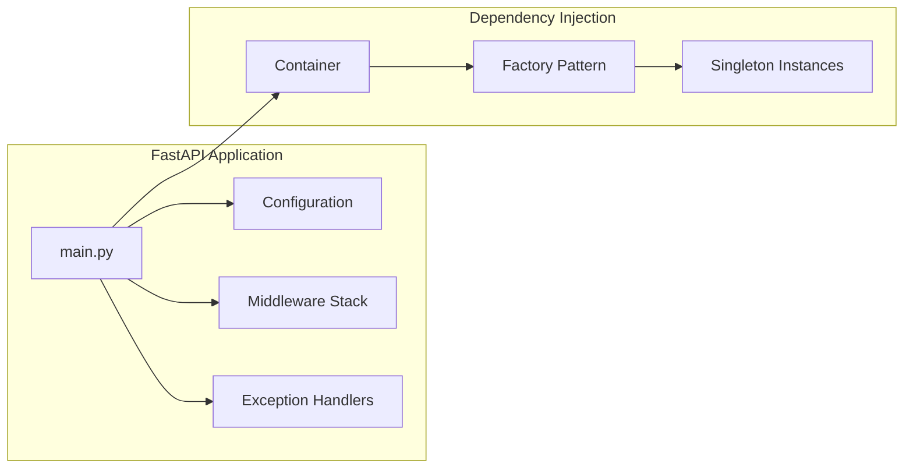

### 2. Interface Layer

The interface layer defines **abstract contracts** that enable provider independence and facilitate testing through dependency injection:

**Core Interface Categories**:
- **ConversationEngine**: Standardizes conversation processing across different AI frameworks (LangGraph, LangChain, custom implementations)
- **DatabaseProvider**: Abstracts database operations enabling seamless switching between Supabase, PostgreSQL, or other databases
- **StorageProvider**: Unifies file storage operations across cloud providers (Supabase Storage, AWS S3, Google Cloud Storage)
- **LLMProvider**: Standardizes language model interactions supporting multiple providers (OpenAI, Anthropic, Azure OpenAI, local models)

**Interface Benefits**:
- **Testability**: Easy mocking for unit tests without external dependencies
- **Flexibility**: Runtime provider selection based on environment or configuration
- **Maintainability**: Changes to implementations don't affect consuming code
- **Extensibility**: New providers can be added without modifying existing interfaces

**Implementation Strategy**:
- **Factory Pattern**: Dynamic provider instantiation based on configuration
- **Dependency Injection**: Automatic provider resolution and injection into services
- **Configuration-Driven**: Environment variables control which implementations are used
- **Graceful Fallbacks**: Automatic failover to backup providers when primary providers fail

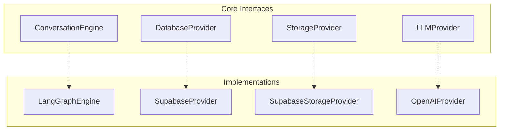

## Data Flow

### 1. Request Processing Flow

This sequence demonstrates the **complete request lifecycle** from client interaction to final response, showing how each architectural layer contributes to request processing:

**Flow Stages**:
1. **Client Request**: HTTP request with authentication headers and request payload
2. **API Gateway Processing**: CORS validation, JWT authentication, rate limiting, and request logging
3. **Service Layer**: Business logic execution, data validation, and orchestration of multiple services
4. **Repository Layer**: Database queries, data transformation, and caching operations
5. **Provider Integration**: External API calls with retry logic, timeout handling, and response processing
6. **Response Assembly**: Data aggregation, response formatting, and metadata attachment

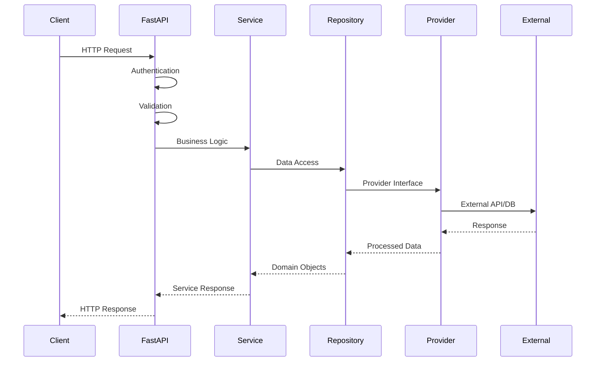

### 2. Conversation Processing Flow

This sequence illustrates the **sophisticated AI-powered conversation processing** pipeline, showcasing how the system intelligently routes and processes different types of user queries:

**Processing Stages**:
1. **Initial Assessment**: User message analysis and conversation context retrieval
2. **Engine Selection**: Factory pattern selects appropriate conversation engine based on configuration
3. **State Management**: Conversation state initialization with user context and history
4. **Intent Classification**: AI-powered analysis to determine query type (document search, complaint, general inquiry)
5. **Contextual Processing**: Based on intent, the system performs document search, data retrieval, or specialized processing
6. **Response Generation**: LLM-powered response generation with retrieved context and conversation history
7. **Quality Assurance**: Response validation, formatting, and metadata enrichment before delivery

**Intelligence Features**: The system maintains conversation context across interactions, learns from previous exchanges, and provides contextually relevant responses with source attribution.

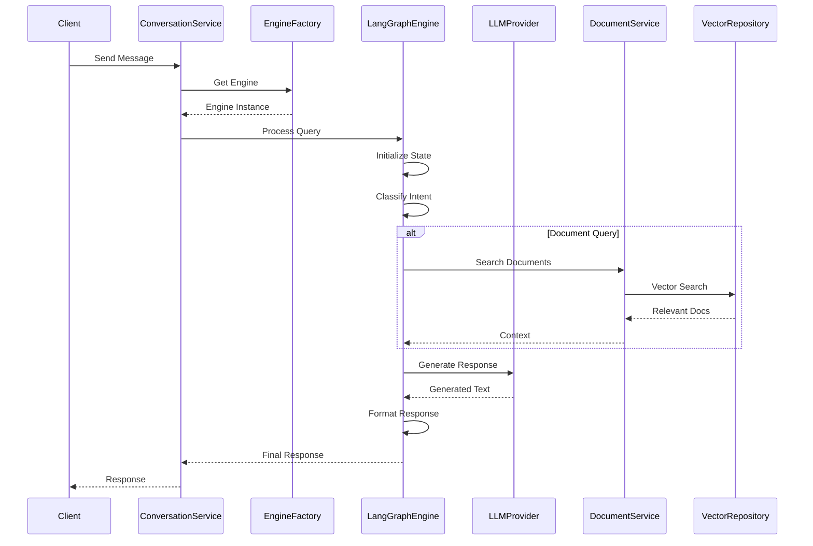

## Conversation Engine Architecture

### 1. LangGraph Engine Structure

The LangGraph Engine represents the **sophisticated AI orchestration layer** that manages complex conversation workflows with state-aware processing:

**Core Components**:
- **Engine Coordinator**: Central orchestrator that manages workflow execution, error handling, and resource allocation
- **Workflow Management**: Implements graph-based conversation flows with conditional routing based on user intent and context
- **Processing Nodes**: Modular processing units that handle specific conversation tasks (classification, search, response generation)
- **Tools Layer**: Service integration adapters that connect workflow nodes to business services
- **State Management**: Thread-safe conversation state that persists throughout the entire interaction lifecycle

**Workflow Intelligence**: The engine supports complex multi-turn conversations, maintains context across interactions, and can handle branching conversation paths based on user responses and system conditions.

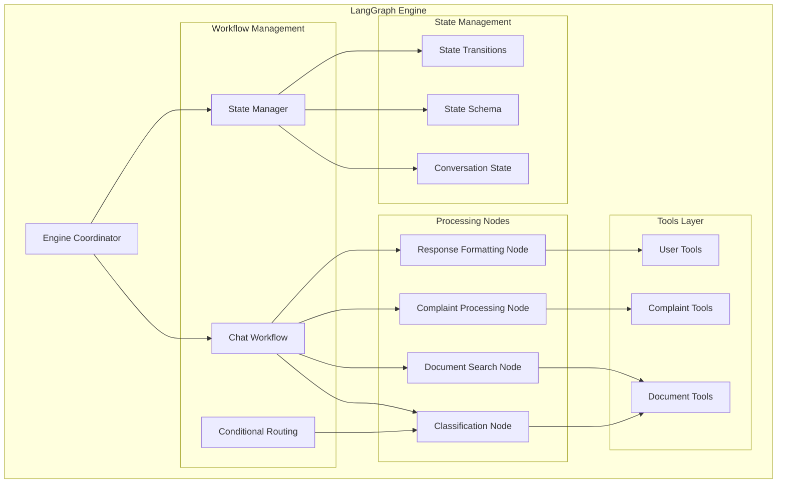

### 2. Workflow Execution

This workflow demonstrates the **intelligent conversation routing system** that adapts processing based on user intent and query complexity:

**Processing Intelligence**:
- **Intent Classification**: AI-powered analysis determines the most appropriate processing path for each user query
- **Dynamic Routing**: System routes queries to specialized processing nodes based on classification results
- **Context Integration**: Each processing path incorporates relevant context (documents, user history, institutional data)
- **Quality Assurance**: Response formatting includes source attribution, confidence scoring, and metadata for transparency
- **Adaptive Processing**: System can handle edge cases, unclear intents, and multi-faceted queries through fallback mechanisms

**Query Types Supported**:
- **Document QA**: Semantic search across institutional documents with relevance ranking
- **Complaint Processing**: Structured complaint intake with validation and routing to appropriate departments
- **General Inquiries**: Open-ended questions about university services, policies, and procedures
- **Procedural Guidance**: Step-by-step assistance for administrative processes and requirements

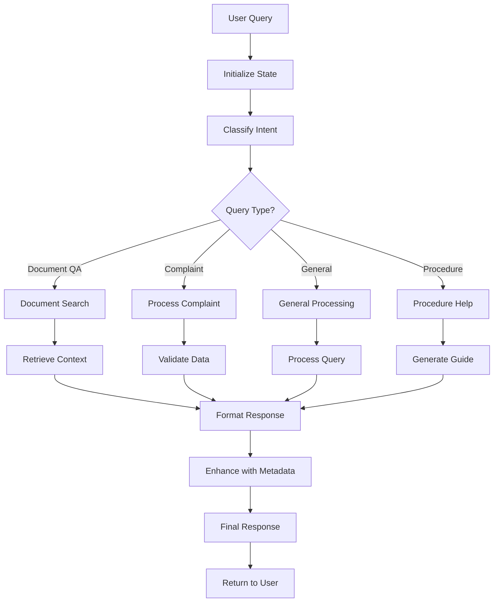

## Provider System

### 1. Provider Architecture

The provider system implements **complete vendor independence** through interface-driven design, enabling seamless switching between different service providers:

**Design Philosophy**:
- **Interface Standardization**: All providers implement common interfaces ensuring consistent behavior regardless of underlying technology
- **Runtime Selection**: Provider selection happens at application startup based on configuration, enabling environment-specific choices
- **Graceful Degradation**: System includes fallback mechanisms and circuit breakers for provider failures
- **Cost Optimization**: Easy switching between providers enables cost optimization and performance tuning
- **A/B Testing**: Multiple providers can run simultaneously for comparison and gradual migration

**Provider Categories**:
- **LLM Providers**: Support for various language models with unified response formatting and error handling
- **Database Providers**: Multiple database backends with consistent query interfaces and transaction management
- **Storage Providers**: Various file storage solutions with unified upload/download APIs and metadata handling
- **Vector Providers**: Different vector database implementations with standardized similarity search operations

```mermaid
graph TB
    subgraph "Provider Interfaces"
        IFACE_LLM[LLMProvider Interface]
        IFACE_DB[DatabaseProvider Interface]
        IFACE_STORAGE[StorageProvider Interface]
        IFACE_VECTOR[VectorProvider Interface]
    end
    
    subgraph "LLM Providers"
        OPENAI[OpenAI Provider]
        ANTHROPIC[Anthropic Provider]
        AZURE[Azure OpenAI Provider]
        LOCAL[Local LLM Provider]
    end
    
    subgraph "Database Providers"
        SUPABASE[Supabase Provider]
        POSTGRES[PostgreSQL Provider]
        MONGODB[MongoDB Provider]
    end
    
    subgraph "Storage Providers"
        SUPABASE_STORAGE[Supabase Storage]
        AWS_S3[AWS S3 Provider]
        GCS[Google Cloud Storage]
    end
    
    subgraph "Vector Providers"
        PGVECTOR[pgvector Provider]
        PINECONE[Pinecone Provider]
        WEAVIATE[Weaviate Provider]
    end
    
    IFACE_LLM -.-> OPENAI
    IFACE_LLM -.-> ANTHROPIC
    IFACE_LLM -.-> AZURE
    IFACE_LLM -.-> LOCAL
    
    IFACE_DB -.-> SUPABASE
    IFACE_DB -.-> POSTGRES
    IFACE_DB -.-> MONGODB
    
    IFACE_STORAGE -.-> SUPABASE_STORAGE
    IFACE_STORAGE -.-> AWS_S3
    IFACE_STORAGE -.-> GCS
    
    IFACE_VECTOR -.-> PGVECTOR
    IFACE_VECTOR -.-> PINECONE
    IFACE_VECTOR -.-> WEAVIATE
```

### 2. Provider Selection Strategy

The system implements **intelligent provider selection** based on environment, performance requirements, and operational constraints:

**Selection Criteria**:
- **Environment-Specific**: Development uses lightweight/mock providers, production uses high-performance solutions
- **Performance Requirements**: CPU-intensive tasks may use local providers, while complex reasoning uses cloud-based LLMs
- **Cost Considerations**: Automatic selection of cost-effective providers based on usage patterns and budget constraints
- **Reliability Needs**: Mission-critical operations use providers with proven reliability and SLA guarantees
- **Geographic Requirements**: Data residency and latency considerations for international deployments

**Dynamic Switching**: The system supports hot-swapping of providers during runtime for maintenance, cost optimization, or performance improvements without service interruption.

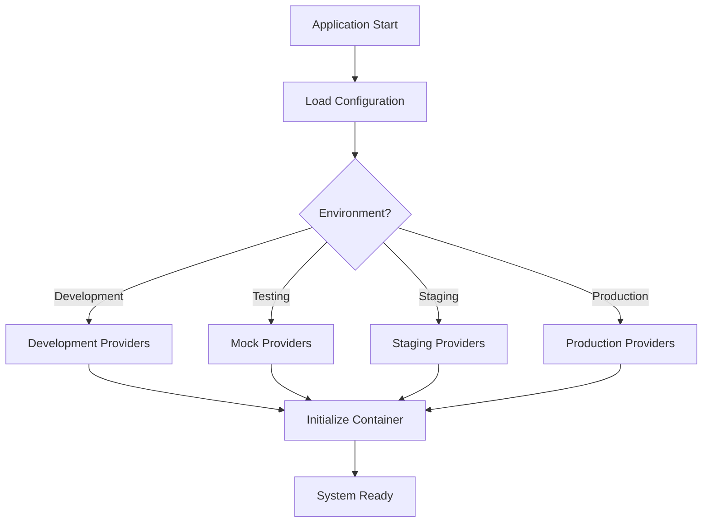

## Service Layer

### 1. Service Architecture

The service layer implements **domain-driven design principles** with clear separation between core business services and cross-cutting concerns:

**Core Services** (Domain-Specific Logic):
- Business logic specific to university operations and chatbot functionality
- Domain models and entities representing university concepts (users, documents, conversations)
- Service orchestration for complex multi-step operations

**Cross-Cutting Services** (Infrastructure Concerns):
- **Authentication Service**: JWT token management, user session handling, and security policy enforcement
- **Cache Service**: Redis-based caching for frequently accessed data with intelligent cache invalidation
- **Monitoring Service**: Real-time system health monitoring, performance metrics collection, and alerting
- **Validation Service**: Input validation, data sanitization, and business rule enforcement

**Service Communication**: Services interact through well-defined interfaces with dependency injection, enabling independent development, testing, and deployment of each service component.

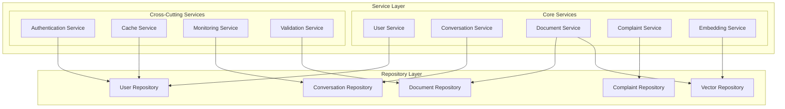

### 2. Service Interactions

The service layer orchestrates complex multi-service operations through well-defined interaction patterns that ensure data consistency and optimal performance:

**Interaction Patterns**:
- **Synchronous Operations**: Real-time user interactions requiring immediate responses (authentication, conversation processing)
- **Asynchronous Processing**: Background tasks like document indexing, embedding generation, and batch operations
- **Event-Driven Communication**: Service-to-service notifications for state changes and workflow triggers
- **Circuit Breaker Pattern**: Automatic failure detection and graceful degradation when dependent services are unavailable

**Performance Optimization**:
- **Request Caching**: Frequently accessed data cached at service level to reduce database load
- **Batch Operations**: Multiple similar operations grouped together for efficiency (bulk document processing)
- **Connection Pooling**: Shared database connections across service instances to optimize resource usage
- **Async/Await**: Non-blocking I/O operations for improved concurrency and response times

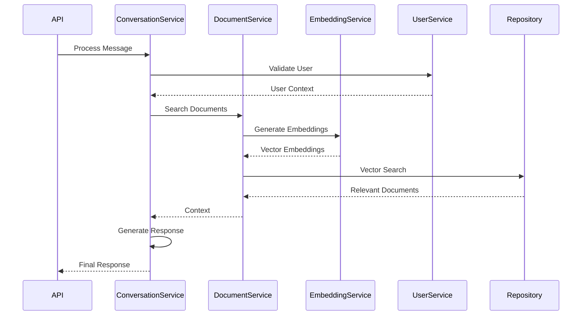

## Database Architecture

### 1. Database Schema

The database schema is designed for **optimal performance and scalability** with proper indexing, relationships, and data integrity constraints:

**Schema Design Principles**:
- **UUID Primary Keys**: Ensures global uniqueness and enables distributed database scenarios
- **Audit Timestamps**: Created/updated timestamps on all entities for change tracking and debugging
- **JSON Metadata**: Flexible metadata storage using PostgreSQL's native JSON support for extensibility
- **Vector Embeddings**: Native vector storage using pgvector extension for efficient similarity search
- **Referential Integrity**: Foreign key relationships ensure data consistency and enable efficient joins

**Performance Optimizations**:
- **Composite Indexes**: Multi-column indexes on frequently queried combinations (user_id + created_at)
- **Partial Indexes**: Conditional indexes on filtered queries (active conversations, published documents)
- **Vector Indexes**: HNSW indexes on embedding columns for fast approximate nearest neighbor search

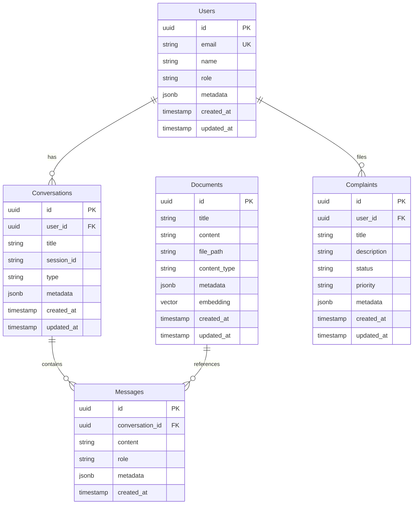

### 2. Data Access Pattern

The data access layer implements **repository pattern with provider abstraction** for clean separation of data access logic:

**Pattern Benefits**:
- **Technology Independence**: Repository interfaces abstract away specific database implementation details
- **Testability**: Easy mocking of data access for unit testing without database dependencies
- **Consistency**: Uniform data access patterns across all entities and operations
- **Caching Integration**: Built-in caching at the repository level for frequently accessed data
- **Transaction Management**: Automatic transaction handling for complex multi-entity operations

**Performance Features**:
- **Connection Pooling**: Efficient database connection management with configurable pool sizes
- **Query Optimization**: Prepared statements, batch operations, and lazy loading for optimal performance
- **Read Replicas**: Automatic routing of read operations to replica databases for load distribution

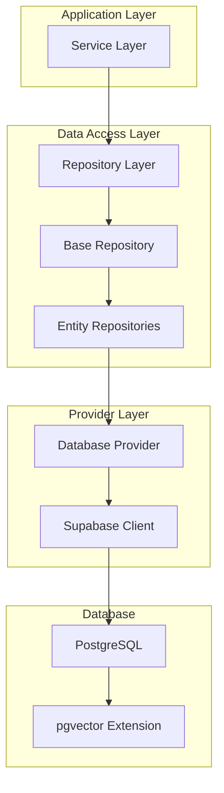

## API Architecture

### 1. API Structure

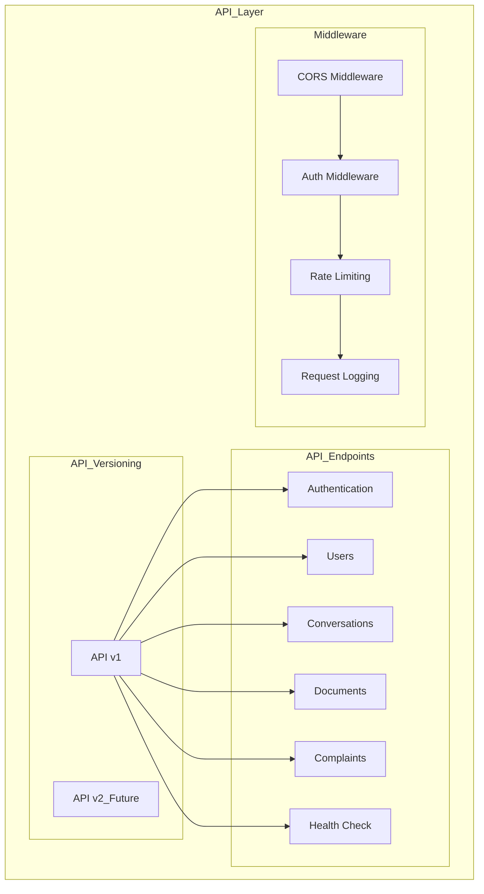

### 2. Request/Response Flow

The API request/response flow implements **comprehensive request processing** with multiple layers of validation, security, and optimization:

**Request Processing Pipeline**:
1. **CORS Validation**: Cross-origin request verification with configurable allowed origins and methods
2. **Authentication**: JWT token validation with expiration checking and user context extraction
3. **Rate Limiting**: Request throttling based on user identity and endpoint sensitivity to prevent abuse
4. **Request Logging**: Structured logging for audit trails, debugging, and performance monitoring
5. **Route Resolution**: Intelligent routing to appropriate controllers based on HTTP method and path patterns
6. **Business Logic**: Core application processing with service orchestration and data validation
7. **Response Assembly**: JSON response formatting with appropriate HTTP status codes and headers

**Error Handling Strategy**:
- **Validation Errors**: Clear field-level error messages for client-side form validation
- **Authorization Errors**: Proper HTTP status codes (401, 403) with security-conscious error messages
- **Business Logic Errors**: Application-specific error codes with actionable error descriptions
- **System Errors**: Graceful degradation with fallback responses and error tracking

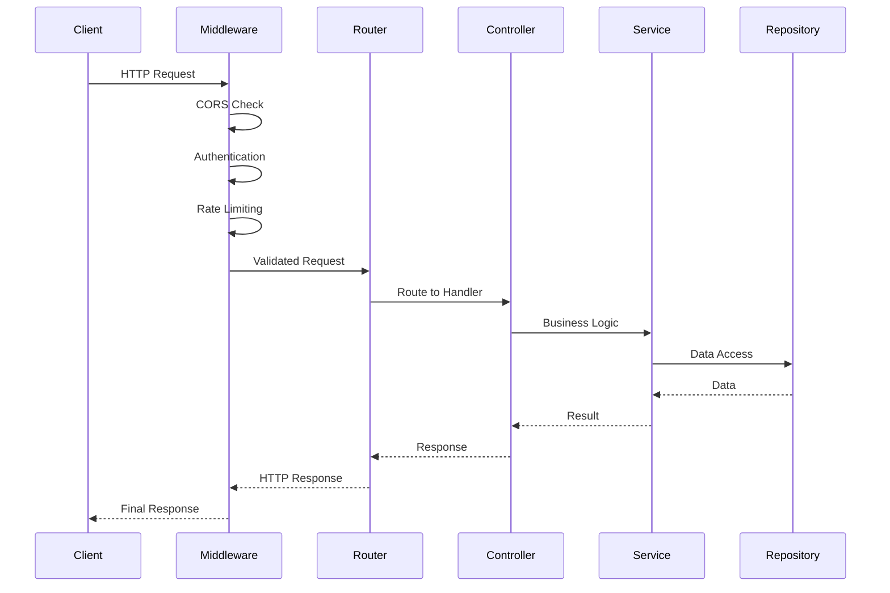

## Deployment Architecture

### 1. Container Architecture

The containerized deployment provides **consistent environments** across development, staging, and production with optimized resource utilization:

**Container Benefits**:
- **Environment Consistency**: Identical runtime environments eliminate "works on my machine" issues
- **Resource Isolation**: Each container has defined CPU, memory, and I/O limits preventing resource contention
- **Scalability**: Easy horizontal scaling by spinning up additional container instances
- **Version Control**: Immutable container images enable reliable rollbacks and blue-green deployments
- **Security**: Container isolation provides additional security boundaries and attack surface reduction

**Production Considerations**:
- **Health Checks**: Built-in health monitoring for automatic container restart and load balancer integration
- **Resource Limits**: Properly configured CPU and memory limits prevent resource exhaustion
- **Volume Management**: Persistent volumes for data storage with backup and recovery procedures

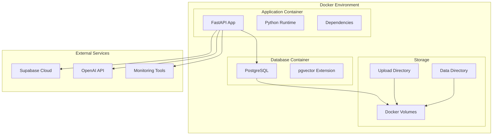

### 2. Production Deployment

The production architecture implements **high availability and scalability patterns** with comprehensive monitoring and disaster recovery:

**Scalability Features**:
- **Horizontal Scaling**: Multiple application instances behind load balancer for handling increased traffic
- **Database Clustering**: Primary-replica setup with automatic failover for database high availability
- **Auto-scaling**: Dynamic scaling based on CPU, memory, and request rate metrics
- **Geographic Distribution**: Multi-region deployment capability for global user base (future enhancement)

**Reliability Measures**:
- **Load Balancing**: Intelligent traffic distribution with health checks and automatic failover
- **Circuit Breakers**: Automatic failure detection and traffic rerouting to healthy instances
- **Backup Strategy**: Regular automated backups with point-in-time recovery capabilities
- **Monitoring**: Comprehensive application and infrastructure monitoring with proactive alerting

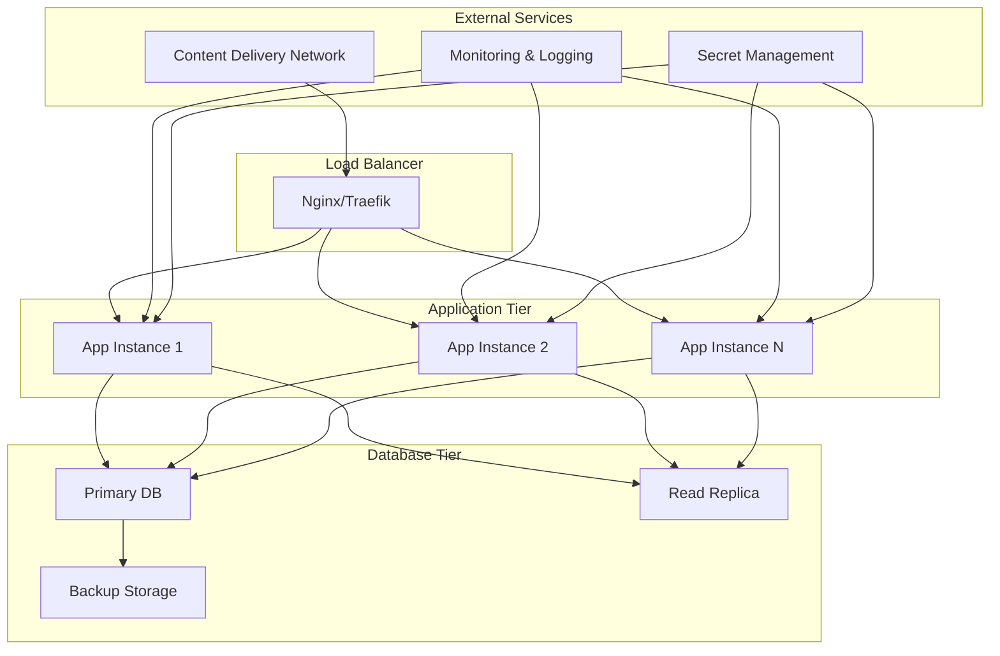

## Security Architecture

### 1. Security Layers

The security architecture implements **defense-in-depth strategy** with multiple security layers providing comprehensive protection:

**Multi-Layer Security Approach**:
- **Network Security**: Firewall rules, VPC isolation, and encrypted communication channels prevent unauthorized access
- **Authentication & Authorization**: JWT-based authentication with role-based access control ensures proper user verification and permissions
- **Data Security**: End-to-end encryption for data at rest and in transit, plus secure password hashing with salt
- **API Security**: Rate limiting, CORS policies, and input validation prevent common web application attacks

**Security Monitoring**:
- **Audit Logging**: Comprehensive logging of all user actions and system events for compliance and forensics
- **Threat Detection**: Real-time monitoring for suspicious activities and automated response procedures
- **Vulnerability Management**: Regular security scans and dependency updates to address known vulnerabilities

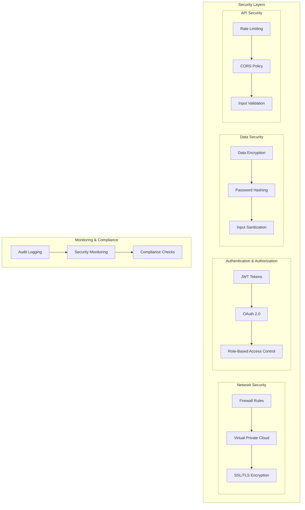

### 2. Authentication Flow

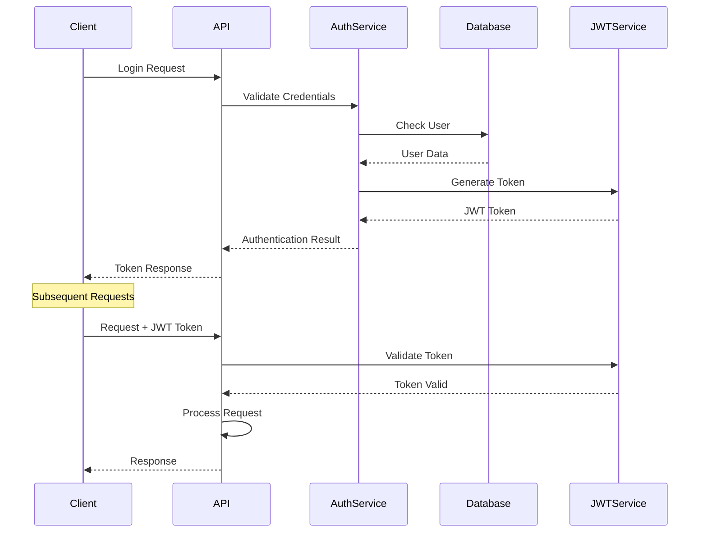

## Monitoring and Observability

### 1. Monitoring Architecture

The monitoring system provides **comprehensive visibility** into application performance, system health, and user behavior through multiple observation layers:

**Observability Pillars**:
- **Metrics**: Quantitative measurements of system performance (response times, throughput, error rates)
- **Logs**: Structured event records providing detailed context for debugging and audit trails
- **Traces**: Request flow tracking across distributed services for performance bottleneck identification
- **Health Checks**: Real-time system status monitoring with automatic alerting for critical failures

**Monitoring Scope**:
- **Application Metrics**: Response times, request rates, business KPIs, and custom application metrics
- **Infrastructure Metrics**: CPU usage, memory consumption, disk I/O, and network performance
- **External Dependencies**: LLM API response times, database performance, and third-party service availability
- **User Experience**: Conversation success rates, user satisfaction scores, and feature adoption metrics

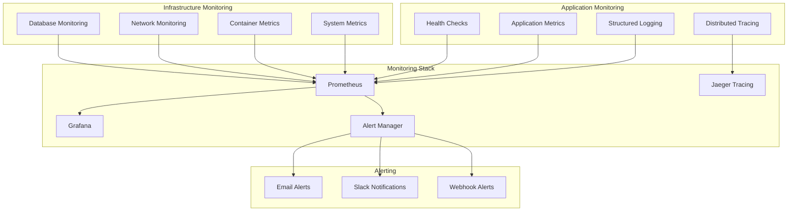

## Performance Considerations

### 1. Scalability Patterns

The system implements **proven scalability patterns** to handle growing user loads and data volumes while maintaining optimal performance:

**Horizontal Scaling Strategies**:
- **Load Balancing**: Intelligent traffic distribution across multiple application instances with health monitoring
- **Auto-scaling**: Dynamic instance provisioning based on CPU, memory, and request rate thresholds
- **Database Replicas**: Read-only replicas for query distribution and improved read performance
- **Microservice Independence**: Individual service scaling based on specific resource requirements

**Caching Architecture**:
- **Multi-layer Caching**: Application-level, database query, and CDN caching for optimal response times
- **Intelligent Cache Invalidation**: Event-driven cache updates ensuring data consistency
- **Cache Warming**: Proactive loading of frequently accessed data during low-traffic periods
- **Distributed Caching**: Redis cluster for shared cache across multiple application instances

**Optimization Techniques**:
- **Connection Pooling**: Efficient database connection reuse reducing connection overhead
- **Async Processing**: Non-blocking I/O operations enabling higher concurrency
- **Batch Operations**: Grouped database operations for improved throughput
- **Query Optimization**: Indexed queries, prepared statements, and efficient data retrieval patterns

```mermaid
graph TB
    subgraph "Horizontal Scaling"
        LOAD_BALANCER[Load Balancer]
        APP_INSTANCES[Multiple App Instances]
        DATABASE_REPLICAS[Database Replicas]
    end
    
    subgraph "Caching Strategy"
        REDIS[Redis Cache]
        CDN[Content Delivery Network]
        APPLICATION_CACHE[Application Cache]
    end
    
    subgraph "Optimization"
        CONNECTION_POOLING[Connection Pooling]
        ASYNC_PROCESSING[Async Processing]
        BATCH_OPERATIONS[Batch Operations]
    end
    
    LOAD_BALANCER --> APP_INSTANCES
    APP_INSTANCES --> DATABASE_REPLICAS
    
    REDIS --> APPLICATION_CACHE
    CDN --> APPLICATION_CACHE
    
    CONNECTION_POOLING --> ASYNC_PROCESSING
    ASYNC_PROCESSING --> BATCH_OPERATIONS
```

### 2. Performance Metrics and Targets

**Response Time Targets**:
- **API Endpoints**: < 200ms for simple operations, < 1s for complex queries
- **Conversation Processing**: < 3s for document search, < 5s for complex AI interactions
- **Database Queries**: < 50ms for indexed queries, < 500ms for complex aggregations
- **Vector Search**: < 100ms for similarity search across 10k+ documents

**Throughput Capabilities**:
- **Concurrent Users**: Support for 1000+ simultaneous conversations
- **Request Rate**: Handle 10,000+ requests per minute with proper caching
- **Document Processing**: Batch processing of 100+ documents per minute
- **Vector Operations**: 1000+ similarity searches per second

## Conclusion

This architecture provides a **robust, scalable, and maintainable foundation** for the University Chatbot system, designed to serve as an intelligent conversational interface for university stakeholders. The system successfully balances **architectural sophistication with operational simplicity**.

### Key Architectural Achievements

- **Provider Agnosticism**: Complete vendor independence enabling cost optimization and technology evolution
- **Separation of Concerns**: Clear boundaries between layers facilitating independent development and testing
- **Dependency Injection**: Testable and flexible component coupling supporting rapid feature development
- **Scalability**: Horizontal scaling capabilities supporting growth from hundreds to thousands of users
- **Observability**: Comprehensive monitoring and logging ensuring operational excellence
- **Security**: Multi-layered security approach protecting sensitive university data
- **Extensibility**: Easy addition of new features, providers, and conversation capabilities

### Future-Proofing Benefits

The **provider-agnostic design** ensures the system can adapt to:
- **Emerging AI Technologies**: New LLM providers, conversation engines, and AI capabilities
- **Changing Infrastructure Needs**: Different cloud providers, database systems, and storage solutions
- **Evolving University Requirements**: New departments, services, and use cases
- **Performance Demands**: Scaling from pilot deployment to university-wide adoption

### Operational Excellence

The modular design ensures that the system can **evolve with changing requirements** while maintaining:
- **High Availability**: 99.9% uptime through redundancy and failover mechanisms
- **Performance**: Sub-second response times for most user interactions
- **Maintainability**: Clean code architecture enabling efficient development cycles
- **Cost Efficiency**: Optimized resource utilization and provider flexibility

This architecture establishes a **solid foundation** for delivering exceptional conversational AI experiences while maintaining the flexibility needed for long-term success in the dynamic educational technology landscape.