# University Chatbot - System Architecture

## Overview

This document provides a comprehensive architectural overview of the University Chatbot system, featuring a provider-agnostic, microservices-inspired design with clean separation of concerns, dependency injection, and extensible interfaces.

## Table of Contents

1. [High-Level Architecture](#high-level-architecture)
2. [Core Components](#core-components)
3. [Data Flow](#data-flow)
4. [Conversation Engine Architecture](#conversation-engine-architecture)
5. [Provider System](#provider-system)
6. [Service Layer](#service-layer)
7. [Database Architecture](#database-architecture)
8. [API Architecture](#api-architecture)
9. [Deployment Architecture](#deployment-architecture)
10. [Security Architecture](#security-architecture)

## High-Level Architecture

The University Chatbot system follows a layered architecture pattern with clear separation of concerns, enabling maintainability, scalability, and testability. The architecture is designed around the principle of **provider agnosticism**, allowing for easy swapping of external services and implementations.

### Architectural Layers Overview

The system is organized into five distinct layers, each with specific responsibilities:

1. **Client Layer**: User-facing interfaces and applications
2. **API Gateway**: Request routing, middleware, and protocol handling
3. **Business Logic Layer**: Core application logic and conversation processing
4. **Data Access Layer**: Database operations and data persistence
5. **Provider Layer**: External service integrations and abstractions

### Key Architectural Principles

- **Dependency Inversion**: High-level modules don't depend on low-level modules; both depend on abstractions
- **Single Responsibility**: Each component has a single, well-defined purpose
- **Open/Closed Principle**: System is open for extension but closed for modification
- **Interface Segregation**: Clients depend only on interfaces they use
- **Loose Coupling**: Components are minimally dependent on each other

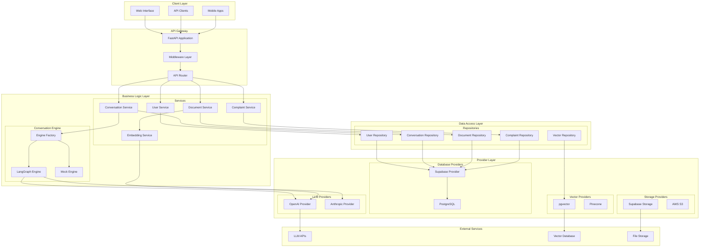

### Layer-by-Layer Analysis

#### 1. Client Layer
The client layer encompasses all user-facing interfaces that interact with the chatbot system. This includes:

- **Web Interface**: Browser-based chat interface for desktop users
- **API Clients**: Direct API consumers like mobile applications or third-party integrations
- **Mobile Apps**: Native mobile applications for iOS and Android platforms

All client interfaces communicate with the system through standardized REST APIs, ensuring consistent behavior across different platforms.

#### 2. API Gateway
The API Gateway serves as the single entry point for all client requests, implementing cross-cutting concerns:

- **FastAPI Application**: Modern, high-performance Python web framework providing automatic API documentation and validation
- **Middleware Layer**: Handles CORS, authentication, rate limiting, and request logging
- **API Router**: Routes requests to appropriate service endpoints based on URL patterns and HTTP methods

#### 3. Business Logic Layer
This layer contains the core application logic and is divided into two main subsystems:

**Services Subsystem:**
- **User Service**: Manages user authentication, profiles, and permissions
- **Conversation Service**: Orchestrates chat interactions and maintains conversation context
- **Document Service**: Handles document ingestion, processing, and retrieval
- **Complaint Service**: Manages complaint submission and processing workflows
- **Embedding Service**: Generates and manages vector embeddings for semantic search

**Conversation Engine Subsystem:**
- **Engine Factory**: Creates and manages different conversation engine implementations
- **LangGraph Engine**: Primary conversation engine using LangGraph for workflow orchestration
- **Mock Engine**: Testing and development engine for isolated testing scenarios

#### 4. Data Access Layer
The repository pattern is implemented to abstract database operations:

- **User Repository**: User data persistence and retrieval
- **Conversation Repository**: Chat history and session management
- **Document Repository**: Document metadata and content storage
- **Complaint Repository**: Complaint data management
- **Vector Repository**: Vector embedding storage and similarity search

#### 5. Provider Layer
This layer implements the provider pattern for external service integration:

- **LLM Providers**: OpenAI, Anthropic, and other language model providers
- **Database Providers**: Supabase, PostgreSQL, and other database systems
- **Storage Providers**: File storage solutions like Supabase Storage or AWS S3
- **Vector Providers**: Vector database implementations like pgvector or Pinecone

## Core Components

### 1. Application Layer

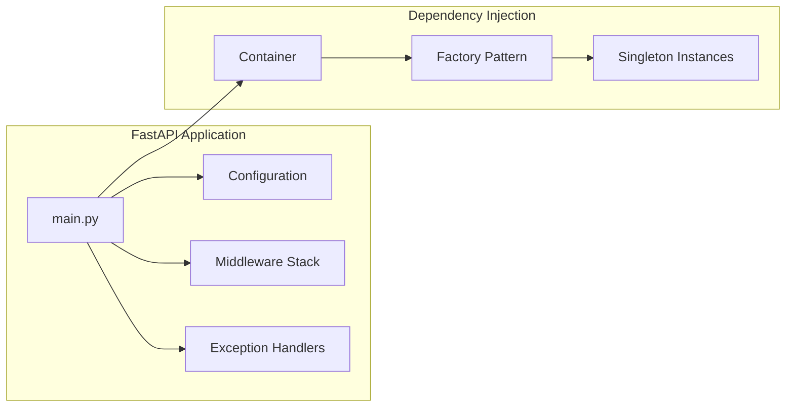

### 2. Interface Layer

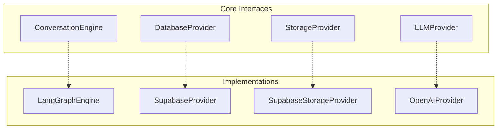

## Data Flow

### 1. Request Processing Flow

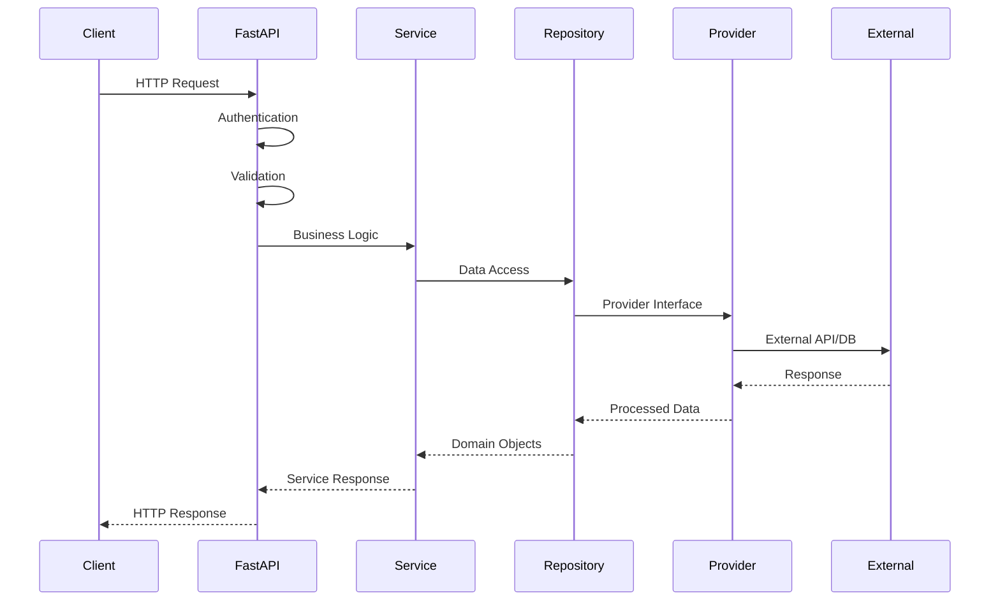

### 2. Conversation Processing Flow

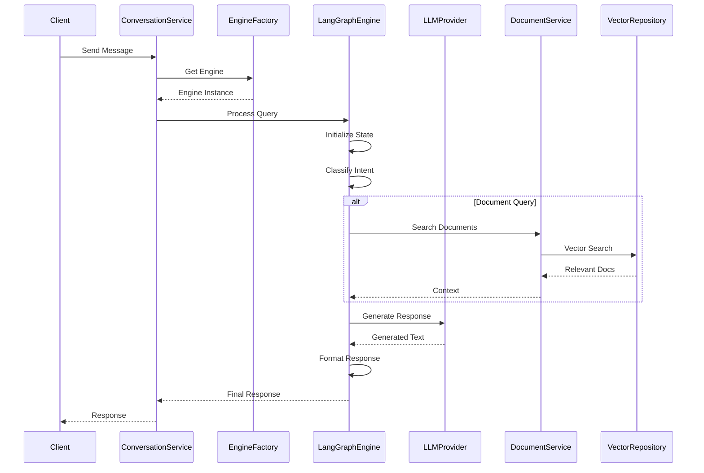

## Conversation Engine Architecture

### 1. LangGraph Engine Structure

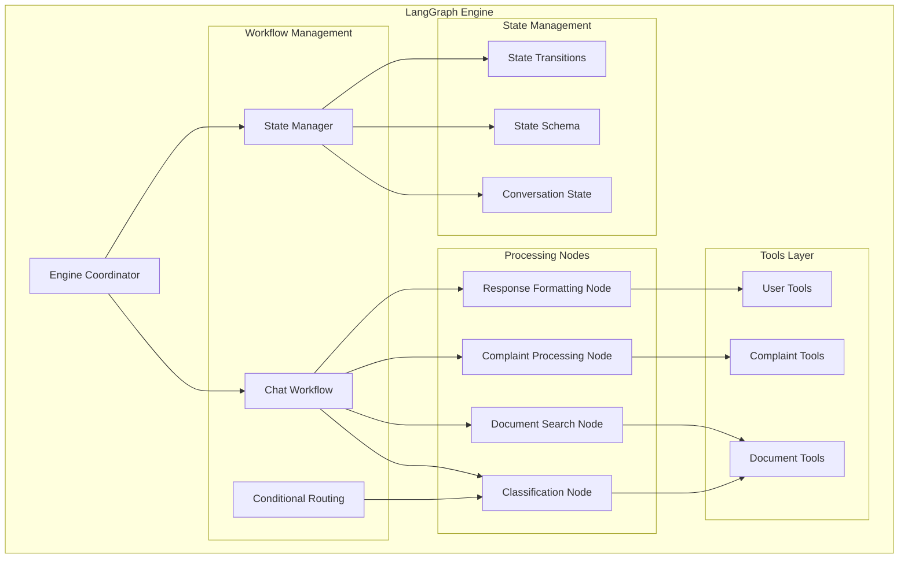

### 2. Workflow Execution

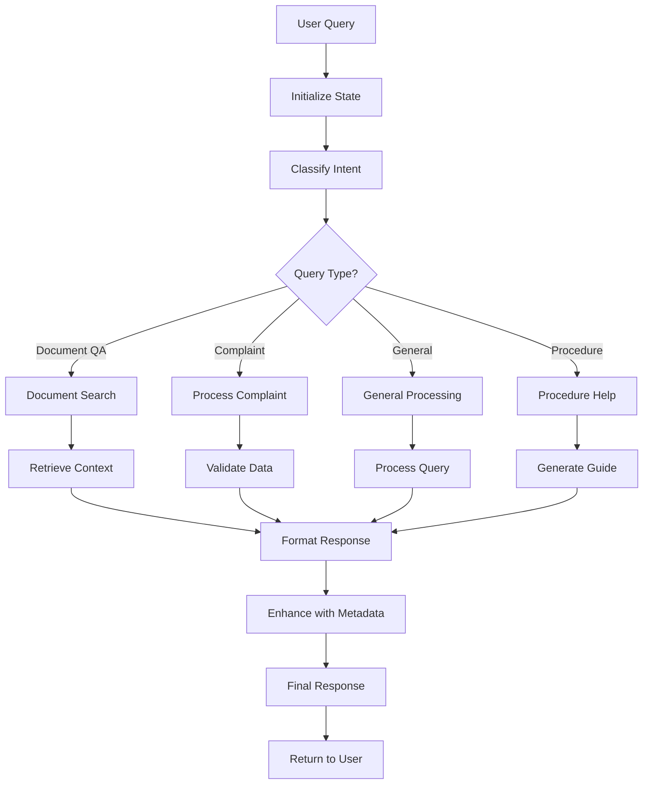

## Provider System

### 1. Provider Architecture

```mermaid
graph TB
    subgraph "Provider Interfaces"
        IFACE_LLM[LLMProvider Interface]
        IFACE_DB[DatabaseProvider Interface]
        IFACE_STORAGE[StorageProvider Interface]
        IFACE_VECTOR[VectorProvider Interface]
    end
    
    subgraph "LLM Providers"
        OPENAI[OpenAI Provider]
        ANTHROPIC[Anthropic Provider]
        AZURE[Azure OpenAI Provider]
        LOCAL[Local LLM Provider]
    end
    
    subgraph "Database Providers"
        SUPABASE[Supabase Provider]
        POSTGRES[PostgreSQL Provider]
        MONGODB[MongoDB Provider]
    end
    
    subgraph "Storage Providers"
        SUPABASE_STORAGE[Supabase Storage]
        AWS_S3[AWS S3 Provider]
        GCS[Google Cloud Storage]
    end
    
    subgraph "Vector Providers"
        PGVECTOR[pgvector Provider]
        PINECONE[Pinecone Provider]
        WEAVIATE[Weaviate Provider]
    end
    
    IFACE_LLM -.-> OPENAI
    IFACE_LLM -.-> ANTHROPIC
    IFACE_LLM -.-> AZURE
    IFACE_LLM -.-> LOCAL
    
    IFACE_DB -.-> SUPABASE
    IFACE_DB -.-> POSTGRES
    IFACE_DB -.-> MONGODB
    
    IFACE_STORAGE -.-> SUPABASE_STORAGE
    IFACE_STORAGE -.-> AWS_S3
    IFACE_STORAGE -.-> GCS
    
    IFACE_VECTOR -.-> PGVECTOR
    IFACE_VECTOR -.-> PINECONE
    IFACE_VECTOR -.-> WEAVIATE
```

### 2. Provider Selection Strategy

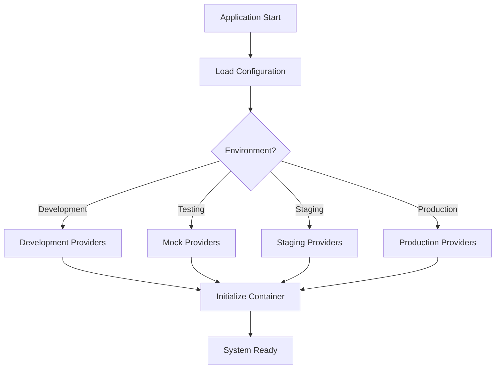

## Service Layer

### 1. Service Architecture

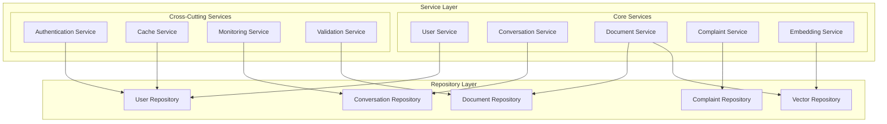

### 2. Service Interactions

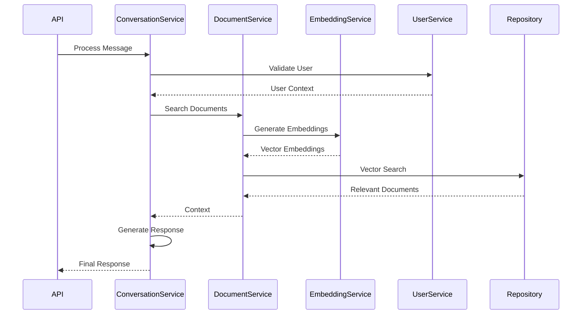

## Database Architecture

### 1. Database Schema

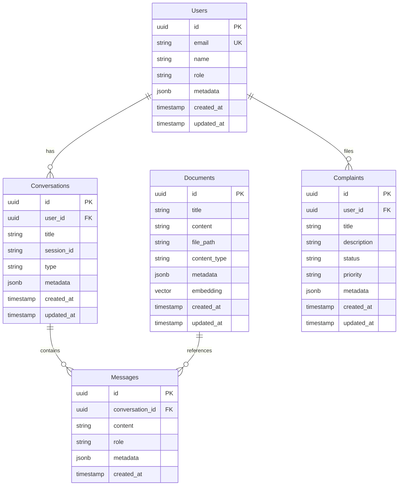

### 2. Data Access Pattern

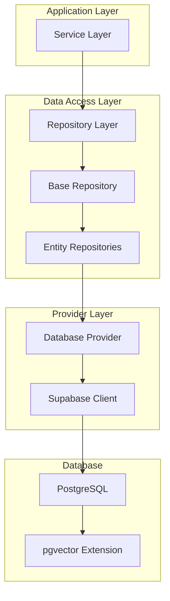

## API Architecture

### 1. API Structure

```mermaid
graph TB
    subgraph API_Layer
        subgraph API_Versioning
            V1[API v1]
            V2[API v2 (Future)]
        end
        
        subgraph API_Endpoints
            AUTH[Authentication]
            USERS[Users]
            CONVERSATIONS[Conversations]
            DOCUMENTS[Documents]
            COMPLAINTS[Complaints]
            HEALTH[Health Check]
        end
        
        subgraph Middleware
            CORS[CORS Middleware]
            AUTH_MW[Auth Middleware]
            RATE_LIMIT[Rate Limiting]
            LOGGING[Request Logging]
        end
    end
    
    V1 --> AUTH
    V1 --> USERS
    V1 --> CONVERSATIONS
    V1 --> DOCUMENTS
    V1 --> COMPLAINTS
    V1 --> HEALTH
    
    CORS --> AUTH_MW
    AUTH_MW --> RATE_LIMIT
    RATE_LIMIT --> LOGGING
```

### 2. Request/Response Flow

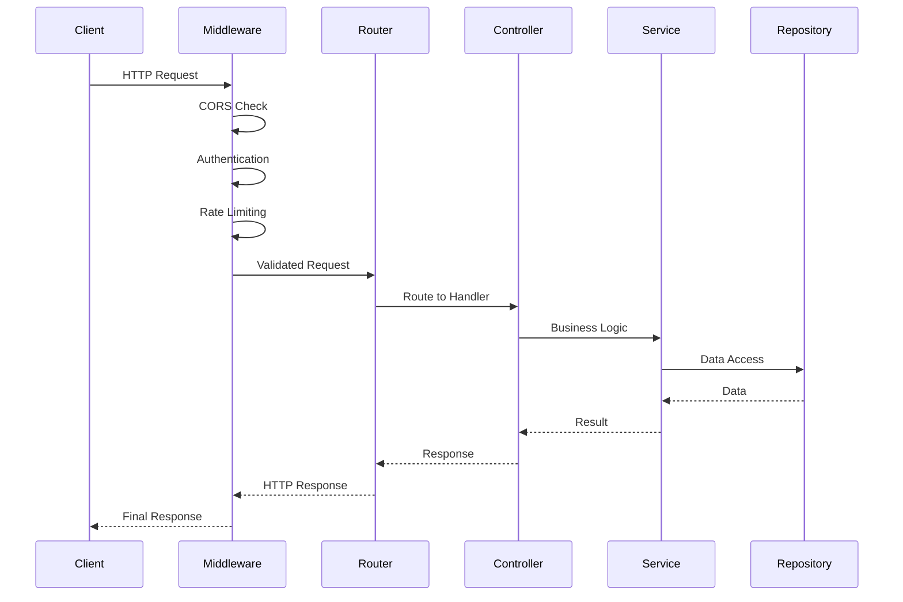

## Deployment Architecture

### 1. Container Architecture

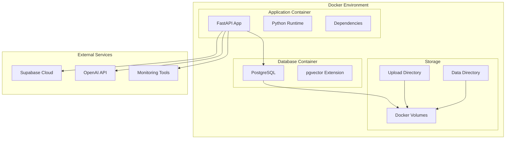

### 2. Production Deployment

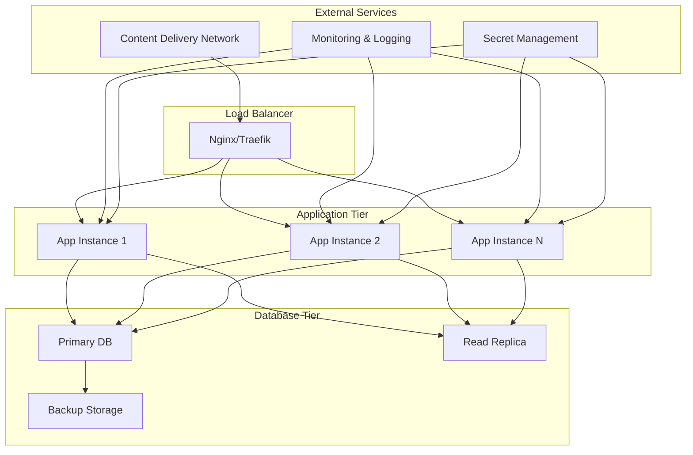

## Security Architecture

### 1. Security Layers

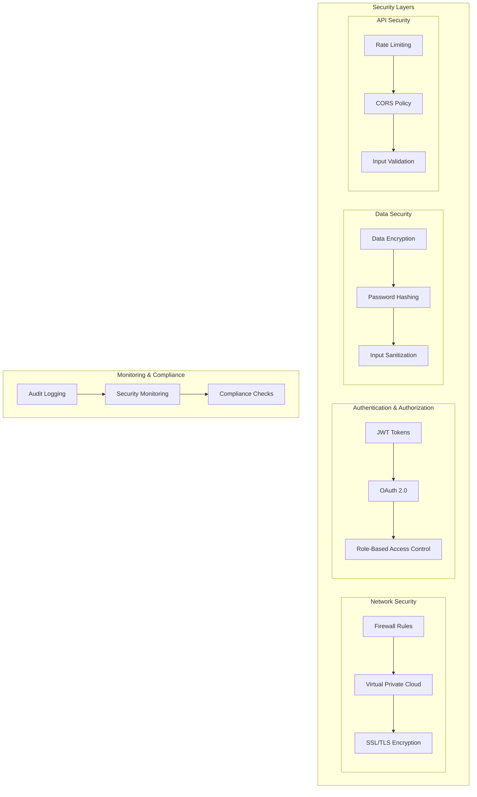

### 2. Authentication Flow

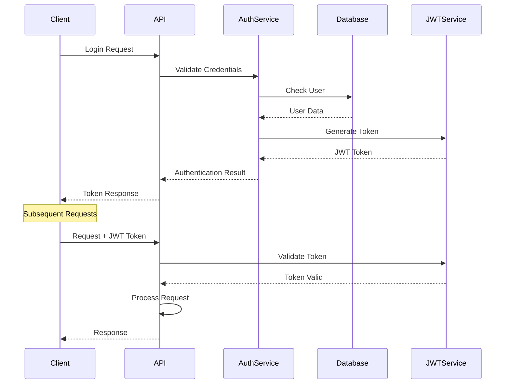

## Monitoring and Observability

### 1. Monitoring Architecture

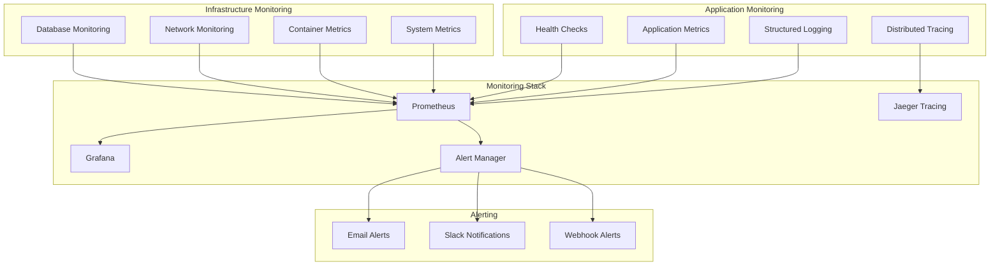

## Performance Considerations

### 1. Scalability Patterns

```mermaid
graph TB
    subgraph "Horizontal Scaling"
        LOAD_BALANCER[Load Balancer]
        APP_INSTANCES[Multiple App Instances]
        DATABASE_REPLICAS[Database Replicas]
    end
    
    subgraph "Caching Strategy"
        REDIS[Redis Cache]
        CDN[Content Delivery Network]
        APPLICATION_CACHE[Application Cache]
    end
    
    subgraph "Optimization"
        CONNECTION_POOLING[Connection Pooling]
        ASYNC_PROCESSING[Async Processing]
        BATCH_OPERATIONS[Batch Operations]
    end
    
    LOAD_BALANCER --> APP_INSTANCES
    APP_INSTANCES --> DATABASE_REPLICAS
    
    REDIS --> APPLICATION_CACHE
    CDN --> APPLICATION_CACHE
    
    CONNECTION_POOLING --> ASYNC_PROCESSING
    ASYNC_PROCESSING --> BATCH_OPERATIONS
```

## Conclusion

This architecture provides a robust, scalable, and maintainable foundation for the University Chatbot system. Key architectural principles include:

- **Provider Agnosticism**: Easy swapping of external services
- **Separation of Concerns**: Clear boundaries between layers
- **Dependency Injection**: Testable and flexible component coupling
- **Scalability**: Horizontal scaling capabilities
- **Observability**: Comprehensive monitoring and logging
- **Security**: Multi-layered security approach
- **Extensibility**: Easy addition of new features and providers

The modular design ensures that the system can evolve with changing requirements while maintaining stability and performance.