# University Chatbot - System Architecture

## Overview

The University Chatbot uses a layered, provider-agnostic architecture that separates concerns and enables easy swapping of external services through configuration.

## Architecture Layers

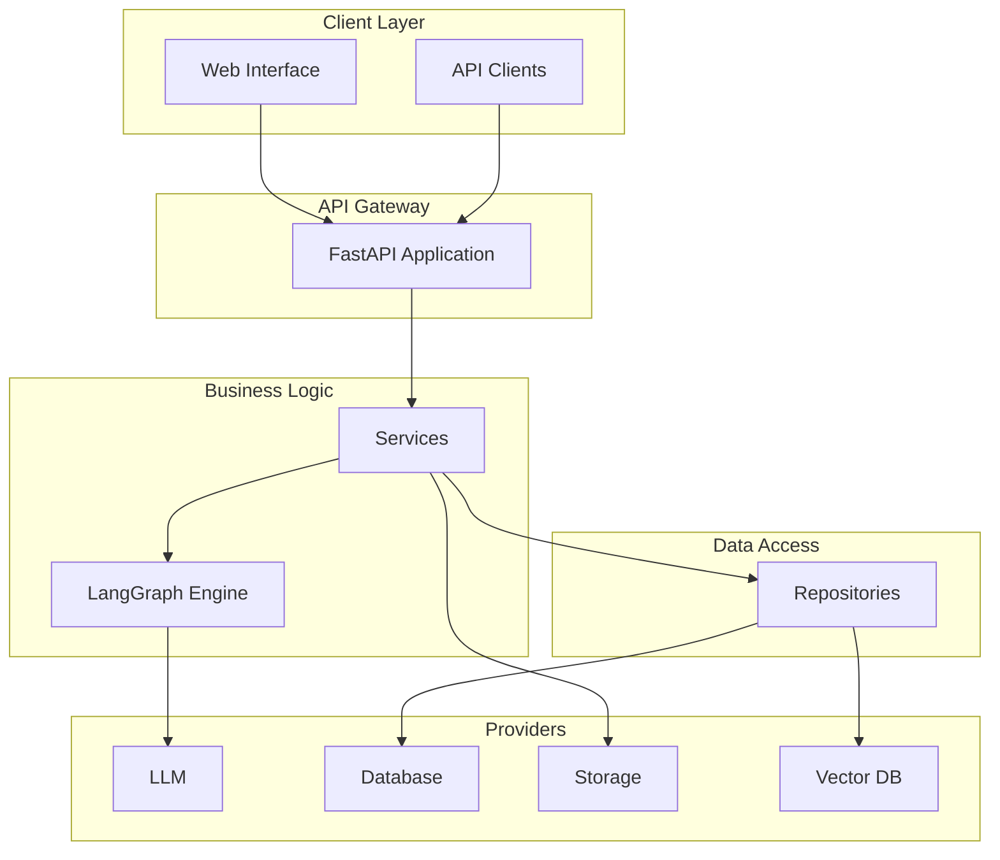

## Core Components

### LangGraph Conversation Engine
- Graph-based workflow orchestration
- Multi-turn conversation state management
- Intent classification and routing

### Services Layer  
- **User Service**: Authentication and profiles
- **Conversation Service**: Chat orchestration
- **Document Service**: Document processing and search

### Repository Layer
- Data access abstraction
- Database operations
- Vector operations for semantic search

### Provider System
Pluggable external service integrations:
- **LLM**: OpenAI, Anthropic, Azure OpenAI
- **Database**: Supabase, PostgreSQL  
- **Storage**: Supabase Storage, AWS S3
- **Vector**: pgvector, Pinecone

## Key Design Principles

- **Provider Agnosticism**: Interface-driven external dependencies
- **Clean Architecture**: Clear separation of concerns
- **Configuration-Based**: Environment-driven provider selection
- **Dependency Injection**: Loose coupling via DI container

## Technology Stack

- **Framework**: FastAPI (Python)
- **AI Engine**: LangGraph
- **Database**: PostgreSQL + pgvector
- **LLM**: OpenAI GPT models
- **Deployment**: Docker containers

---

*For detailed implementation, deployment guides, and API documentation, see the respective documentation files.*

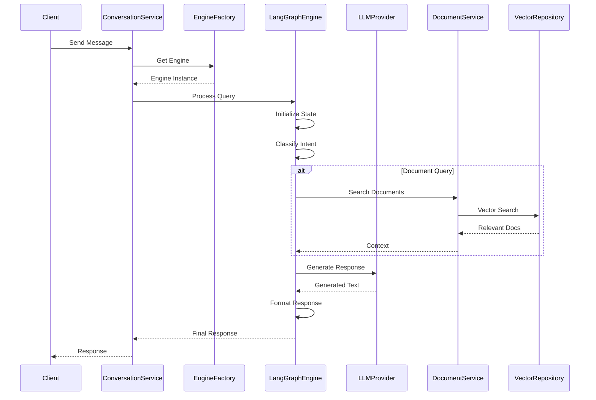

### Data Flow Optimization

#### Performance Optimizations
- **Connection Pooling**: Database and API connections are pooled for efficiency
- **Caching Strategies**: Frequently accessed data is cached at multiple levels
- **Async Processing**: Non-blocking I/O operations for better concurrency
- **Batch Operations**: Multiple operations are batched when possible

#### Error Handling and Resilience
- **Circuit Breaker Pattern**: Prevents cascading failures in external service calls
- **Retry Logic**: Automatic retry with exponential backoff for transient failures
- **Fallback Mechanisms**: Graceful degradation when services are unavailable
- **Timeout Management**: Appropriate timeouts to prevent hanging requests

#### Monitoring and Observability
- **Request Tracing**: End-to-end request tracing for debugging
- **Performance Metrics**: Response times, throughput, and error rates
- **Health Checks**: Continuous monitoring of system components
- **Structured Logging**: Contextual logging for better debugging

## Conversation Engine Architecture

The conversation engine is the intelligent core of the University Chatbot system, responsible for understanding user intents, retrieving relevant information, and generating contextually appropriate responses. The architecture is built around the LangGraph framework, which provides sophisticated workflow orchestration capabilities for complex conversational AI scenarios.

### Engine Design Philosophy

The conversation engine architecture follows several key design principles that ensure scalability, maintainability, and extensibility:

#### Core Principles
- **Provider Agnosticism**: The engine can work with different LLM providers, vector databases, and storage systems
- **Workflow Orchestration**: Complex conversation flows are managed through a graph-based workflow system
- **State Management**: Conversation state is maintained throughout the interaction process
- **Modular Processing**: Individual processing steps are isolated and can be tested independently
- **Error Resilience**: Graceful error handling and fallback mechanisms at every stage
- **Performance Optimization**: Parallel processing and caching for optimal response times

#### Advanced Capabilities
- **Multi-turn Conversations**: Maintains context across multiple conversation turns with sophisticated memory management
- **Intent Refinement**: Continuously improves intent classification based on user feedback and interaction patterns
- **Dynamic Routing**: Intelligently routes conversations based on user intent, confidence scores, and available resources
- **Quality Assurance**: Comprehensive validation of responses for accuracy, appropriateness, and safety

#### Scalability Features
- **Horizontal Scaling**: Engine instances can be distributed across multiple servers
- **Load Balancing**: Intelligent distribution of conversation load across available engines
- **Resource Management**: Efficient memory and CPU usage optimization for high-volume deployments
- **Monitoring Integration**: Real-time performance monitoring and alerting capabilities
- **Extensibility**: New processing nodes and workflows can be added without affecting existing functionality

### 1. LangGraph Engine Structure

The LangGraph engine represents the current implementation of the conversation engine interface, built on the LangGraph framework for workflow orchestration. This engine provides sophisticated conversation management through a graph-based approach.

#### Core Components

**Engine Coordinator**:
- **Purpose**: Main orchestrator that manages the entire conversation process
- **Responsibilities**: 
  - Initialize conversation state
  - Coordinate workflow execution
  - Manage error handling and recovery
  - Provide health monitoring capabilities
- **Integration**: Works with all other engine components to deliver cohesive conversation experience

**Workflow Management**:
- **Chat Workflow**: Defines the sequence of operations for processing user queries
- **State Manager**: Maintains conversation state throughout the workflow
- **Conditional Routing**: Dynamically routes conversation flow based on user intent and context

**Processing Nodes**:
- **Classification Node**: Analyzes user input to determine intent and query type
- **Document Search Node**: Performs semantic search on document knowledge base
- **Complaint Processing Node**: Handles complaint submission and validation
- **Response Formatting Node**: Generates and formats the final response

**Tools Layer**:
- **Document Tools**: Interface with document services for search and retrieval
- **User Tools**: Manage user authentication and profile operations
- **Complaint Tools**: Handle complaint processing and validation

**State Management**:
- **Conversation State**: Central state object that flows through the workflow
- **State Schema**: Defines the structure and validation rules for conversation state
- **State Transitions**: Manages how state changes between workflow steps

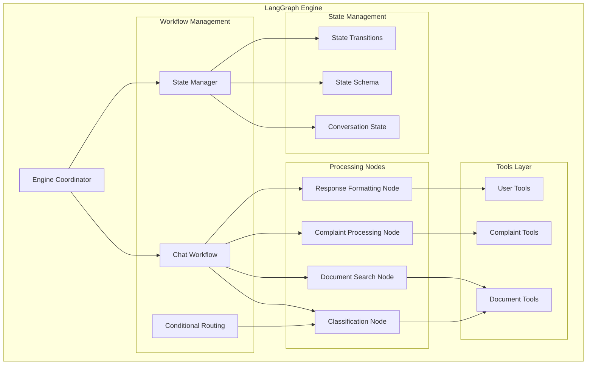

### 2. Workflow Execution

The workflow execution process defines how user queries are processed through the various stages of the conversation engine. Each stage has specific responsibilities and can branch based on the determined user intent.

#### Workflow Stages

**Initialization Phase**:
- **User Query Processing**: Parse and validate incoming user message
- **Context Loading**: Retrieve conversation history and user metadata
- **State Initialization**: Create initial conversation state object
- **Session Management**: Maintain or create user session

**Classification Phase**:
- **Intent Analysis**: Use LLM to analyze user intent and determine query type
- **Confidence Scoring**: Assign confidence scores to classification results
- **Context Consideration**: Factor in conversation history for better classification
- **Routing Decision**: Determine which processing path to follow

**Processing Phase**:
The processing phase branches based on the classified intent:

- **Document QA Path**: 
  - Semantic search on document knowledge base
  - Context retrieval and ranking
  - Relevance filtering based on similarity thresholds
  
- **Complaint Submission Path**:
  - Data validation and structure verification
  - Complaint categorization and priority assignment
  - Integration with complaint management system
  
- **General Information Path**:
  - General knowledge processing
  - University-specific information retrieval
  - FAQ matching and response generation
  
- **Procedure Help Path**:
  - Step-by-step procedure guidance
  - Interactive assistance for complex processes
  - Progress tracking and checkpoint management

**Response Generation Phase**:
- **Context Integration**: Combine retrieved information with user query
- **Response Generation**: Use LLM to generate contextually appropriate response
- **Quality Assurance**: Validate response for accuracy and appropriateness
- **Metadata Enrichment**: Add sources, confidence scores, and suggested actions

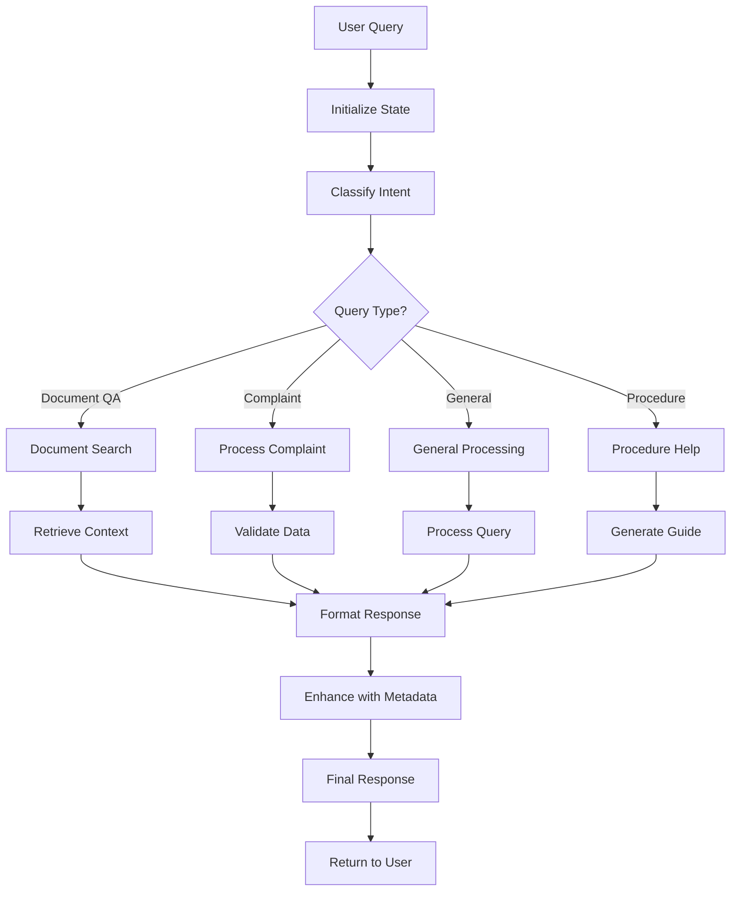

### Engine Capabilities and Features

#### Advanced Features
- **Multi-turn Conversations**: Maintains context across multiple conversation turns
- **Conversation Memory**: Remembers important information from previous interactions
- **Intent Refinement**: Improves intent classification based on user feedback
- **Dynamic Workflow Adaptation**: Adjusts workflow based on conversation patterns

#### Error Handling and Recovery
- **Graceful Degradation**: Provides fallback responses when primary processing fails
- **Error Recovery**: Attempts to recover from errors at each workflow stage
- **User Feedback Integration**: Learns from user corrections and feedback
- **Monitoring and Alerting**: Comprehensive monitoring of engine performance and errors

#### Performance Optimizations
- **Parallel Processing**: Executes independent workflow nodes in parallel
- **Caching Strategies**: Caches frequently accessed information and responses
- **Resource Management**: Optimizes memory and CPU usage for large-scale deployment
- **Load Balancing**: Distributes processing load across multiple engine instances

## Provider System

The provider system is a cornerstone of the University Chatbot's architecture, implementing the Strategy pattern to enable seamless switching between different external service providers. This system ensures vendor independence, facilitates testing, and provides flexibility in choosing the best services for different environments.

### Provider Architecture Philosophy

The provider system is built on several key principles:

- **Abstraction**: All external services are accessed through well-defined interfaces
- **Interchangeability**: Providers can be swapped without changing application logic
- **Configuration-Driven**: Provider selection is controlled through environment variables
- **Graceful Degradation**: System continues functioning even when some providers are unavailable
- **Performance Optimization**: Providers implement caching, connection pooling, and other optimizations

### 1. Provider Architecture

The provider architecture consists of four main categories, each addressing specific system needs:

#### LLM Providers
Language Model providers handle all AI-powered text generation and understanding tasks:

**OpenAI Provider**:
- **Models Supported**: GPT-4, GPT-3.5 Turbo, text-embedding-ada-002
- **Features**: Chat completions, embeddings, function calling
- **Optimization**: Request batching, token management, streaming responses
- **Use Cases**: Primary conversation processing, intent classification, response generation

**Anthropic Provider**:
- **Models Supported**: Claude 3 family (Haiku, Sonnet, Opus)
- **Features**: Large context windows, safety-focused responses
- **Advantages**: Strong reasoning capabilities, ethical AI alignment
- **Use Cases**: Complex reasoning tasks, safety-critical responses

**Azure OpenAI Provider**:
- **Benefits**: Enterprise security, compliance, regional data residency
- **Features**: Same OpenAI models with enterprise features
- **Use Cases**: Enterprise deployments requiring specific compliance

**Local LLM Provider**:
- **Purpose**: On-premises deployment, cost optimization, data privacy
- **Models**: Llama 2, Mistral, other open-source models
- **Benefits**: No external API calls, complete data control

#### Database Providers
Database providers handle all data persistence and retrieval operations:

**Supabase Provider**:
- **Features**: PostgreSQL with real-time subscriptions, built-in auth
- **Benefits**: Rapid development, integrated features, excellent developer experience
- **Use Cases**: Primary database for most deployments

**PostgreSQL Provider**:
- **Features**: Direct PostgreSQL connection, maximum flexibility
- **Benefits**: Full control over database configuration and optimization
- **Use Cases**: Custom deployments, specific performance requirements

**MongoDB Provider**:
- **Features**: Document-based storage, flexible schema
- **Benefits**: Rapid prototyping, handling of unstructured data
- **Use Cases**: Document metadata storage, flexible data models

#### Storage Providers
Storage providers manage file uploads, document storage, and media handling:

**Supabase Storage**:
- **Features**: S3-compatible API, integrated with Supabase ecosystem
- **Benefits**: Seamless integration, built-in CDN, automatic optimization
- **Use Cases**: Primary file storage for most deployments

**AWS S3 Provider**:
- **Features**: Industry-standard object storage, extensive ecosystem
- **Benefits**: Unlimited scalability, global distribution, enterprise features
- **Use Cases**: Large-scale deployments, multi-region applications

**Google Cloud Storage**:
- **Features**: Google's object storage with machine learning integration
- **Benefits**: AI/ML capabilities, global infrastructure
- **Use Cases**: Google Cloud deployments, AI-enhanced workflows

#### Vector Providers
Vector providers handle embedding storage and similarity search operations:

**pgvector Provider**:
- **Features**: PostgreSQL extension for vector operations
- **Benefits**: Single database for all data, ACID compliance, familiar SQL interface
- **Use Cases**: Integrated deployments, transactional consistency requirements

**Pinecone Provider**:
- **Features**: Purpose-built vector database, optimized for similarity search
- **Benefits**: High-performance search, automatic scaling, advanced indexing
- **Use Cases**: Large-scale vector search, high-performance requirements

**Weaviate Provider**:
- **Features**: Open-source vector database with semantic search
- **Benefits**: GraphQL API, hybrid search capabilities, schema flexibility
- **Use Cases**: Complex search requirements, open-source deployments

```mermaid
graph TB
    subgraph "Provider Interfaces"
        IFACE_LLM[LLMProvider Interface]
        IFACE_DB[DatabaseProvider Interface]
        IFACE_STORAGE[StorageProvider Interface]
        IFACE_VECTOR[VectorProvider Interface]
    end
    
    subgraph "LLM Providers"
        OPENAI[OpenAI Provider]
        ANTHROPIC[Anthropic Provider]
        AZURE[Azure OpenAI Provider]
        LOCAL[Local LLM Provider]
    end
    
    subgraph "Database Providers"
        SUPABASE[Supabase Provider]
        POSTGRES[PostgreSQL Provider]
        MONGODB[MongoDB Provider]
    end
    
    subgraph "Storage Providers"
        SUPABASE_STORAGE[Supabase Storage]
        AWS_S3[AWS S3 Provider]
        GCS[Google Cloud Storage]
    end
    
    subgraph "Vector Providers"
        PGVECTOR[pgvector Provider]
        PINECONE[Pinecone Provider]
        WEAVIATE[Weaviate Provider]
    end
    
    IFACE_LLM -.-> OPENAI
    IFACE_LLM -.-> ANTHROPIC
    IFACE_LLM -.-> AZURE
    IFACE_LLM -.-> LOCAL
    
    IFACE_DB -.-> SUPABASE
    IFACE_DB -.-> POSTGRES
    IFACE_DB -.-> MONGODB
    
    IFACE_STORAGE -.-> SUPABASE_STORAGE
    IFACE_STORAGE -.-> AWS_S3
    IFACE_STORAGE -.-> GCS
    
    IFACE_VECTOR -.-> PGVECTOR
    IFACE_VECTOR -.-> PINECONE
    IFACE_VECTOR -.-> WEAVIATE
```

### 2. Provider Selection Strategy

The provider selection strategy ensures that the most appropriate providers are chosen for each environment and use case, while maintaining system stability and performance.

#### Environment-Based Selection

**Development Environment**:
- **Purpose**: Rapid development and testing
- **LLM Provider**: OpenAI (fast iteration, good documentation)
- **Database**: Supabase (easy setup, integrated features)
- **Storage**: Supabase Storage (seamless integration)
- **Vector**: pgvector (simple setup, single database)

**Testing Environment**:
- **Purpose**: Automated testing and CI/CD
- **LLM Provider**: Mock providers (predictable responses, no API costs)
- **Database**: SQLite or in-memory (fast, isolated tests)
- **Storage**: Local filesystem (no external dependencies)
- **Vector**: In-memory vector store (fast, isolated)

**Staging Environment**:
- **Purpose**: Pre-production validation
- **LLM Provider**: Same as production (realistic testing)
- **Database**: Scaled-down production setup
- **Storage**: Production-like storage with smaller capacity
- **Vector**: Same as production (realistic performance testing)

**Production Environment**:
- **Purpose**: Live system serving real users
- **LLM Provider**: Based on performance, cost, and compliance requirements
- **Database**: High-availability setup with replication
- **Storage**: Scalable cloud storage with CDN
- **Vector**: High-performance vector database with clustering

#### Selection Criteria

**Performance Considerations**:
- **Latency Requirements**: Choose providers with lowest latency for critical paths
- **Throughput Needs**: Select providers that can handle expected load
- **Scalability**: Ensure providers can scale with system growth
- **Availability**: Choose providers with appropriate SLA guarantees

**Cost Optimization**:
- **API Costs**: Balance features with per-request costs
- **Storage Costs**: Consider data volume and access patterns
- **Compute Costs**: Factor in processing and hosting costs
- **Total Cost of Ownership**: Include operational and maintenance costs

**Compliance Requirements**:
- **Data Residency**: Ensure data stays in required geographic regions
- **Security Standards**: Meet industry-specific security requirements
- **Audit Trail**: Maintain required audit and compliance logs
- **Privacy Regulations**: Comply with GDPR, CCPA, and other privacy laws

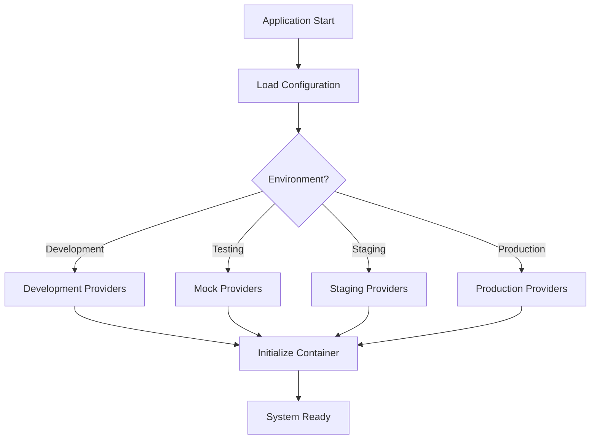

### Provider Management Features

#### Health Monitoring
- **Continuous Health Checks**: Regular monitoring of provider availability and performance
- **Automatic Failover**: Switch to backup providers when primary providers fail
- **Performance Metrics**: Track response times, error rates, and resource usage
- **Alert Systems**: Notify operations team of provider issues

#### Configuration Management
- **Environment Variables**: Provider selection through configuration
- **Runtime Switching**: Change providers without system restart
- **A/B Testing**: Run multiple providers simultaneously for comparison
- **Feature Flags**: Enable/disable provider features dynamically

#### Cost Management
- **Usage Tracking**: Monitor API calls, storage usage, and costs
- **Budget Alerts**: Notify when approaching cost thresholds
- **Cost Optimization**: Automatically choose cost-effective providers
- **Usage Analytics**: Detailed breakdown of provider costs and usage patterns

## Service Layer

The service layer implements the business logic of the University Chatbot system, providing a clean separation between the API layer and data access layer. This layer encapsulates all business rules, workflows, and cross-cutting concerns, ensuring that complex operations are properly organized and reusable.

### Service Layer Architecture

The service layer is organized into two main categories: core business services and cross-cutting services. Each service has a specific domain of responsibility and communicates with other services through well-defined interfaces.

#### Core Business Services

**User Service (`app/services/user_service.py`)**:
- **Primary Responsibilities**:
  - User authentication and authorization
  - User profile management and updates
  - Permission validation and role-based access control
  - User session management and tracking
- **Key Features**:
  - JWT token generation and validation
  - Password hashing and security
  - User preference management
  - Activity logging and audit trails
- **Integration Points**:
  - Authentication middleware for request validation
  - Conversation service for user context
  - Audit logging for security compliance

**Conversation Service (`app/services/conversation_service.py`)**:
- **Primary Responsibilities**:
  - Orchestrate conversation processing through engines
  - Manage conversation history and context
  - Handle multi-turn conversation flows
  - Provide conversation analytics and insights
- **Key Features**:
  - Engine factory integration for provider-agnostic processing
  - Conversation state management across multiple turns
  - Context enrichment with user preferences and history
  - Performance monitoring and optimization
- **Integration Points**:
  - Conversation engine factory for processing
  - User service for authentication and context
  - Document service for information retrieval

**Document Service (`app/services/document_service.py`)**:
- **Primary Responsibilities**:
  - Document ingestion and processing workflows
  - Semantic search and information retrieval
  - Document metadata management
  - Content extraction and chunking
- **Key Features**:
  - Multi-format document processing (PDF, DOCX, TXT, HTML)
  - Intelligent text chunking with overlap management
  - Vector embedding generation and storage
  - Search result ranking and relevance scoring
- **Integration Points**:
  - Embedding service for vector generation
  - Vector repository for similarity search
  - Storage providers for file management

**Complaint Service (`app/services/complaint_service.py`)**:
- **Primary Responsibilities**:
  - Complaint submission and validation
  - Complaint categorization and priority assignment
  - Workflow management for complaint resolution
  - Status tracking and notifications
- **Key Features**:
  - Structured data validation for complaint forms
  - Automatic categorization using AI classification
  - Integration with university complaint management systems
  - Email notifications and status updates
- **Integration Points**:
  - User service for complaint attribution
  - Conversation engine for natural language complaint extraction
  - External university systems for complaint routing

**Embedding Service (`app/services/embedding_service.py`)**:
- **Primary Responsibilities**:
  - Vector embedding generation for text content
  - Embedding model management and optimization
  - Batch processing for large document sets
  - Embedding quality monitoring and validation
- **Key Features**:
  - Support for multiple embedding models
  - Efficient batch processing with rate limiting
  - Embedding caching and optimization
  - Quality metrics and monitoring
- **Integration Points**:
  - LLM providers for embedding generation
  - Vector repository for storage and retrieval
  - Document service for content processing

#### Cross-Cutting Services

**Authentication Service**:
- **Purpose**: Centralized authentication and authorization logic
- **Features**: JWT management, session handling, multi-factor authentication
- **Benefits**: Consistent security across all endpoints

**Cache Service**:
- **Purpose**: Distributed caching for performance optimization
- **Features**: Redis integration, cache invalidation strategies, TTL management
- **Benefits**: Reduced database load, improved response times

**Monitoring Service**:
- **Purpose**: Application performance monitoring and metrics collection
- **Features**: Custom metrics, health checks, performance tracking
- **Benefits**: Operational visibility, proactive issue detection

**Validation Service**:
- **Purpose**: Centralized data validation and sanitization
- **Features**: Schema validation, input sanitization, business rule validation
- **Benefits**: Consistent data quality, security enhancement

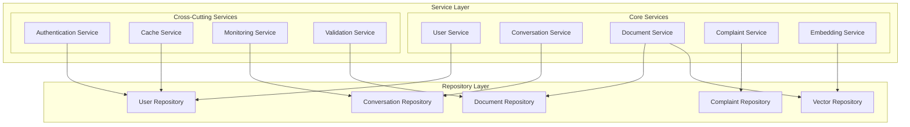

### 2. Service Interactions

Service interactions are designed to be efficient, reliable, and maintainable. The interaction patterns follow established enterprise patterns and best practices.

#### Interaction Patterns

**Service Orchestration**:
- Services coordinate complex business processes
- Each service maintains its own domain responsibilities
- Cross-service communications are minimized and well-defined
- Transaction boundaries are clearly established

**Event-Driven Communication**:
- Services communicate through events for loose coupling
- Asynchronous processing for non-critical operations
- Event sourcing for audit trails and debugging
- Eventual consistency for distributed operations

**Circuit Breaker Pattern**:
- Services implement circuit breakers for external dependencies
- Graceful degradation when downstream services are unavailable
- Automatic recovery and health monitoring
- Fallback strategies for critical operations

#### Performance Optimization

**Caching Strategies**:
- **Service-Level Caching**: Frequently accessed business objects
- **Query Result Caching**: Expensive database queries
- **API Response Caching**: Cacheable API responses
- **Distributed Caching**: Shared cache across service instances

**Async Processing**:
- Non-blocking I/O operations for better concurrency
- Background task processing for time-intensive operations
- Queue-based processing for scalability
- Real-time processing for critical operations

**Connection Management**:
- Connection pooling for database and external API connections
- Connection health monitoring and automatic recovery
- Resource cleanup and lifecycle management
- Load balancing across connection pools

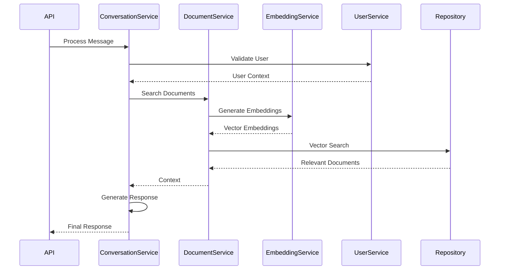

### Service Design Principles

#### Domain-Driven Design
- **Bounded Contexts**: Each service operates within a well-defined domain boundary
- **Domain Models**: Rich domain models that encapsulate business logic
- **Ubiquitous Language**: Consistent terminology across service interfaces
- **Aggregate Roots**: Clear entity relationships and transaction boundaries

#### SOLID Principles
- **Single Responsibility**: Each service has one reason to change
- **Open/Closed**: Services are open for extension, closed for modification
- **Liskov Substitution**: Service interfaces can be substituted without breaking clients
- **Interface Segregation**: Clients depend only on interfaces they use
- **Dependency Inversion**: Services depend on abstractions, not concretions

#### Error Handling and Resilience
- **Structured Error Responses**: Consistent error format across all services
- **Error Recovery**: Automatic retry mechanisms with exponential backoff
- **Graceful Degradation**: Partial functionality when dependencies are unavailable
- **Comprehensive Logging**: Detailed logging for debugging and monitoring

#### Testing Strategy
- **Unit Testing**: Individual service method testing with mocks
- **Integration Testing**: Service interaction testing with real dependencies
- **Contract Testing**: Interface contract validation between services
- **Load Testing**: Performance testing under realistic load conditions

## Database Architecture

The database architecture of the University Chatbot system is designed for scalability, performance, and data integrity. The system uses a hybrid approach combining relational data management with vector search capabilities, providing both transactional consistency and advanced semantic search features.

### Database Design Philosophy

The database architecture follows several key principles:

- **Single Source of Truth**: All data has a clear primary location and ownership
- **ACID Compliance**: Critical operations maintain transactional consistency
- **Scalability**: Schema and indexes designed for horizontal and vertical scaling
- **Performance**: Optimized queries and efficient data access patterns
- **Extensibility**: Schema can evolve without breaking existing functionality
- **Data Integrity**: Comprehensive constraints and validation rules

### 1. Database Schema

The database schema is organized around core business entities with clear relationships and well-defined boundaries. The schema supports both operational workloads and analytical queries.

#### Core Entities

**Users Table**:
- **Purpose**: Central user management and authentication
- **Key Fields**:
  - `id`: UUID primary key for global uniqueness
  - `email`: Unique identifier for authentication
  - `name`: User display name
  - `role`: Role-based access control (student, staff, admin)
  - `metadata`: JSON field for extensible user properties
- **Indexes**: Email unique index, role index for access control queries
- **Relationships**: One-to-many with conversations and complaints

**Conversations Table**:
- **Purpose**: Conversation session management and organization
- **Key Fields**:
  - `id`: UUID primary key
  - `user_id`: Foreign key to users table
  - `title`: Conversation title (auto-generated or user-defined)
  - `session_id`: Grouping identifier for related conversations
  - `type`: Conversation category (general, document_qa, complaint)
  - `metadata`: JSON field for conversation-specific data
- **Indexes**: User_id index, session_id index, type index for filtering
- **Relationships**: Belongs to user, has many messages

**Messages Table**:
- **Purpose**: Individual message storage with full conversation history
- **Key Fields**:
  - `id`: UUID primary key
  - `conversation_id`: Foreign key to conversations table
  - `content`: Message text content
  - `role`: Message sender (user, assistant, system)
  - `metadata`: JSON field for message-specific data (sources, confidence, etc.)
- **Indexes**: Conversation_id index, role index, created_at index for chronological queries
- **Relationships**: Belongs to conversation, may reference documents

**Documents Table**:
- **Purpose**: Document metadata and content management
- **Key Fields**:
  - `id`: UUID primary key
  - `title`: Document title or filename
  - `content`: Full text content for search
  - `file_path`: Storage location reference
  - `content_type`: MIME type for file handling
  - `metadata`: JSON field for document properties
  - `embedding`: Vector embedding for semantic search (using pgvector)
- **Indexes**: Title index, content_type index, vector index for similarity search
- **Relationships**: May be referenced by messages through metadata

**Complaints Table**:
- **Purpose**: Complaint submission and tracking system
- **Key Fields**:
  - `id`: UUID primary key
  - `user_id`: Foreign key to users table
 
    Messages {
        uuid id PK
        uuid conversation_id FK
        string content
        string role
        jsonb metadata
        timestamp created_at
    }
    
    Documents {
        uuid id PK
        string title
        string content
        string file_path
        string content_type
        jsonb metadata
        vector embedding
        timestamp created_at
        timestamp updated_at
    }
    
    Complaints {
        uuid id PK
        uuid user_id FK
        string title
        string description
        string status
        string priority
        jsonb metadata
        timestamp created_at
        timestamp updated_at
    }
    
    Users ||--o{ Conversations : has
    Conversations ||--o{ Messages : contains
    Users ||--o{ Complaints : files
    Documents ||--o{ Messages : references
```

### 2. Data Access Pattern

The data access pattern implements the Repository pattern to provide a clean abstraction between the business logic and data persistence layers. This pattern enables testing, caching, and provider switching while maintaining data consistency.

#### Repository Pattern Implementation

**Base Repository (`app/repositories/base.py`)**:
- **Purpose**: Common data access operations and patterns
- **Features**:
  - CRUD operations with standardized interfaces
  - Query building and parameter binding
  - Transaction management and rollback handling
  - Connection pooling and resource management
  - Error handling and logging
- **Benefits**:
  - Consistent data access patterns across all entities
  - Centralized optimization and caching logic
  - Easy testing with mock implementations
  - Database provider independence

**Entity-Specific Repositories**:
Each entity has a specialized repository that extends the base repository:

- **User Repository**: User authentication, profile management, role queries
- **Conversation Repository**: Session management, conversation history, analytics
- **Document Repository**: Document search, metadata management, content operations
- **Complaint Repository**: Complaint submission, status tracking, reporting queries
- **Vector Repository**: Embedding storage, similarity search, index management

#### Database Provider Abstraction

**Provider Interface Benefits**:
- **Database Independence**: Switch between PostgreSQL, Supabase, or other providers
- **Testing Flexibility**: Use different databases for testing and production
- **Performance Optimization**: Provider-specific optimizations
- **Migration Support**: Gradual migration between database systems

**Connection Management**:
- **Connection Pooling**: Efficient resource utilization with configurable pool sizes
- **Health Monitoring**: Automatic detection and recovery from connection issues
- **Load Balancing**: Distribute queries across read replicas
- **Transaction Isolation**: Appropriate isolation levels for different operations

**Query Optimization**:
- **Prepared Statements**: Improved performance and security
- **Query Caching**: Cache expensive query results
- **Index Optimization**: Automatic index usage analysis and recommendations
- **Batch Operations**: Efficient bulk insert and update operations

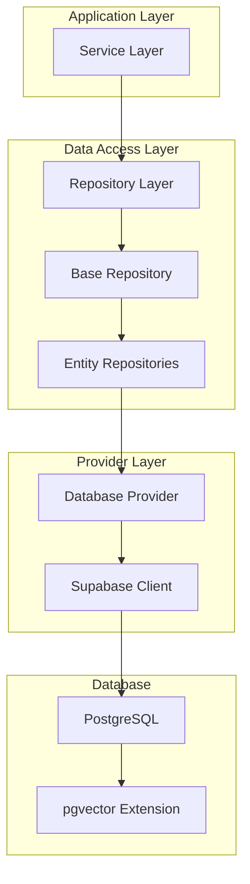

### Database Performance and Scalability

#### Performance Optimizations

**Indexing Strategy**:
- **Primary Indexes**: UUID primary keys with B-tree indexes
- **Foreign Key Indexes**: Efficient join operations
- **Composite Indexes**: Multi-column indexes for complex queries
- **Partial Indexes**: Filtered indexes for common query patterns
- **Vector Indexes**: Specialized indexes for similarity search (IVFFlat, HNSW)

**Query Optimization**:
- **Query Analysis**: Regular analysis of slow queries and optimization
- **Materialized Views**: Pre-computed aggregations for reporting
- **Query Plan Caching**: Reuse of execution plans for repeated queries
- **Parallel Queries**: Utilize multiple CPU cores for large operations

**Caching Strategies**:
- **Application-Level Caching**: Redis for frequently accessed data
- **Query Result Caching**: Cache expensive query results
- **Connection Caching**: Persistent connections to reduce overhead
- **Metadata Caching**: Cache schema information and query plans

#### Scalability Considerations

**Horizontal Scaling**:
- **Read Replicas**: Scale read operations across multiple database instances
- **Sharding Strategy**: Partition data across multiple databases if needed
- **Connection Pooling**: Manage connections efficiently across instances
- **Load Balancing**: Distribute database load intelligently

**Vertical Scaling**:
- **Resource Optimization**: Efficient use of CPU, memory, and storage
- **Connection Limits**: Appropriate connection pool sizing
- **Memory Configuration**: Optimized buffer sizes and cache settings
- **Storage Performance**: Fast SSD storage with appropriate IOPS

**Data Lifecycle Management**:
- **Data Archiving**: Move old data to cheaper storage
- **Data Retention**: Automated cleanup of expired data
- **Backup Strategy**: Regular backups with point-in-time recovery
- **Disaster Recovery**: Multi-region backup and recovery procedures

## API Architecture

The API architecture implements a RESTful design with modern FastAPI capabilities, providing a clean, well-documented, and highly performant interface for all client interactions. The API design emphasizes consistency, security, and developer experience.

### API Design Principles

#### RESTful Design
The University Chatbot API follows REST principles with clear resource identification, standard HTTP methods, and stateless interactions:

- **Resource-Based URLs**: Clear, hierarchical URL structure representing system resources
- **HTTP Methods**: Proper use of GET, POST, PUT, DELETE for different operations
- **Status Codes**: Meaningful HTTP status codes for different response scenarios
- **Content Negotiation**: Support for different content types and response formats

#### API Standards
- **Consistent Naming**: Snake_case for JSON fields, clear and descriptive endpoint names
- **Versioning Strategy**: URL-based versioning for backward compatibility
- **Error Handling**: Standardized error responses with detailed error information
- **Documentation**: Automatic OpenAPI/Swagger documentation generation

#### Performance Optimization
- **Response Compression**: Automatic gzip compression for reduced bandwidth
- **Caching Headers**: Appropriate cache control headers for different resource types
- **Pagination**: Efficient pagination for large datasets
- **Field Selection**: Allow clients to specify required fields to reduce payload size

### 1. API Structure

The API is organized into logical groupings with clear separation of concerns and consistent patterns across all endpoints.

#### Endpoint Categories

**Authentication Endpoints (`/auth`)**:
- **Purpose**: User authentication and session management
- **Endpoints**:
  - `POST /auth/login`: User login with email/password
  - `POST /auth/refresh`: JWT token refresh
  - `POST /auth/logout`: Session termination
  - `GET /auth/me`: Current user information
- **Security**: Public endpoints with rate limiting
- **Response Format**: JWT tokens with user metadata

**User Management Endpoints (`/users`)**:
- **Purpose**: User profile and preference management
- **Endpoints**:
  - `GET /users/profile`: User profile information
  - `PUT /users/profile`: Update user profile
  - `GET /users/preferences`: User preference settings
  - `PUT /users/preferences`: Update user preferences
- **Security**: Authenticated endpoints with role-based access
- **Data Privacy**: Personal data protection and GDPR compliance

**Conversation Endpoints (`/conversations`)**:
- **Purpose**: Chat interaction and conversation management
- **Endpoints**:
  - `POST /conversations`: Start new conversation
  - `GET /conversations`: List user conversations
  - `GET /conversations/{id}`: Get conversation details
  - `POST /conversations/{id}/messages`: Send message
  - `GET /conversations/{id}/messages`: Get conversation history
- **Real-time**: WebSocket support for live chat
- **Performance**: Optimized for high-frequency interactions

**Document Endpoints (`/documents`)**:
- **Purpose**: Document search and management
- **Endpoints**:
  - `GET /documents/search`: Semantic document search
  - `POST /documents/upload`: Document upload (admin only)
  - `GET /documents/{id}`: Get document details
  - `DELETE /documents/{id}`: Delete document (admin only)
- **Features**: Full-text search, semantic similarity, metadata filtering
- **Access Control**: Role-based access with different permissions

**Complaint Endpoints (`/complaints`)**:
- **Purpose**: Complaint submission and tracking
- **Endpoints**:
  - `POST /complaints`: Submit new complaint
  - `GET /complaints`: List user complaints
  - `GET /complaints/{id}`: Get complaint details
  - `PUT /complaints/{id}/status`: Update complaint status (admin only)
- **Workflow**: Structured complaint processing with status tracking
- **Notifications**: Automatic notifications for status changes

**System Endpoints (`/system`)**:
- **Purpose**: System health and operational information
- **Endpoints**:
  - `GET /health`: System health check
  - `GET /metrics`: System performance metrics (admin only)
  - `GET /info`: API version and build information
- **Monitoring**: Integration with monitoring and alerting systems
- **Public Access**: Health endpoints are publicly accessible

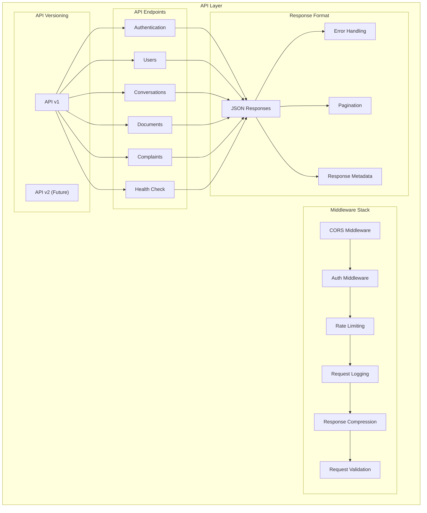

### 2. Middleware Architecture

The middleware stack provides cross-cutting concerns that apply to all API requests, ensuring consistent security, logging, and performance optimization.

#### Middleware Components

**CORS (Cross-Origin Resource Sharing)**:
- **Purpose**: Enable secure cross-origin requests from web browsers
- **Configuration**: Configurable allowed origins, methods, and headers
- **Security**: Prevents unauthorized cross-origin access
- **Development**: Permissive settings for development, restrictive for production

**Authentication Middleware**:
- **JWT Processing**: Automatic JWT token validation and user context extraction
- **Route Protection**: Configurable authentication requirements per endpoint
- **Session Management**: User session tracking and timeout handling
- **Error Handling**: Proper authentication error responses

**Rate Limiting Middleware**:
- **Algorithm**: Token bucket algorithm for smooth rate limiting
- **Granularity**: Per-user, per-IP, and global rate limiting
- **Customization**: Different limits for different endpoint categories
- **Response Headers**: Rate limit information in response headers

**Request Logging Middleware**:
- **Structured Logging**: JSON-formatted logs with request context
- **Performance Tracking**: Request timing and response size monitoring
- **Error Logging**: Detailed error information for debugging
- **Privacy**: Sensitive data filtering in logs

**Response Compression**:
- **Automatic Compression**: Gzip compression for responses above threshold
- **Content Type Filtering**: Compression for text-based content types
- **Performance**: Reduced bandwidth usage and faster responses
- **Client Support**: Automatic detection of client compression support

**Request Validation**:
- **Pydantic Integration**: Automatic request body validation
- **Type Safety**: Strong typing for all request and response models
- **Error Messages**: Detailed validation error messages
- **Security**: Input sanitization and validation for security

### 3. Request/Response Patterns

The API implements consistent patterns for request processing and response formatting, ensuring predictable and reliable interactions.

#### Request Processing Flow

**Request Lifecycle**:
1. **Reception**: HTTP request received by FastAPI server
2. **CORS Check**: Cross-origin request validation
3. **Authentication**: JWT token validation and user context extraction
4. **Rate Limiting**: Request rate validation and throttling
5. **Validation**: Request body and parameter validation
6. **Routing**: Request routing to appropriate endpoint handler
7. **Business Logic**: Service layer processing
8. **Response**: JSON response formatting and delivery

**Error Handling Strategy**:
- **Structured Errors**: Consistent error response format across all endpoints
- **Error Codes**: Application-specific error codes in addition to HTTP status codes
- **Detail Messages**: Human-readable error descriptions for debugging
- **Validation Errors**: Detailed field-level validation error information

**Response Format Standardization**:
- **Success Responses**: Consistent success response structure
- **Metadata**: Request ID, timestamp, and processing time in responses
- **Pagination**: Standardized pagination format for list endpoints
- **Links**: HATEOAS-style links for related resources where appropriate

#### Response Format Examples

**Standard Success Response**:
```json
{
  "success": true,
  "data": { /* response data */ },
  "metadata": {
    "request_id": "uuid",
    "timestamp": "2024-01-01T00:00:00Z",
    "processing_time_ms": 150
  }
}
```

**Paginated Response**:
```json
{
  "success": true,
  "data": [/* array of items */],
  "pagination": {
    "page": 1,
    "page_size": 20,
    "total_items": 100,
    "total_pages": 5
  },
  "metadata": { /* standard metadata */ }
}
```

**Error Response**:
```json
{
  "success": false,
  "error": {
    "code": "VALIDATION_ERROR",
    "message": "Request validation failed",
    "details": [
      {
        "field": "email",
        "message": "Invalid email format"
      }
    ]
  },
  "metadata": { /* standard metadata */ }
}
```

### 2. Request/Response Flow

The request/response flow demonstrates how HTTP requests are processed through the entire middleware stack and business logic layers, ensuring proper handling at every stage.

#### Detailed Request Processing

**Client Request Initiation**:
- Client applications (web, mobile, API clients) send HTTP requests
- Requests include authentication tokens, request bodies, and query parameters
- Client libraries handle request formatting and error handling

**Middleware Processing Pipeline**:
1. **CORS Validation**: Check origin, methods, and headers against CORS policy
2. **Request Parsing**: Parse HTTP headers, body, and query parameters
3. **Authentication**: Validate JWT tokens and extract user context
4. **Rate Limiting**: Check request rate against user/IP limits
5. **Request Logging**: Log request details for monitoring and debugging
6. **Input Validation**: Validate request structure using Pydantic models

**Business Logic Execution**:
- **Route Resolution**: FastAPI router determines appropriate handler
- **Dependency Injection**: Inject required services and dependencies
- **Service Processing**: Execute business logic through service layer
- **Data Access**: Perform database operations through repository layer
- **External Calls**: Interact with LLM providers and external services

**Response Generation**:
- **Result Formatting**: Format response according to API standards
- **Metadata Addition**: Add request metadata and processing information
- **Error Handling**: Convert exceptions to structured error responses
- **Response Compression**: Compress response if beneficial and supported

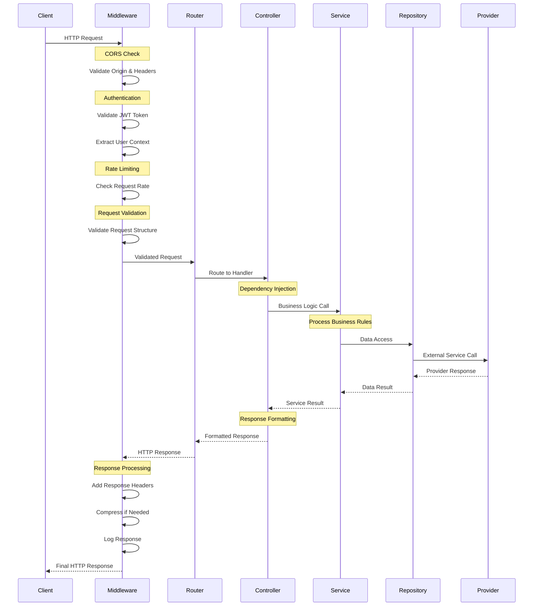

#### Error Handling and Recovery

**Error Classification**:
- **Client Errors (4xx)**: Invalid requests, authentication failures, validation errors
- **Server Errors (5xx)**: Internal failures, external service unavailability, database errors
- **Business Logic Errors**: Domain-specific errors like insufficient permissions

**Error Recovery Strategies**:
- **Graceful Degradation**: Provide partial functionality when services are unavailable
- **Automatic Retry**: Retry transient failures with exponential backoff
- **Circuit Breaker**: Prevent cascading failures by temporarily disabling failing services
- **Fallback Responses**: Provide default responses when primary processing fails

**Error Monitoring and Alerting**:
- **Error Rate Monitoring**: Track error rates and patterns across endpoints
- **Alert Thresholds**: Automatic alerts when error rates exceed thresholds
- **Error Logging**: Comprehensive error logging with context and stack traces
- **User Feedback**: Error responses that help users understand and resolve issues

## Deployment Architecture

The deployment architecture provides a comprehensive strategy for deploying the University Chatbot across different environments, from development to production. The architecture emphasizes scalability, reliability, and operational excellence through modern containerization and cloud-native practices.

### Deployment Philosophy

The deployment strategy is built around several core principles:

- **Environment Parity**: Consistent deployment across development, staging, and production
- **Infrastructure as Code**: Reproducible infrastructure through code and configuration
- **Scalability**: Horizontal and vertical scaling capabilities for varying loads
- - **Resilience**: High availability, fault tolerance, and disaster recovery
- **Security**: Comprehensive security controls at every layer
- **Monitoring**: Full observability into system performance and health

### 1. Container Architecture

The containerized architecture provides consistent deployment across environments while maintaining optimal resource utilization and security isolation.

#### Container Design Strategy

**Multi-Stage Docker Build**:
- **Base Stage**: Python runtime with system dependencies
- **Dependencies Stage**: Python package installation and caching
- **Application Stage**: Application code and configuration
- **Production Stage**: Optimized runtime without development tools

**Security Hardening**:
- **Non-Root User**: Containers run with non-privileged user accounts
- **Minimal Base Images**: Use slim/alpine images to reduce attack surface
- **Security Scanning**: Automated vulnerability scanning in CI/CD pipeline
- **Secrets Management**: External secrets injection, no hardcoded credentials

**Resource Optimization**:
- **Layer Caching**: Optimized Dockerfile for efficient layer caching
- **Resource Limits**: CPU and memory limits for container scheduling
- **Health Checks**: Container health checks for orchestrator integration
- **Graceful Shutdown**: Proper signal handling for zero-downtime deployments

#### Container Components

**Application Container**:
- **Base Image**: Python 3.10+ slim image for security and performance
- **Application Code**: University Chatbot FastAPI application
- **Configuration**: Environment-based configuration management
- **Dependencies**: All Python dependencies and system packages
- **Health Checks**: Built-in health check endpoints for container orchestration

**Database Container (Development)**:
- **PostgreSQL**: Official PostgreSQL image with pgvector extension
- **Data Persistence**: Volume mounting for data persistence
- **Configuration**: Custom PostgreSQL configuration for performance
- **Initialization**: Database schema and seed data scripts
- **Backup Integration**: Automated backup and restore capabilities

**Supporting Containers**:
- **Redis Cache**: Optional caching layer for improved performance
- **Nginx Proxy**: Reverse proxy for load balancing and SSL termination
- **Monitoring**: Prometheus, Grafana, and other monitoring tools

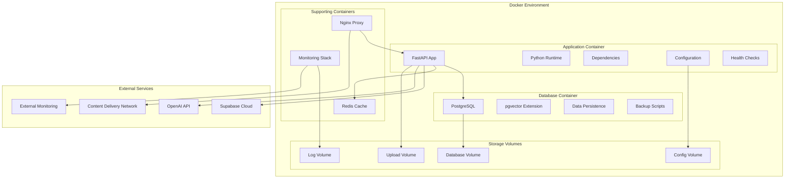

### 2. Production Deployment

The production deployment architecture ensures high availability, scalability, and security for serving real users in a university environment.

#### Multi-Tier Architecture

**Load Balancer Tier**:
- **Primary Load Balancer**: Nginx or cloud-native load balancer
- **SSL Termination**: TLS certificate management and termination
- **Health Checks**: Upstream server health monitoring
- **Traffic Distribution**: Intelligent traffic routing and load balancing
- **Rate Limiting**: Global rate limiting and DDoS protection

**Application Tier**:
- **Container Orchestration**: Kubernetes or Docker Swarm for container management
- **Auto-Scaling**: Horizontal pod autoscaling based on CPU and memory usage
- **Rolling Deployments**: Zero-downtime deployments with health checks
- **Service Discovery**: Automatic service registration and discovery
- **Configuration Management**: ConfigMaps and Secrets for external configuration

**Database Tier**:
- **Primary Database**: High-performance PostgreSQL with pgvector
- **Read Replicas**: Multiple read replicas for scaling read operations
- **Connection Pooling**: PgBouncer for efficient connection management
- **Backup Strategy**: Automated backups with point-in-time recovery
- **Monitoring**: Database performance monitoring and alerting

**Storage Tier**:
- **Object Storage**: Cloud storage for documents and media files
- **CDN Integration**: Global content delivery for static assets
- **Backup Storage**: Separate backup storage for disaster recovery
- **Archive Storage**: Long-term archival for compliance and audit

#### High Availability Features

**Redundancy and Failover**:
- **Multiple Availability Zones**: Deployment across multiple data centers
- **Database Clustering**: Primary-replica setup with automatic failover
- **Application Instances**: Multiple application instances with load balancing
- **Network Redundancy**: Multiple network paths and failover routing

**Disaster Recovery**:
- **Backup Strategy**: Regular backups with tested restore procedures
- **Recovery Time Objective (RTO)**: Target recovery time under 1 hour
- **Recovery Point Objective (RPO)**: Maximum 15 minutes of data loss
- **Cross-Region Backup**: Backups stored in multiple geographic regions

**Security Hardening**:
- **Network Segmentation**: VPC with private subnets for application and database tiers
- **Firewall Rules**: Strict firewall rules with minimal required ports
- **Access Control**: Role-based access control for all infrastructure components
- **Audit Logging**: Comprehensive audit logs for all system access and changes

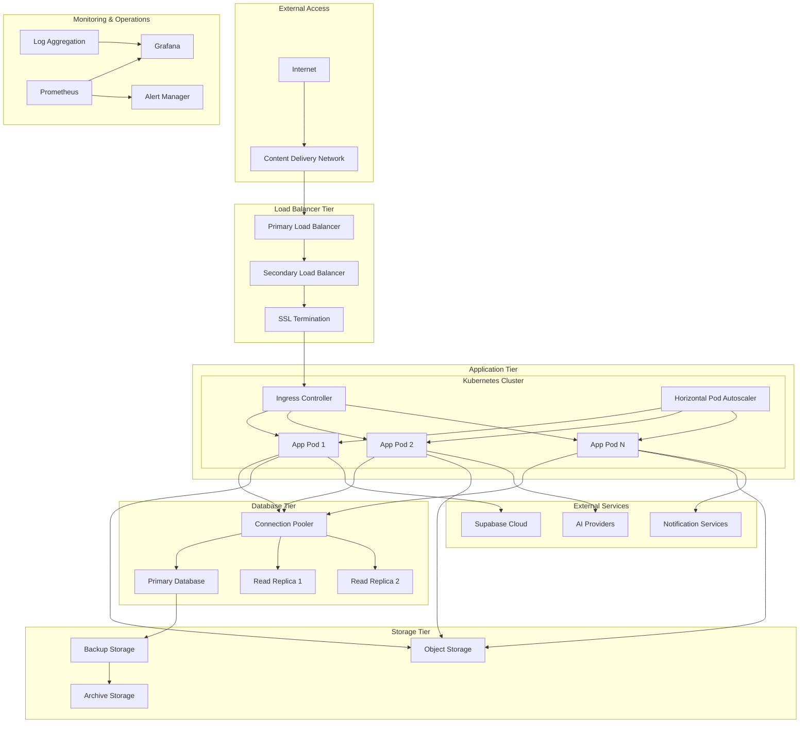

### Deployment Environments

#### Development Environment
- **Purpose**: Local development and feature testing
- **Infrastructure**: Docker Compose with local containers
- **Database**: Local PostgreSQL with sample data
- **External Services**: Development API keys and sandbox environments
- **Monitoring**: Basic logging and health checks

#### Staging Environment
- **Purpose**: Pre-production testing and validation
- **Infrastructure**: Scaled-down production environment
- **Database**: Production-like data with privacy protection
- **External Services**: Staging/test environments where available
- **Monitoring**: Full monitoring stack for testing

#### Production Environment
- **Purpose**: Live system serving university users
- **Infrastructure**: Full high-availability deployment
- **Database**: Production database with full redundancy
- **External Services**: Production API keys and accounts
- **Monitoring**: Comprehensive monitoring with 24/7 alerting

### Operations and Maintenance

#### Deployment Process
- **CI/CD Pipeline**: Automated testing, building, and deployment
- **Blue-Green Deployment**: Zero-downtime deployments with quick rollback
- **Database Migrations**: Automated schema migrations with rollback capability
- **Configuration Management**: Environment-specific configuration deployment

#### Monitoring and Observability
- **Application Metrics**: Performance, error rates, and business metrics
- **Infrastructure Metrics**: Server resources, network, and storage performance
- **Log Aggregation**: Centralized logging with search and analysis capabilities
- **Distributed Tracing**: Request tracing across all system components

#### Security Operations
- **Vulnerability Management**: Regular security scanning and patching
- **Access Management**: Regular access reviews and privilege management
- **Incident Response**: Defined procedures for security incident handling
- **Compliance Monitoring**: Continuous compliance monitoring and reporting

## Security Architecture

The security architecture implements a comprehensive, multi-layered security approach that protects the University Chatbot system from various threats while ensuring data privacy, user authentication, and regulatory compliance. Security is integrated into every aspect of the system architecture.

### Security Philosophy

The security approach is built on fundamental principles of defense in depth, zero trust, and privacy by design:

- **Defense in Depth**: Multiple security layers to prevent single points of failure
- **Zero Trust**: Never trust, always verify - all access requires authentication and authorization
- **Privacy by Design**: Data privacy considerations built into every system component
- **Principle of Least Privilege**: Users and systems have minimal necessary permissions
- **Security by Default**: Secure configurations and behaviors are the default state

### 1. Security Layers

The security architecture implements security controls at multiple layers to ensure comprehensive protection against various threat vectors.

#### Network Security Layer

**Perimeter Security**:
- **Web Application Firewall (WAF)**: Protection against OWASP Top 10 vulnerabilities
- **DDoS Protection**: Cloud-based DDoS mitigation and rate limiting
- **Intrusion Detection**: Network-based intrusion detection and prevention
- **Geographic Blocking**: IP-based filtering for restricted regions
- **Bot Protection**: Advanced bot detection and mitigation

**Network Segmentation**:
- **Virtual Private Cloud (VPC)**: Isolated network environment for the application
- **Private Subnets**: Database and internal services isolated from public internet
- **Security Groups**: Fine-grained firewall rules for each service tier
- **Network ACLs**: Additional layer of network access control
- **VPN Access**: Secure administrative access through VPN connections

**Transport Security**:
- **TLS 1.3**: Modern transport layer security for all communications
- **Certificate Management**: Automated certificate provisioning and renewal
- **HSTS Headers**: HTTP Strict Transport Security to prevent downgrade attacks
- **Certificate Pinning**: Additional protection against certificate-based attacks

#### Application Security Layer

**Authentication and Authorization**:
- **Multi-Factor Authentication (MFA)**: Optional MFA for enhanced security
- **JWT Token Security**: Secure token generation, validation, and expiration
- **Role-Based Access Control (RBAC)**: Fine-grained permissions based on user roles
- **Session Management**: Secure session handling with timeout and revocation
- **OAuth 2.0 Integration**: Support for external identity providers

**Input Validation and Sanitization**:
- **Schema Validation**: Pydantic-based request validation and type checking
- **SQL Injection Prevention**: Parameterized queries and ORM usage
- **XSS Protection**: Input sanitization and output encoding
- **CSRF Protection**: Cross-site request forgery prevention tokens
- **File Upload Security**: Virus scanning and file type validation

**API Security**:
- **Rate Limiting**: Protect against abuse and brute force attacks
- **API Key Management**: Secure API key generation and rotation
- **Request Signing**: Message integrity verification for critical operations
- **CORS Configuration**: Strict cross-origin resource sharing policies
- **API Versioning**: Secure deprecation and migration of API versions

#### Data Security Layer

**Data Encryption**:
- **Encryption at Rest**: Database and file storage encryption using AES-256
- **Encryption in Transit**: TLS encryption for all network communications
- **Key Management**: Hardware security modules (HSM) for key protection
- **Field-Level Encryption**: Additional encryption for sensitive data fields
- **Backup Encryption**: Encrypted backups with separate key management

**Data Privacy**:
- **Personal Data Classification**: Identification and classification of personal data
- **Data Minimization**: Collect and store only necessary data
- **Anonymization**: Remove personally identifiable information where possible
- **Pseudonymization**: Replace identifying data with pseudonyms
- **Right to Erasure**: Capability to completely delete user data on request

**Access Control**:
- **Database Authentication**: Strong database authentication and access control
- **Column-Level Security**: Fine-grained access control at the column level
- **Audit Logging**: Comprehensive logging of all data access and modifications
- **Data Loss Prevention (DLP)**: Prevent unauthorized data exfiltration
- **Backup Security**: Secure backup storage with access controls

```mermaid
graph TB
    subgraph "Security Layers"
        subgraph "Network Security"
            WAF[Web Application Firewall]
            DDOS[DDoS Protection]
            VPC[Virtual Private Cloud]
            FIREWALL[Firewall Rules]
            TLS[TLS Encryption]
        end
        
        subgraph "Application Security"
            AUTH[Authentication & Authorization]
            VALIDATION[Input Validation]
            RATE_LIMIT[Rate Limiting]
            CSRF[CSRF Protection]
            XSS[XSS Protection]
        end
        
        subgraph "Data Security"
            ENCRYPTION[Data Encryption]
            ACCESS_CONTROL[Access Control]
            PRIVACY[Data Privacy]
            AUDIT[Audit Logging]
            BACKUP[Backup Security]
        end
        
        subgraph "Infrastructure Security"
            CONTAINER[Container Security]
            SECRETS[Secret Management]
            VULN[Vulnerability Management]
            PATCH[Patch Management]
            MONITORING[Security Monitoring]
        end
        
        subgraph "Compliance & Governance"
            GDPR[GDPR Compliance]
            AUDIT_TRAIL[Audit Trail]
            POLICIES[Security Policies]
            TRAINING[Security Training]
            INCIDENT[Incident Response]
        end
    end
    
    WAF --> VPC
    VPC --> FIREWALL
    FIREWALL --> TLS
    
    AUTH --> VALIDATION
    VALIDATION --> RATE_LIMIT
    RATE_LIMIT --> CSRF
    CSRF --> XSS
    
    ENCRYPTION --> ACCESS_CONTROL
    ACCESS_CONTROL --> PRIVACY
    PRIVACY --> AUDIT
    AUDIT --> BACKUP
    
    CONTAINER --> SECRETS
    SECRETS --> VULN
    VULN --> PATCH
    PATCH --> MONITORING
    
    GDPR --> AUDIT_TRAIL
    AUDIT_TRAIL --> POLICIES
    POLICIES --> TRAINING
    TRAINING --> INCIDENT
```

### 2. Authentication and Authorization Flow

The authentication and authorization system provides secure, scalable user management with support for various authentication methods and fine-grained access control.

#### Authentication Process

**Initial Authentication**:
1. **User Credentials**: User provides email and password
2. **Credential Validation**: Server validates credentials against user database
3. **Multi-Factor Authentication**: Optional MFA verification step
4. **Token Generation**: JWT token generated with user claims and permissions
5. **Secure Storage**: Token stored securely on client with appropriate flags

**Token-Based Authentication**:
- **JWT Structure**: Header, payload, and signature with user information
- **Token Expiration**: Short-lived access tokens with refresh token mechanism
- **Token Validation**: Server validates token signature and expiration
- **Token Refresh**: Automatic token refresh for seamless user experience
- **Token Revocation**: Ability to revoke tokens for security incidents

#### Authorization Model

**Role-Based Access Control (RBAC)**:
- **Student Role**: Access to chat, document search, and complaint submission
- **Staff Role**: Access to user management and system monitoring
- **Admin Role**: Full system access including configuration and user management
- **System Role**: Service accounts for automated processes

**Permission Model**:
- **Resource-Based Permissions**: Permissions tied to specific resources
- **Action-Based Permissions**: Permissions for specific actions (read, write, delete)
- **Context-Aware Permissions**: Permissions based on context (time, location, device)
- **Dynamic Permissions**: Permissions that change based on system state

**Access Control Implementation**:
- **Middleware Enforcement**: Authentication middleware validates all requests
- **Decorator-Based Authorization**: Service method authorization using decorators
- **Resource-Level Filtering**: Filter results based on user permissions
- **Audit Logging**: Log all authorization decisions for compliance

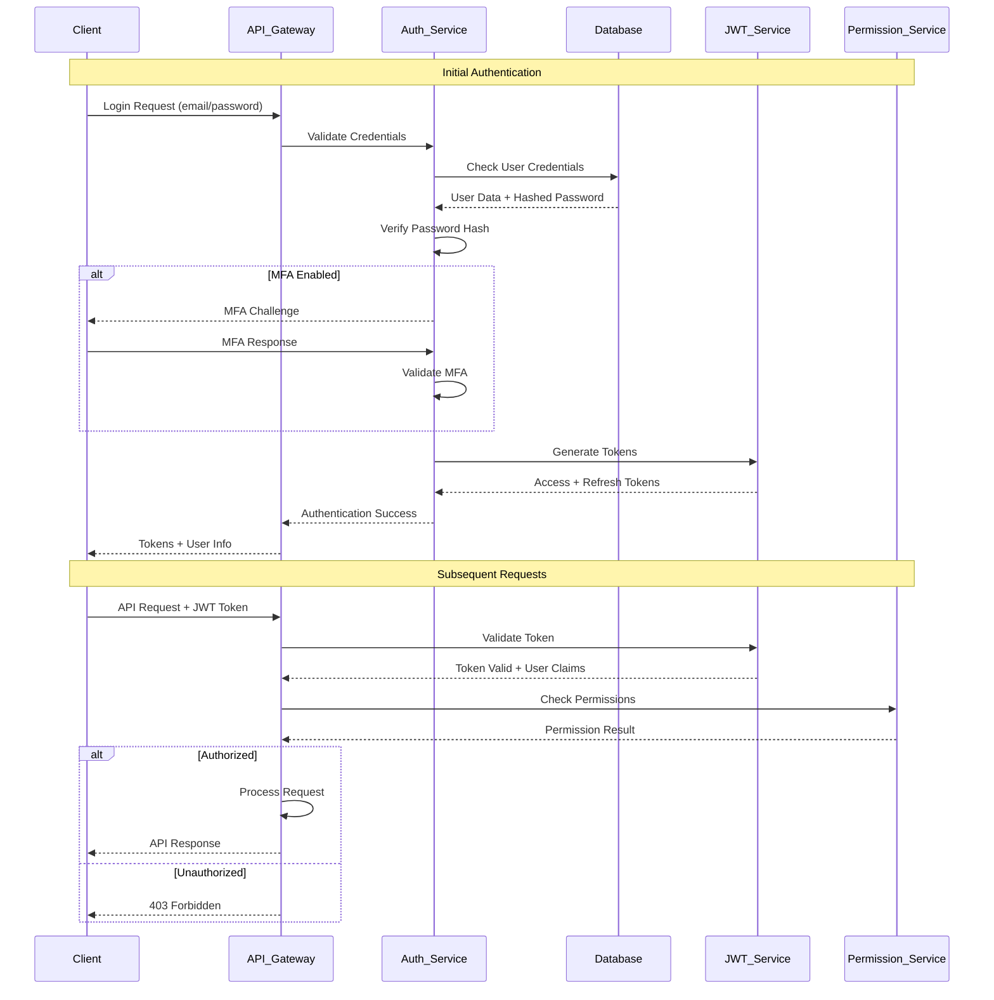

### Security Monitoring and Incident Response

#### Security Monitoring

**Real-Time Monitoring**:
- **Anomaly Detection**: Machine learning-based detection of unusual patterns
- **Failed Authentication Tracking**: Monitor and alert on authentication failures
- **Suspicious Activity Detection**: Identify potential security threats
- **Performance Impact Monitoring**: Track security control performance impact

**Security Information and Event Management (SIEM)**:
- **Log Aggregation**: Centralized collection of security logs
- **Correlation Rules**: Automated correlation of security events
- **Threat Intelligence**: Integration with threat intelligence feeds
- **Incident Prioritization**: Automated prioritization of security incidents

**Compliance Monitoring**:
- **Policy Compliance**: Continuous monitoring of security policy compliance
- **Regulatory Compliance**: GDPR, CCPA, and other regulatory requirement tracking
- **Audit Trail Integrity**: Ensure audit logs are complete and tamper-proof
- **Access Review**: Regular review of user access and permissions

#### Incident Response

**Incident Response Plan**:
- **Incident Classification**: Categorization of security incidents by severity
- **Response Procedures**: Step-by-step procedures for different incident types
- **Communication Plan**: Internal and external communication procedures
- **Recovery Procedures**: System recovery and business continuity procedures

**Automated Response**:
- **Account Lockout**: Automatic lockout for suspicious authentication attempts
- **IP Blocking**: Temporary blocking of suspicious IP addresses
- **Rate Limiting**: Dynamic rate limiting during attacks
- **Alert Escalation**: Automated escalation of critical security alerts

### Privacy and Compliance

#### Data Privacy Framework

**Privacy by Design**:
- **Data Minimization**: Collect only necessary data for system functionality
- **Purpose Limitation**: Use data only for stated purposes
- **Consent Management**: Clear consent mechanisms for data collection
- **Data Subject Rights**: Support for access, rectification, and erasure requests

**GDPR Compliance**:
- **Lawful Basis**: Clear lawful basis for all data processing activities
- **Data Protection Impact Assessment**: Regular assessment of privacy risks
- **Data Breach Notification**: Procedures for breach notification within 72 hours
- **Data Protection Officer**: Designated data protection officer for compliance

**Cross-Border Data Transfer**:
- **Data Residency**: Control over where data is stored and processed
- **Transfer Mechanisms**: Appropriate safeguards for international transfers
- **Third-Party Assessments**: Regular assessment of third-party data processors
- **Contractual Safeguards**: Strong contractual protections for data transfers

## Monitoring and Observability

The monitoring and observability framework provides comprehensive visibility into the University Chatbot system's performance, health, and behavior. This framework enables proactive issue detection, performance optimization, and reliable system operations through structured logging, metrics collection, and distributed tracing.

### Observability Philosophy

The observability approach is built on the three pillars of observability - logs, metrics, and traces - with additional focus on business intelligence and user experience monitoring:

- **Proactive Monitoring**: Detect issues before they impact users
- **Data-Driven Decisions**: Use telemetry data for optimization and planning
- **Full Stack Visibility**: Monitor from user experience to infrastructure
- **Real-Time Alerting**: Immediate notification of critical issues
- **Historical Analysis**: Long-term trend analysis and capacity planning

### 1. Monitoring Architecture

The monitoring architecture implements a modern observability stack that scales with the system and provides insights at multiple levels of abstraction.

#### Monitoring Stack Components

**Metrics Collection (Prometheus)**:
- **Time Series Database**: Efficient storage and querying of numerical metrics
- **Pull-Based Model**: Scrapes metrics from application and infrastructure endpoints
- **Service Discovery**: Automatic discovery of services to monitor
- **Alerting Rules**: Define conditions for generating alerts
- **High Availability**: Clustered deployment for reliability

**Visualization (Grafana)**:
- **Dashboard Creation**: Custom dashboards for different audiences and use cases
- **Data Source Integration**: Connect to multiple data sources (Prometheus, logs, traces)
- **Alerting Interface**: Visual alert management and notification configuration
- **User Management**: Role-based access to different dashboards and data
- **Template Variables**: Dynamic dashboards that adapt to different environments

**Log Aggregation (ELK Stack)**:
- **Elasticsearch**: Distributed search and analytics engine for log data
- **Logstash**: Data processing pipeline for log ingestion and transformation
- **Kibana**: Visualization and exploration interface for log data
- **Filebeat**: Lightweight log shipper for collecting and forwarding logs

**Distributed Tracing (Jaeger)**:
- **Request Tracing**: End-to-end request tracing across service boundaries
- **Performance Analysis**: Identify bottlenecks and optimize request paths
- **Error Tracking**: Trace errors back to their origin across multiple services
- **Dependency Mapping**: Visualize service dependencies and communication patterns

**Application Performance Monitoring (APM)**:
- **Code-Level Insights**: Monitor application performance at the code level
- **Database Monitoring**: Track database query performance and optimization
- **External Service Monitoring**: Monitor integrations with third-party services
- **Real User Monitoring**: Track actual user experience and performance

```mermaid
graph TB
    subgraph "Application Layer"
        APP1[App Instance 1]
        APP2[App Instance 2]
        APP3[App Instance N]
        
        subgraph "Instrumentation"
            METRICS[Metrics Endpoint]
            LOGS[Structured Logging]
            TRACES[Tracing]
            HEALTH[Health Checks]
        end
    end
    
    subgraph "Infrastructure Layer"
        subgraph "System Metrics"
            CPU[CPU Metrics]
            MEMORY[Memory Metrics]
            DISK[Disk Metrics]
            NETWORK[Network Metrics]
        end
        
        subgraph "Container Metrics"
            DOCKER[Docker Stats]
            K8S[Kubernetes Metrics]
        end
        
        subgraph "Database Metrics"
            DB_PERF[DB Performance]
            DB_CONN[Connection Pool]
            DB_QUERIES[Query Metrics]
        end
    end
    
    subgraph "Monitoring Stack"
        PROMETHEUS[Prometheus]
        GRAFANA[Grafana]
        ELASTICSEARCH[Elasticsearch]
        KIBANA[Kibana]
        JAEGER[Jaeger]
        ALERTMANAGER[Alert Manager]
    end
    
    subgraph "Alerting Channels"
        EMAIL[Email Alerts]
        SLACK[Slack Notifications]
        PAGERDUTY[PagerDuty]
        WEBHOOK[Webhook Alerts]
    end
    
    subgraph "External Monitoring"
        UPTIME[Uptime Monitoring]
        SYNTHETICS[Synthetic Monitoring]
        RUM[Real User Monitoring]
    end
    
    APP1 --> METRICS
    APP2 --> LOGS
    APP3 --> TRACES
    
    METRICS --> PROMETHEUS
    LOGS --> ELASTICSEARCH
    TRACES --> JAEGER
    HEALTH --> PROMETHEUS
    
    CPU --> PROMETHEUS
    MEMORY --> PROMETHEUS
    DISK --> PROMETHEUS
    NETWORK --> PROMETHEUS
    
    DOCKER --> PROMETHEUS
    K8S --> PROMETHEUS
    
    DB_PERF --> PROMETHEUS
    DB_CONN --> PROMETHEUS
    DB_QUERIES --> PROMETHEUS
    
    PROMETHEUS --> GRAFANA
    PROMETHEUS --> ALERTMANAGER
    ELASTICSEARCH --> KIBANA
    
    ALERTMANAGER --> EMAIL
    ALERTMANAGER --> SLACK
    ALERTMANAGER --> PAGERDUTY
    ALERTMANAGER --> WEBHOOK
    
    UPTIME --> GRAFANA
    SYNTHETICS --> GRAFANA
    RUM --> GRAFANA
```

### 2. Metrics and KPIs

The system tracks comprehensive metrics across multiple dimensions to provide full visibility into system behavior and business outcomes.

#### Application Metrics

**Performance Metrics**:
- **Response Time**: API endpoint response times with percentile distributions
- **Throughput**: Requests per second for each endpoint and overall system
- **Error Rate**: Error percentage with breakdown by error type and endpoint
- **Availability**: System uptime and availability measurements
- **Resource Utilization**: CPU, memory, and network usage across all components

**Business Metrics**:
- **Conversation Volume**: Number of conversations per time period
- **User Engagement**: Active users, session duration, and repeat usage
- **Document Usage**: Document search frequency and success rates
- **Complaint Processing**: Complaint submission and resolution metrics
- **Feature Adoption**: Usage statistics for different system features

**AI/ML Metrics**:
- **Model Performance**: Response quality, accuracy, and relevance scores
- **LLM Usage**: Token usage, cost per conversation, and model selection
- **Embedding Quality**: Vector search accuracy and relevance scores
- **Processing Time**: Time spent in different stages of conversation processing
- **Confidence Scores**: Distribution of confidence scores for generated responses

#### Infrastructure Metrics

**System Resource Metrics**:
- **CPU Utilization**: Per-core and aggregate CPU usage across all instances
- **Memory Usage**: Available memory, memory pressure, and swap usage
- **Disk I/O**: Read/write operations, disk space usage, and I/O wait times
- **Network Traffic**: Inbound/outbound traffic, packet loss, and latency

**Database Metrics**:
- **Query Performance**: Query execution times, slow query identification
- **Connection Pool**: Active connections, connection pool utilization
- **Database Size**: Table sizes, index usage, and storage growth
- **Backup Status**: Backup success/failure rates and backup duration

**Container Metrics**:
- **Container Health**: Container status, restart counts, and health check results
- **Resource Limits**: CPU and memory limit utilization per container
- **Image Security**: Vulnerability counts and security scan results
- **Deployment Metrics**: Deployment frequency, success rates, and rollback counts

#### User Experience Metrics

**Frontend Performance**:
- **Page Load Time**: Complete page load times for web interface
- **Time to Interactive**: Time until page becomes fully interactive
- **Core Web Vitals**: Largest Contentful Paint, First Input Delay, Cumulative Layout Shift
- **JavaScript Errors**: Client-side error rates and error types

**API Performance**:
- **API Response Time**: Response times for different API endpoints
- **API Success Rate**: Success rates with breakdown by endpoint
- **Rate Limiting**: Rate limit hit rates and throttling effectiveness
- **Authentication Performance**: Login success rates and authentication timing

### Alerting and Incident Management

#### Alert Configuration

**Severity Levels**:
- **Critical**: Immediate response required, system unavailable or data loss
- **High**: Significant impact on users, degraded performance or functionality
- **Medium**: Minor issues that may impact some users or operations
- **Low**: Informational alerts for trend monitoring and optimization

**Alert Types**:
- **Threshold Alerts**: Triggered when metrics exceed defined thresholds
- **Anomaly Detection**: Machine learning-based detection of unusual patterns
- **Composite Alerts**: Complex alerts based on multiple conditions
- **Trend Alerts**: Alerts based on metric trends over time periods

**Alert Routing**:
- **Escalation Policies**: Automatic escalation based on severity and response time
- **On-Call Rotation**: Support for on-call schedules and rotation management
- **Channel Routing**: Different alert types routed to appropriate communication channels
- **Alert Suppression**: Intelligent alert suppression during maintenance windows

#### Incident Response Integration

**Incident Management Workflow**:
1. **Alert Generation**: Monitoring system generates alert based on defined conditions
2. **Incident Creation**: Automatic incident creation in incident management system
3. **Notification**: Immediate notification to on-call personnel through multiple channels
4. **Acknowledgment**: Incident acknowledgment and ownership assignment
5. **Investigation**: Guided investigation using monitoring data and runbooks
6. **Resolution**: Incident resolution with post-mortem analysis and learning

**Runbook Automation**:
- **Automated Diagnostics**: Automatic collection of diagnostic information
- **Remediation Scripts**: Automated execution of common remediation steps
- **Escalation Procedures**: Clear procedures for escalating complex issues
- **Communication Templates**: Standardized communication for different incident types

### Performance Optimization and Capacity Planning

#### Performance Analysis

**Bottleneck Identification**:
- **Resource Contention**: Identify CPU, memory, or I/O bottlenecks
- **Database Performance**: Slow query identification and optimization opportunities
- **External Dependencies**: Monitor performance of external services and APIs
- **Network Latency**: Identify network-related performance issues

**Trend Analysis**:
- **Growth Patterns**: Analyze usage growth and predict future resource needs
- **Seasonal Variations**: Identify patterns in usage based on academic calendar
- **Performance Degradation**: Track performance changes over time
- **Optimization Impact**: Measure the impact of performance optimizations

#### Capacity Planning

**Resource Forecasting**:
- **Traffic Prediction**: Predict future traffic based on historical patterns
- **Resource Requirements**: Calculate required resources for different growth scenarios
- **Scaling Triggers**: Define thresholds for automatic and manual scaling
- **Cost Optimization**: Balance performance requirements with cost considerations

**Proactive Scaling**:
- **Auto-Scaling Policies**: Configure automatic scaling based on metrics
- **Predictive Scaling**: Use machine learning to predict and prepare for traffic spikes
- **Load Testing**: Regular load testing to validate system capacity
- **Disaster Recovery**: Capacity planning for disaster recovery scenarios

## Performance Considerations

### 1. Scalability Patterns

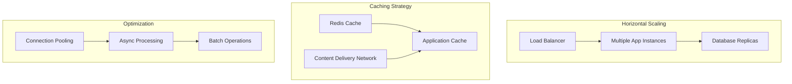

## Conclusion

The University Chatbot system architecture represents a sophisticated, production-ready solution that balances complexity with maintainability, performance with flexibility, and innovation with reliability. The architecture demonstrates how modern software engineering principles can be applied to create a robust AI-powered system.

### Architectural Achievements

#### Technical Excellence
The system successfully implements several advanced architectural patterns:

- **Provider-Agnostic Design**: Complete abstraction of external dependencies enables vendor independence and easy testing
- **Modular Architecture**: Clean separation of concerns with well-defined interfaces and responsibilities
- **Conversation Engine Framework**: Sophisticated workflow orchestration using LangGraph for complex conversation management
- **Multi-Provider Support**: Seamless integration with multiple LLM, database, and storage providers
- **Advanced Vector Operations**: Integrated semantic search with pgvector for intelligent document retrieval

#### Scalability and Performance
The architecture is designed for enterprise-scale deployment:

- **Horizontal Scaling**: Stateless design allows easy scaling across multiple instances
- **Performance Optimization**: Connection pooling, caching strategies, and async processing
- **Resource Efficiency**: Optimized database queries, lazy loading, and efficient memory management
- **Load Distribution**: Support for load balancers, read replicas, and CDN integration

#### Security and Compliance
Security is built into every layer of the architecture:

- **Multi-Layer Security**: Network, application, and data-level security measures
- **Authentication & Authorization**: JWT-based auth with role-based access control
- **Data Protection**: Encryption at rest and in transit, input sanitization, and audit logging
- **Compliance Ready**: GDPR, CCPA compliance capabilities with data retention and deletion

#### Developer Experience
The architecture prioritizes developer productivity and maintainability:

- **Clear Abstractions**: Well-defined interfaces and contracts between components
- **Comprehensive Testing**: Unit, integration, and end-to-end testing capabilities
- **Documentation**: Extensive documentation with diagrams and examples
- **Development Tools**: Hot reloading, debugging tools, and comprehensive logging

### Business Value Delivered

#### Operational Efficiency
- **Automated Support**: Reduces manual workload for university administrative staff
- **24/7 Availability**: Continuous service without human intervention requirements
- **Consistent Responses**: Standardized information delivery reduces errors and confusion
- **Scalable Operations**: Handles varying load without proportional staffing increases

#### User Experience Enhancement
- **Intelligent Responses**: Context-aware, personalized assistance for students and staff
- **Multi-Channel Support**: Consistent experience across web, mobile, and API integrations
- **Quick Resolution**: Immediate responses to common queries and efficient complaint processing
- **Learning System**: Continuous improvement through conversation analysis and feedback

#### Cost Optimization
- **Resource Efficiency**: Optimized infrastructure usage through smart caching and scaling
- **Provider Flexibility**: Choose cost-effective providers without architectural changes
- **Operational Savings**: Reduced need for human support staff for routine queries
- **Future-Proof Investment**: Architecture adapts to new technologies without major rewrites

### Technology Stack Benefits

#### FastAPI Framework
- **Modern Python**: Leverages latest Python features with excellent performance
- **Automatic Documentation**: Self-documenting APIs with interactive exploration
- **Type Safety**: Pydantic integration ensures data validation and type safety
- **Async Support**: Native async/await support for high-concurrency scenarios

#### LangGraph Integration
- **Workflow Orchestration**: Graph-based conversation flows for complex interactions
- **State Management**: Sophisticated state handling for multi-turn conversations
- **Extensibility**: Easy addition of new conversation nodes and workflows
- **Debugging**: Visual workflow representation aids in debugging and optimization

#### PostgreSQL with pgvector
- **ACID Compliance**: Reliable transactions for critical business operations
- **Vector Search**: Native vector operations for semantic similarity
- **Mature Ecosystem**: Extensive tooling, monitoring, and optimization options
- **Scalability**: Proven performance at enterprise scale with read replicas

#### Supabase Integration
- **Rapid Development**: Accelerated development with built-in features
- **Real-time Capabilities**: Live updates for collaborative features
- **Built-in Auth**: Comprehensive authentication and authorization
- **Storage Integration**: Seamless file handling with CDN capabilities

### Future Roadmap and Extensibility

#### Planned Enhancements
- **Multi-Language Support**: Internationalization for diverse user base
- **Voice Interface**: Speech-to-text and text-to-speech capabilities
- **Advanced Analytics**: Deep conversation analytics and user behavior insights
- **Mobile Applications**: Native iOS and Android applications

#### Extensibility Points
- **New Conversation Engines**: Easy integration of alternative AI frameworks
- **Additional Providers**: Support for new LLM, database, and storage providers
- **Custom Workflows**: University-specific conversation flows and processes
- **Integration APIs**: Connect with existing university systems and databases

#### Technology Evolution
- **AI Model Upgrades**: Seamless migration to newer, more capable language models
- **Cloud Migration**: Easy deployment across different cloud providers
- **Microservices Transition**: Potential evolution to full microservices architecture
- **Real-time Features**: Enhanced real-time collaboration and communication

### Best Practices Demonstrated

#### Software Architecture
- **Domain-Driven Design**: Clear domain boundaries and ubiquitous language
- **SOLID Principles**: Maintainable, extensible, and testable code structure
- **Clean Architecture**: Dependency inversion and layered architecture
- **Pattern Implementation**: Proper use of Factory, Repository, and Strategy patterns

#### DevOps and Operations
- **Infrastructure as Code**: Containerized deployment with Docker
- **Monitoring and Observability**: Comprehensive logging, metrics, and health checks
- **Security First**: Security considerations integrated throughout the architecture
- **Documentation**: Living documentation that evolves with the system

#### AI and Machine Learning
- **Responsible AI**: Ethical considerations in AI implementation and usage
- **Model Management**: Proper versioning, monitoring, and fallback strategies
- **Data Privacy**: Privacy-preserving AI with appropriate data handling
- **Performance Optimization**: Efficient AI model usage and cost management

### Strategic Impact

The University Chatbot architecture serves as more than just a technical solution; it represents a strategic investment in the university's digital transformation. The system provides:

- **Competitive Advantage**: Modern, intelligent student services that enhance university reputation
- **Operational Excellence**: Streamlined administrative processes and improved efficiency
- **Innovation Platform**: Foundation for future AI-powered educational initiatives
- **Knowledge Management**: Centralized, searchable repository of university information

The architecture's flexibility and extensibility ensure that it can evolve with changing requirements, new technologies, and growing user needs, making it a sustainable long-term investment in the university's technological infrastructure.

This comprehensive architectural approach demonstrates how thoughtful design, modern technologies, and engineering best practices can be combined to create a system that not only meets current requirements but provides a solid foundation for future growth and innovation.
